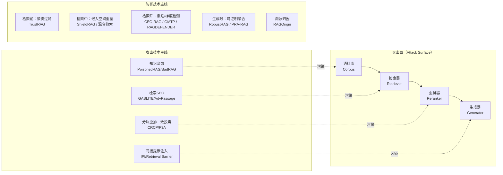
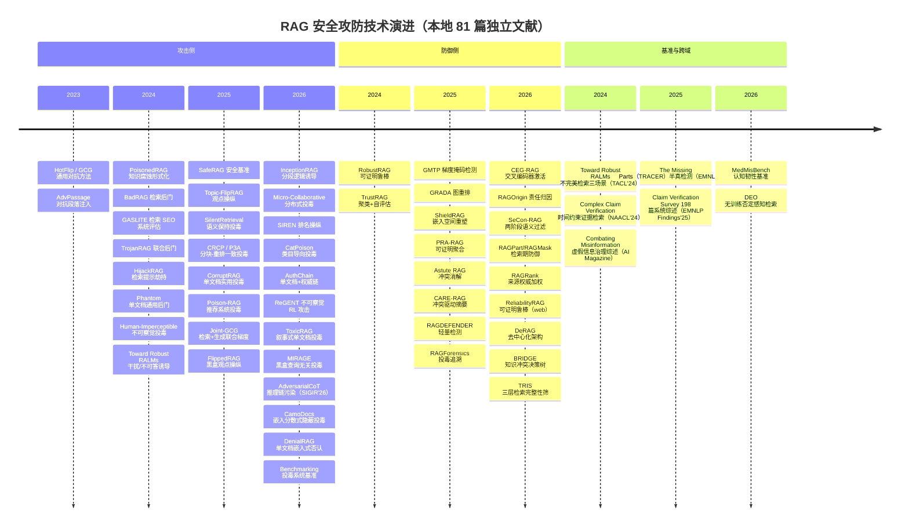
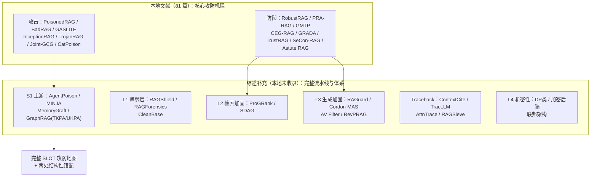

# RAG 安全攻防文献技术手段总结报告

> **文献来源**：`D:\学在东南\毕业论文\开题\科研数据库\20_Research\Papers\RAG安全文献`
> **文献规模**：**81 个 PDF**（含 1 个附录工件，重复副本已清理，去重后 **80 篇本地独立文献**），连同 1 篇以著录形式收录的中文综述，**独立文献共 81 篇**
> **统计时间**：2026-10-04（全量扫描）
> **提取方式**：PyMuPDF 批量提取标题与摘要（`tmp/extract_rag_abstracts.py` → `tmp/rag_abstracts.json`）+ 实验设计逐篇全文提取（`tmp/extract_experiment_compact.py` → `tmp/experiment_design_compact.txt`）+ **文献逐篇精读存档**（`tmp/read_new_papers.py` → `tmp/new_papers_deep_read.txt`）
> **文档结构**：
> - **第二、三章**：技术手段主题综述（攻击 A1–A16、防御 D1–D18）；
> - **第六章**：**本地 81 篇完整文献清单（含逐篇解读与实验设计要点、方法论类别）**——全文的"事实底座"；§6.1/§6.2 各行的「方法论类别」列给出**逐篇方法论判定**（系统机制设计 / 算法优化 / 混合），判定标准与三类横向对比见 §6.6；**§6.7 另收录 5 篇"其它领域可借鉴文献"**（虚假信息、事实核查、查询嵌入），**§6.8 收录 1 篇低优先级邻域文献**；
> - **第七章**：实验设计横向分析（五个统一维度 + **§7.5 ACC / ASR 专项分析** + §7.6 机理实验分类 + **§7.7 实验设置整定与计算开销** + §7.8 共性缺陷 E1–E12）；
> - **第八章**：**本地文献优先级评定**（按《文献筛选方案》**含开源因子版**计算，分攻击 / 防御 / 基准三类降序）；
> - **第九章**：三篇综述所引攻防文献的原文整理（联网补充，**20 篇**攻防文献的原始数据）；
> - **第十章**：对开题研究的启示。
> **一致性约定**：各章提及具体文献时，其**完整解读与实验设计参数以第六章为准**；标注"详见 §9.x"者为综述联网核实数据（第九章），"见 §7.x"者为实验设计横向统计（第七章）。

---

## 一、总体概览

### 1.1 文献构成

> 81 个 PDF 文件去重后为 **80 篇独立文献**（剔除 Topic-FlipRAG 与 When Poison Fails 各 1 个重复副本，以及 1 个附录工件）。

| 类型 | 数量 | 占独立文献比 | 代表文献 |
|------|------|------|----------|
| **攻击方法**（Attack） | 31 | 38.3% | PoisonedRAG、BadRAG、GASLITE、InceptionRAG、TrojanRAG、Phantom、Joint-GCG、ToxicRAG、**MIRAGE**、**FlippedRAG**、**AdversarialCoT**、**CamoDocs**、**DenialRAG** |
| **防御方法**（Defense，含 2 篇攻防混合） | 22 | 27.2% | RobustRAG、PRA-RAG、TrustRAG、GMTP、GRADA、SeCon-RAG、Astute RAG、TRIS、**RAGForensics** |
| **综述/分类学**（Survey） | 9 | 11.1% | SLOT 分类学、Retrieved But Not Reliable、Towards Secure RAG、Security & Privacy in RAG |
| **基准、数据集与实证研究**（Benchmark/Dataset/Empirical） | 10 | 12.3% | SafeRAG、Benchmarking Poisoning Attacks、BEIR、NQ、MS MARCO、HotpotQA、FEVER、**MedMisBench**、**Toward Robust RALMs** |
| **基础方法与检索增强技术**（Foundation） | 3 | 3.7% | HotFlip、GCG、**DEO** |
| **其它领域可借鉴文献**（Cross-domain，详见 §6.7） | 5 | 6.2% | **Combating Misinformation**、**Complex Claim Verification**、**The Missing Parts（TRACER）**、**Claim Verification Survey**、**Estimating Embedding Vectors** |
| **其它低优先级文献**（Low-priority，详见 §6.8） | 1 | 1.2% | **FilterRAG**（多模态 VQA） |
| **合计** | **81** | 100% | — |

> **注 1**：*On the Vulnerability…* 与 *Semantic Chameleon* 同时提出攻击与防御，在「防御」计数中重复计入。
> **注 2**：*Influence Factors on RAG Poisoning*（432 组全因子实验）归入「基准与数据集」类，因其贡献是**投毒影响因子分析**而非新攻击方法。
> **注 3**：4 篇中文综述（RAG 优化技术、检索增强生成综述:方法与应用、RAG 综述-刘雪颖、RAG 在软件工程中的应用）与 2 篇英文综述（Towards Secure RAG、Security & Privacy in RAG）为**通用 RAG 综述**，仅部分章节涉及安全，列于 §6.3。
> **注 4**：本库另有一组与攻防主线**互补**的工作。**TRIS** 补齐了"检索期纵深校验"这一防御空白；**MedMisBench** 提出"**认知韧性（epistemic resilience）**"这一新评测维度（干净 71.1% → 误导上下文下 38.0%，ASR 51.5%）；**Toward Robust RALMs** 系统刻画"**不可答 / 对抗 / 冲突**"三类不完美检索场景（并提出 GenADV 攻击与 RAD 指标）；**5 篇其它领域文献**（虚假信息综述、事实核查管线、半真检测、事实验证综述、查询嵌入估计）**并非 RAG 攻防工作**，而是为本开题提供**方法学与评测范式借鉴**，单列于 §6.7 以示区分。

### 1.2 攻防格局一句话总结

**攻方**已从「显式单点注入」演进到「分布式、语义保持、跨检索阶段一致」的隐蔽投毒；
**守方**则沿两条路线并进——**可证明鲁棒性**（RobustRAG/PRA-RAG 的形式化保证）与**检测过滤**（GMTP/CEGRAG 的激活信号/梯度特征），且都开始**下移到检索与重排阶段**，而非仅在生成端修补。

---

## 二、攻击技术手段（Attacks）

### 2.1 手段总览表

| 编号 | 技术手段 | 代表文献 | 核心机理 | 攻击目标 |
|------|----------|----------|----------|----------|
| A1 | **知识腐蚀投毒** | PoisonedRAG、BadRAG、OntheVulnerability | 向知识库注入恶意文本，使模型对目标问题输出攻击者指定答案 | 事实篡改 |
| A2 | **对抗段落注入 / 检索 SEO** | AdvPassage、GASLITE | 优化离散 token 使恶意段落与查询高相似，抢占 top-k 排名 | 排名劫持 |
| A3 | **检索后门（Retrieval Backdoor）** | BadRAG | 自定义触发器（如语义组"共和党、特朗普"）唤醒毒段落 | 条件触发 |
| A4 | **间接提示注入（IPI）** | Overcoming the Retrieval Barrier | 将恶意指令藏入外部语料，被检索后劫持模型行为 | 指令劫持/数据外泄 |
| A5 | **隐蔽分段投毒（逻辑诱导）** | InceptionRAG、Micro-Collaborative Poisoning | 恶意载荷拆分为多条「无害」休眠段落，共检索后由 LLM 多跳推理自证错误信息 | 规避单文档检测 |
| A6 | **语义保持与嵌入分散式隐蔽投毒** | SilentRetrieval、Semantic Chameleon、**MIRAGE**（查询无关）、**CamoDocs**（嵌入分散） | 约束困惑度、保持流畅性，使毒文档与良性文档难区分；MIRAGE 进一步把"像不像正常文档"作为**唯一可依赖的判断依据**（攻击者不知目标语料、检索器与用户查询）；**CamoDocs 同时规避两类检测**——既不写目标查询（躲开词法检测），又把嵌入**离散化**（躲开聚类检测） | 规避人工/模型审查 |
| A7 | **分块-重排一致投毒** | CRCP（When Poison Fails）、P3A | 显式建模分块变换 + 字符级扰动，使毒段落通过重排器过滤 | 突破重排防御 |
| A8 | **低层扰动/拼写攻击** | GARAG（Typos that Broke the RAG's Back） | 遗传算法注入轻微文本错误，破坏 RAG 组件协同 | 鲁棒性破坏 |
| A9 | **观点/偏好操纵** | Topic-FlipRAG、SIREN、**FlippedRAG** | 面向话题而非单一事实，系统性偏移模型输出立场/推荐排序；FlippedRAG 先**反推黑盒检索器**再迁移触发器，并把影响一直测到**用户认知层面** | 舆论与排名操纵 |
| A10 | **梯度优化对抗后缀** | GCG、HotFlip、Joint-GCG | 基于梯度搜索生成通用对抗后缀；Joint-GCG 进一步**统一检索+生成双阶段梯度** | 越狱/通用扰动 |
| A11 | **类目导向投毒** | CatPoison、BadRAG（语义组） | 面向**整个语义类别**（如政治类问题）统一操纵，同时保持非目标类别正常 | 类别级事实篡改 |
| A12 | **检索提示劫持** | HijackRAG | 注入文本使检索器对目标问题返回攻击者预置上下文，实现"提示劫持" | 检索结果劫持 |
| A13 | **单文档投毒（含权威链、叙事更新与嵌入式否认）** | CorruptRAG、AuthChain（One Shot Dominance）、**ToxicRAG**、**DenialRAG** | 仅注入**单篇**文档即可操纵输出；AuthChain 叠加**权威信号链**、ToxicRAG 构造"**知识已被更新**"的因果叙事（旧答案失效 + 多源权威共识）、DenialRAG 则反其道而行——**显式点名正确答案并当场否定它**（"嵌入式否认"），三者均用于突破 LLM 内部知识偏置 | 低投毒预算攻击 |
| A14 | **推荐系统元数据投毒** | Poison-RAG | 投毒 item 的 **tag/描述元数据**，在 RAG 推荐系统中提升长尾、压制热门 | 推荐结果操纵 |
| A15 | **领域专向攻击** | 医疗（On the Vulnerability）、CTI（RAGRank 评估）、软件工程 | 面向医疗问答、网络威胁情报（CTI）、代码知识等领域定制投毒 | 垂直领域危害 |
| **A16** | **干扰/不可答诱导攻击**（Distraction / Unanswerability） | **Toward Robust RALMs**（GenADV）、**MedMisBench**（误导上下文注入） | 不伪造"错误答案"，而是注入**貌似相关实则无用**（或**形式化规则式虚假**）的上下文，使模型在**本应回答"无法作答/存在冲突"**时错误作答、或**放弃原本正确的判断** | 幻觉诱导 / 判断题失守 |
| **A17** | **推理链污染**（Reasoning-Chain / CoT Poisoning） | **AdversarialCoT** | 不伪造"最终答案"，而是向语料注入一段**伪推理链（pseudo-CoT）**——模仿目标模型的推理骨架（起始 → 逐条推进证据 → 归纳结论），把错误答案包装成"**推理的必然结论**"；再通过"观察 → 反馈 → 再优化"的迭代回路逐步贴合模型的推理偏好 | 针对推理模型（reasoning LLM）的推理过程 |

> **注 1**：原排在本表中的「A16 通用后门」已在正文中并入 **A3**——**Phantom** 将后门从"需控制检索器训练"简化为**单篇毒文档 + 自然触发词**，是后门威胁模型的现实化版本（详见 §6.1）。
> **注 2**：**A16 是第 16 类攻击面**。与 A1–A15 的"**让模型输出攻击者指定答案**"不同，A16 的威胁是"**让模型在不该作答时作答、或放弃原本正确的判断**"——它**不依赖伪造具体事实**，而是利用**检索证据与参数知识冲突**（MedMisBench 中权威框架假陈述 ASR **69.5%**、例外型投毒 **64.1%**）或**不可答性识别失败**（Toward Robust RALMs 中 Llama2 在 NQ 上幻觉率 **95.79%**）。详见 §6.4 与 §7.5。
> **注 3**：**A17 面向"推理过程"而非"答案"**。A1–A16 的载荷最终都以"某条外部证据"的形式被模型读取；而 A17 的载荷是一段**可被模仿、可被对齐的推理轨迹**——它利用"经 RL 优化的推理模型会显式输出 CoT"这一新特性，把攻击面从**证据层**上移到**推理层**。与 A5（分段逻辑诱导）的区别在于：A5 靠**多片段共现**触发模型自我推导，A17 靠**单篇文档内的完整反事实推理链**直接说服模型。其威胁模型也随之退化到最弱的一档——攻击者只需**读回模型的输出文本**（决策式黑盒），既不需要梯度，也不需要控制检索器。

### 2.2 关键技术细节

#### （1）知识腐蚀与投毒（A1、A3）

- **PoisonedRAG** 是该方向的奠基工作：首次将知识腐蚀形式化为**优化问题**，其解为一组恶意文本。黑盒/白盒两种设定下分别求解，**仅注入 5 条恶意文本**（百万级语料库中）即可达到 **90% 攻击成功率**。论文同时评估了多种防御，结论是**现有防御均不足**。
- **BadRAG** 提出**检索后门**概念：仅投毒 **10 条对抗段落（占语料 0.04%）**，即可达到 **98.2% 的对抗段落检索成功率**；进而使 RAG-GPT-4 的拒答率从 0.01% 升至 **74.6%**（DoS 攻击），或使负面回答率从 0.22% 升至 **72%**（语义操纵）。
- **On the Vulnerability of RAG in Knowledge-Intensive Domains**：在医疗问答场景做 **225 组**配置的通用投毒实验，发现**偏离查询的嵌入仍呈现规律性模式**，使毒文档能被精确检索；并据此提出检测式防御。

#### （2）检索 SEO 与对抗段落（A2）

- **Poisoning Retrieval Corpora by Injecting Adversarial Passages**：通过扰动离散 token 最大化与训练查询的相似度，**50 条生成段落**在 Natural Questions 上优化后，可误导金融文档/在线论坛中 **>94%** 的问题；注入 ≤500 条即可击破各类稠密检索器。
- **GASLITE**：改进为**不依赖语料内容、不修改模型**的对抗段落生成方法，在 **9 个先进检索模型**、多种威胁模型下系统评估检索器的最坏情况鲁棒性，一致优于先前方法。

#### （3）隐蔽投毒（A5、A6、A7）

这是**最新的攻防博弈焦点**——当传统单文档检测成熟后，攻击者转向「分布式、隐蔽化」：

- **InceptionRAG**：将载荷**碎片化为休眠段落链**，单独看均无害，可绕过现有缓解机制；但**共同检索后触发 LLM 自推导**目标错误信息。提出**零阶后缀优化（ZOSO）**提升黑盒可用性，在 3 数据集 × 3 LLM 上 ASR **>80%**。其核心洞见是「**LLM 推理能力越强，越易受基于推理的投毒攻击**」。
- **Micro-Collaborative Poisoning**：跨 **108 组 RAG 配置**验证——攻击不靠单一主毒段落，而靠**多个弱对抗信号的累积**；增大 top-k、投毒多个数据库会提升信号共现概率，文档级检测难以发现。
- **SilentRetrieval**：两阶段——**协同束搜索（CBS）**联合优化流畅度-相似度目标预处理宿主文档；**上下文自适应触发器生成（CATG）**融合触发器。NQ/MS MARCO 上 HR@10 达 **84.6%/81.3%**、ASR-LLM **57.5%/54.8%**，困惑度接近良性（32.4 vs 28.4），人类评估标记率显著低于不流畅基线。
- **CRCP（When Poison Fails After Retrieval）**：指出**检索粒度失配**是攻击失效的关键——文档级对抗信号在分块时被打碎，重排器偏好**局部连贯、含答案**的段落。CRCP 在优化时显式建模分块变换，生成局部自包含的段落，在多种分块配置下保持有效。
- **P3A（Reranker Helps, but Not Enough）**：针对重排器盲点设计**提示扰动**，注入约 **1% 的字符级扰动**即可提升重排排名且保持对抗有效性，仅毒化单文档即有效。
- **MIRAGE**：把"隐蔽"推进到**威胁模型层面**——攻击者既不知道目标知识库构成、检索器与后端 LLM，也**没有任何用户查询先验**（既非实例级也非主题级）。其三段流水线是：① **查询分布建模**（借助 Ellis 信息搜寻行为模型的六种活动映射为 **Novice / Learner / Explorer / Critic / Expert / Analyst** 六类人格，为文档中的每条断言合成一簇"可能被问到的问题"）；② **语义锚定**（用从句、过渡语等修辞手段把这些问句**自然织入**段落，而非拼接关键词）；③ **对抗对齐**（把 Test-Time Preference Optimization 改造成"评论者—编辑者"循环，用**检索奖励 + 误导奖励**的加权和驱动候选文档迭代）。因其输出是**人类可读的自然语言**，跨模型迁移性好且困惑度分布与良性语料**无法区分**。
- **CamoDocs**：指出既有投毒（PoisonedRAG / PIA / CorruptRAG）普遍**把目标查询写进毒文档**以提高被检索概率，而这恰好留下两类可被利用的痕迹——**词法痕迹**（毒文档与查询高度重合，滑窗最长公共子序列之类的简单手段即可识别）与**几何痕迹**（毒文档在嵌入空间中挤成紧致簇，可被 TrustRAG 一类聚类防御一并剔除）。CamoDocs 反向设计：先用合成器 LLM 各生成一批**良性草稿**与**对抗草稿**并**分别切块**，再以**梯度引导的 token 替换**在良性子文档中植入"**分散 token**"（以最大化子文档嵌入与其质心的平均距离为目标），最后用冻结轻量语言模型做**困惑度重排（连贯性过滤）**并与对抗子文档拼接。结果是既**不含目标查询**、又在嵌入空间**离散分布**：在 7 种防御（查询检测、Divide-and-Vote、RobustRAG、隔离森林、LLM 过滤器、交叉编码器重排、TrustRAG）下平均 ASR 最高——基线在查询检测上均**低于 12%**，而 CamoDocs 达 **26.1–78.0%**；对闭源模型 **GPT-5.4-mini / Claude-Haiku-4.5** 平均 ASR 仍有 **61.80% / 55.09%**。它同时证明了一件对防御不利的事：**唯一有效的 TrustRAG 类手段须剔除 91.48% 的检索文档，干净准确率随之从 29.13% 掉到 5.79%**。

#### （4）观点与偏好操纵（A9）

- **Topic-FlipRAG**：面向**话题级**（而非单查询事实）的意见操纵，两阶段流水线结合传统对抗排名攻击与 LLM 语义级扰动，**跨相关查询系统性偏移模型立场**；现有缓解手段无法有效防御。
- **SIREN**：将 **PAIR 越狱循环**适配为**竞争性排名操纵**，用 **23 种内容投毒技术**的可解释分类体系迭代编辑已检索网页，在保持源集不变的前提下将目标实体推至**排名第 1**（124 次试验中 62 次成功，复现均值 0.805）。发现**声明式排名断言、植入列表**比指令式注入更有效。
- **FlippedRAG**：面向**争议性话题**（如"堕胎是否应当合法"）的**黑盒观点操纵**。其关键前提是一个经验观察——**用户可以通过提示让 RAG 系统原样复述它检索到的片段**；于是攻击者用这一"泄漏通道"枚举查询、候选与答案，构造高质伪相关对比对，**反向训练一个替代检索器**（原型用 `NBoost/pt-bert-base-uncased-msmarco`），再在其上优化"使目标立场文档进入 top-3"的触发器，最后把**极少量被改写的文档**投回原系统。攻击者全程只查询系统、不接触语料、检索器与模型参数。四个领域的实测表明：观点极性**方向性偏移约 50%**，平均攻击成功率比基线**高 16.7 个百分点**，且**约 20% 的受试用户认知被带动**——它把攻击效果评估从"答案是否被翻转"推到"人的立场是否被带动"。

#### （5）基础攻击方法（A10）

- **GCG（Universal and Transferable Adversarial Attacks）**：结合贪心与梯度搜索自动生成**对抗后缀**，可**迁移至黑盒模型**，是后续 RAG 投毒（如 Semantic Chameleon 的 GCG 优化）的方法学基础。
- **HotFlip**：基于 one-hot 输入梯度的**原子翻转**操作，以极少改动大幅降低分类器精度，是白盒对抗样本的经典方法。
- **Joint-GCG**（增补）：首个把**检索器与生成器双阶段梯度统一优化**的投毒框架，三项创新为 **跨词表投影（Cross-Vocabulary Projection）**、**梯度分词对齐（Gradient Tokenization Alignment）**、**自适应加权融合**。ASR 较前作最高提升 **25%**、平均 **5%**，且毒文本对**未见模型**展现前所未有的迁移性（跨检索器 96%/87%，对 GPT-4o 比未优化毒文本高约 2%）。

#### （6）类目级与单文档投毒（A11、A13）

新近攻击的共同走向是**用更少的毒文档、影响更大的查询集合**：

- **CatPoison**：首个**类目导向**投毒——使**属于某类别（如政治类）的全部查询**输出攻击者指定答案，同时**保持非目标类别正常**。形式化为黑盒优化问题，生成一组泛化毒文本。在 NQ 上 ASR 达 **1.0**（Contriever），随检索器变化为 0.9（Contriever-MS）、0.825（ANCE）；NQ 上 F1 稳定在 **0.932**。
- **AuthChain（One Shot Dominance）**：**仅毒化单篇文档**即可攻击**复杂多跳问题**，通过构造**权威信号链（Chain of Evidence）**使毒文档在大型知识库与 LLM 内部知识偏置下仍被检索并信任。HotpotQA/MS-MARCO/NQ 上平均 ASR **87.0%/81.5%/77.8%**，远超 PoisonedRAG（21.7–36.7%）与 HijackRAG（31.0–46.5%）。
- **CorruptRAG（Practical Poisoning Attacks）**：指出既有攻击"每问题需注入足够多毒文本以压倒正确答案"的假设**不现实**，提出**每问题仅注入 1 篇毒文本**的实用攻击，兼顾可行性与隐蔽性，在多个大规模数据集上 ASR 高于基线。
- **ToxicRAG**：把毒文档写成**一篇"知识已被更新"的连贯叙事**（Evolutionary Paradigm-Shift Narrative）——先**承认旧的正确答案**，再虚构一组**使其失效的因果事件**，最后把攻击者选定的答案归因于**多个虚构权威机构**；随后以**答案导向的自校验循环**（让替代语言模型仅凭该文档作答）反复修订文档。**每目标仅 1 篇**毒文档，**不使用受害者检索器与生成器的参数、提示与输出**，也不需要知道其嵌入模型身份。NQ/HotpotQA/MS-MARCO × 4 生成器 × 4 稠密检索器上 ASR **0.61–0.91**（NQ 0.86–0.91、HotpotQA 0.74–0.80、MS-MARCO 0.61–0.63），12 个数据集–模型格中 **11 格最高、1 格并列**，领先最强基线 **0–11 个百分点**。
- **DenialRAG**：前述单文档攻击（PoisonedRAG-N1、AuthChain、CorruptRAG-AK）虽有权威链与"更新叙事"之别，但**共享同一条设计倾向**——**回避或仅间接处理正确答案 X**，因为担心点名 X 会激活模型的参数知识。DenialRAG 直接检验这一假设是否必要：它构造一段 **≤100 词**的百科体段落，**显式点名 X 并当场否定它**（给出"早先来源误报 X"的合理理由），最后以机构/记录式引用重申错误答案 Y。段落内部**X 与 Y 的冲突已被就地裁决**，生成器读到的上下文里正确答案"已被解释掉"。两阶段流程为"特征抽取（intent + evidence nodes）→ 段落构造（开篇断言 Y → 织入问题实体 → 否定 X → 收尾权威）"外加一层表层词校验。**每目标仅 1 篇、全程黑盒**（只知 $\langle q, X, Y\rangle$）：Mistral-7B 上三数据集 ASR **89%/94%/86%**；消融显示**去掉"否认"环节使平均 ASR 下降 17.1 个百分点**，去掉"点名 X"下降约 8–12 个百分点——即**"解释为什么 X 该被否决"才是收益来源**，而非单纯断言 Y。
- **Human-Imperceptible Retrieval Poisoning**：面向 LLM 应用框架，构造**视觉上与良性文档无法区分**的毒文档——文档**提供正确信息**，但一旦被用作 RAG 参考源即误导模型。初步实验在 LLM 上达 **88.33%** 误导率，真实应用达 **66.67%**。

#### （7）检索操纵与不可察觉攻击（A12、A6 延伸）

- **HijackRAG**：揭示**检索提示劫持**漏洞——注入文本使检索器对目标问题返回攻击者**预置上下文**，形式化为优化问题并给出黑盒/白盒两套策略。HotpotQA+LLaMA3 黑盒 **ASR 高达 97%**，跨 LLM 与**跨检索器可迁移**；各类防御均不足（加防御后 ASR 仅从 0.97 降至 0.90）。
- **The Silent Saboteur（ReGENT）**：提出**不可察觉的"检索→生成"攻击（IRG-Attack）**，目标是把**原本不在 top-k 的文档**通过微小扰动拉入候选集以影响生成。用**强化学习框架 ReGENT**，以"相关性-生成-自然度"三合一奖励持续精化策略。在 **880 万文档**语料中仅注入 **1 篇**不可察觉扰动文档即达近 **50% ASR**，Quora 场景 **43%**。

#### （8）后门、推荐系统与领域专向（A3、A14、A15）

- **Phantom**：把后门威胁模型**现实化**——只需向知识库注入**单篇毒文档**、**不控制检索器或生成器**，当用户查询出现**自然触发词**（如 "nfl"、"olympics"）时触发。两阶段优化使毒文档仅在**含触发词的查询**上对齐。NQ 上"拒答"目标 ASR **93.3%**、HotpotQA **96.0%**；对 GPT-3.5-turbo 黑盒迁移 **50.7–68.0%**、GPT-4 **10.7–25.3%**；扩展 5 次运行 ASR 仍 **>80%**。
- **TrojanRAG**：**联合后门**攻击——构造多对触发器↔目标上下文并**正交优化**（对比学习），用**知识图谱**增强硬匹配；对受害者 LLM **纯黑盒**、参数冻结。攻击者侧 EMR **15%–61%**、用户侧 **9%–69%**；有害内容占比 **29%–92%**（对照：直接恶意查询 <10% 危害且被拒 >96%）；干净查询性能几乎无损。详见 §9.2。
- **Poison-RAG**：把 RAG 投毒引入**推荐系统**——操纵 item 的 **tag/描述元数据**，在**供应商侧**促进长尾、压制热门。MovieLens 黑盒实验显示**局部策略**（BERT 嵌入个性化标签）操纵效果提升达 **50%**，而全局统一标签反而可能抬升已热门项；约 **70%** item 无标签构成冷启动挑战。
- **领域专向**：医疗（*On the Vulnerability…* 225 组配置）、网络威胁情报（*RAGRank* 以 MS MARCO 构造 CTI 语料）、软件工程（见 §6.3 中文综述）——说明投毒危害在不同垂直领域表现出**不同的脆弱面**。

#### （9）干扰与不可答诱导（A16）

前述 A1–A15 的共同目标是"**让模型输出攻击者想要的答案**"；而 **A16 的目标是破坏模型的"判断力"本身**——使它在**不该作答时作答**，或**放弃本来正确的内部知识**。这类攻击有两个子形态：

- **① 不可答/冲突诱导（Toward Robust RALMs, TACL'24）**：论文定义三类"不完美检索"场景——**不可答（unanswerable）、对抗（adversarial）、冲突（conflicting）**，并指出真实检索器几乎必然落入其中。其结论极具警示性：
  - RALM **无法可靠识别"不可答"与"文档间矛盾"**，而直接产生幻觉：Llama2 在 NQ 上 **95.79%** 的情况下产生幻觉（TriviaQA 上 94.06%）；
  - **"假的高不可答准确率"是个陷阱**：Gemma 看似能识别不可答，但它对 **28.59%** 的**可答**样本也输出"unanswerable"（Llama2 仅 0.7%）——高指标源于**倾向性拒答**而非真识别（呼应 §7.5 中"**拒答是否计入分子**"与"**缺口率**"的讨论）；
  - 作者提出 **GenADV**（用生成模型批量构造**引开注意力**的对抗文档）与 **RAD**（Robustness under Additional Document，衡量"多一篇无关文档就崩多少"）；
  - 关键发现：**"对抗 + 不可答"两场景叠加时模型最脆弱**；NQ/TQA/WebQ/PopQA 四集 Recall@5 仅 0.65–0.76（即本就 24–35% 的问题检索不到答案）。
- **② 误导上下文注入（MedMisBench）**：把**本来能答对的题**注入误导上下文，度量"**认知韧性（epistemic resilience）**"。它**不改变问题本身**，只往上下文里塞**形式化、可信度高**的假规则（如"权威指南规定…"），诱导模型推翻正确答案。与 A1 的关键区别：**毒载荷不是"另一个答案"，而是"让正确答案显得不可信的理由"**。

> **为何 A16 重要**：它直接冲击本领域现有的评测假设——**多数防御只在"毒文档与良性文档可分"的假设下工作**，而 A16 的载荷**语义上与真信息高度兼容**（MedMisBench 的最优载荷是"形式化规则式虚构"）；同时它揭示了一个被忽视的失效模式：**模型不是被骗，而是不敢坚持**。建议开题将"**拒答/放弃正确判断**"作为与 ACC/ASR 并列的失败类型单独统计（即 §7.5 提出的 **$1-(ACC+ASR)$ 缺口率**）。

#### （10）推理链污染（A17）

A1–A16 的共同背景假设是"**模型的判断由读到的证据决定**"；A17 指出，对**经 RL 优化的推理模型**而言，判断更直接地由**推理轨迹**决定——而推理模型恰恰会**把自己的推理轨迹写出来**。

- **AdversarialCoT**：其前提是一组观察——现代推理 LLM（DeepSeek-R1、Qwen3、GLM4.5 等）依赖**显式思维链**，CoT 在提升可解释性的同时，也**暴露了模型的推理骨架、行文偏好与对中间证据的依赖**。论文把这种"粗粒度、可外部观察的组织模式"称为**推理结构** $T=\{P_1,P_2,P_3\}$（① 启动推理 ② 在证据间推进与转折 ③ 归纳证据得出结论）。攻击分两步：**观察与初始化**——用小批量查询探测目标模型，抽出其推理骨架，再由攻方智能体（KIMI-K2）据此生成一篇初版**伪推理链文档**；**反馈驱动的迭代优化**——每轮把模型输出当作诊断信号，沿两个维度改写文档：**相关性优化**（若文档没被检索到，改表面内容与上下文线索提高可检索性）与**漏洞驱动的说服力优化**（若被检索到但没骗过模型，则分析其推理轨迹中被拒绝的证据、转折与结论，设计**风格对齐的反推理链**去反驳它）。最多 **3 轮**交互即收敛。其威胁模型是**决策式黑盒**——攻击者只提交查询、只读回最终输出（含推理过程、最终答案与检索文档集），既无梯度也不控制检索器。MS-MARCO / NQ / HotpotQA（各 100 查询、top-5、Co-Condenser）上迭代后 ASR 达 **59–80%**（MS-MARCO 59–71 / NQ 52–74 / HotpotQA 71–80），**较 PoisonedRAG、提示劫持等基线最高提升 23 个百分点**；跨模型迁移普遍下降（最强的 Qwen3 载体在 NQ 上掉 58–65 个百分点），但在**推理模型之间仍保留部分效力**——说明该范式天然具备一定普适性。作者最后指出：**攻击轨迹本身即是防御资产**——追踪文档"从被拒绝到被接受"的演化过程，可以定位模型的具体推理缺陷。

> **为何 A17 重要**：它把攻防的**作用层面**从"证据"推到"推理"，而现有防御**没有任何一项针对"推理轨迹被模仿"设计**——无论检索侧的聚类/结构过滤，还是生成侧的冲突感知融合，都默认威胁以"可疑证据"的形式出现。这意味着 A17 与 §5.2 缺口 3（信号错配）是同一条线的两端：**当攻击者开始模仿"模型的思考方式"而非"语料的措辞方式"时，所有基于内容异常或来源可信度的信号都会同时失焦**。

---

## 三、防御技术手段（Defenses）

### 3.1 防御手段总览表

| 编号 | 防线阶段 | 技术手段 | 代表文献 | 核心机理 |
|------|----------|----------|----------|----------|
| D1 | 检索前 | **聚类过滤 + 自评估** | TrustRAG | 先聚类检测攻击模式，再由 LLM 自评估剔除恶意文档并消解不一致 |
| D2 | 检索前/中 | **文档增强稀释** | Anti-Knowledge Corruption | 注入良性相关语料**稀释**攻击效果（ASR 从 98%→31%） |
| D3 | 检索中 | **嵌入空间重塑** | ShieldRAG（Push and Pull） | 多数共识机制**推（Push）离/拉（Pull）近**，重塑检索嵌入空间 |
| D4 | 检索中 | **架构级混合检索** | Semantic Chameleon | BM25+向量混合检索，α≤0.5 时可将 GCG 攻击成功率 **38%→0%** |
| D5 | 检索中 | **图重排** | GRADA | 利用对抗文档与**良性文档弱相似**的特性做图结构重排，NQ 上 ASR 降幅达 **80%** |
| D6 | 检索后 | **交叉编码器激活信号** | CEG-RAG | 多示例学习（MIL）检测+定位毒块，ASR 平均降 **88.74%** |
| D7 | 检索后 | **梯度掩码 token 概率** | GMTP | 定位高影响 token→掩码→MLM 概率检查，**>90%** 毒内容被清除 |
| D8 | 检索后 | **轻量 ML 检测** | RAGDEFENDER | 无需额外训练/推理，Gemini 上 ASR **0.89→0.02** |
| D9 | 检索后 | **检索阶段可视化标定** | RADE | 责任感知解码，区分「有害高影响证据」与「真值支撑的桥接段落」 |
| D10 | 生成时 | **隔离-聚合可证明鲁棒** | RobustRAG | isolate-then-aggregate，关键词/解码两种安全聚合，可**形式化证明下界** |
| D11 | 生成时 | **可证明鲁棒聚合** | PRA-RAG | 嵌入空间几何结构采样鲁棒子集，ASR 低至 **1%**，精度保持 71% |
| D12 | 事后 | **责任归因与投毒追溯** | RAGOrigin（Who Taught the Lie）、**RAGForensics** | RAGOrigin：黑盒归因，按检索排名+语义相关性+响应影响力打分，无监督聚类隔离毒文本；RAGForensics：**迭代检索—LLM 判定—剔除**，逐个定位知识库中的毒文本直至 top-K 全为良性 |
| D13 | 输入侧 | **IPI 检测与移除** | Can IPI Be Detected and Removed | 分割移除法 + 抽取移除法（训练抽取模型） |
| D14 | 生成前 | **冲突感知与知识融合** | BRIDGE、Astute RAG、CARE-RAG | 识别参数知识与检索证据的冲突，自适应加权/摘要后再生成 |
| D15 | 检索前/中 | **来源权威度加权** | RAGRank、ReliabilityRAG | 用 PageRank 类**来源可信度图**降权毒文档、提升可信内容 |
| D16 | 检索期 | **两阶段语义过滤** | SeCon-RAG、RAGPart & RAGMask | 语义+聚类联合过滤 + 冲突感知过滤，避免激进过滤误删有用信息 |
| D17 | 架构层 | **去中心化与密码学验证** | DeRAG | 区块链 + 多源共识（Pyth 协议）+ DHT 索引，从架构上保证数据完整性 |
| **D18** | 检索期（多层纵深） | **三层检索完整性筛** | **TRIS** | 跨嵌入空间聚类（L1，含独立判官模型）+ 触发-载荷结构过滤（L2）+ LLM 一致性验证（L3）；利用"单篇毒文档须同时满足 3 种几何/结构/生成目标"的脆弱性 |

### 3.2 防御路线深度解析

#### 路线一：可证明鲁棒性（Certifiable Robustness）

这是**理论性最强**、最受顶会青睐的方向：

- **RobustRAG**：首个具备**可证明鲁棒性**的防御框架。核心是 **isolate-then-aggregate（隔离后聚合）**——将检索段落分成不相交的组，分组生成 LLM 响应，再**安全聚合**。提供**关键词聚合**与**解码聚合**两种算法。对部分查询可**形式化证明响应质量下界**，即便面对**完全知晓防御的自适应攻击者**（注入有界数量的恶意段落）。
- **PRA-RAG**：采样检索文本的**多种组合**，利用**嵌入空间几何结构**识别鲁棒子集，推导稳定聚合表示；给出**毒化内容最大影响的理论界**，ASR 降至 **1%** 而精度保持 **71%**。

> **共性局限**：可证明性依赖「恶意段落数量有上界」的假设；当攻击为 Micro-Collaborative 类**分布式弱信号累积**时，理论上界可能迅速退化。

#### 路线二：检测与过滤（Detection & Filtering）

- **GMTP**（梯度掩码 token 概率）：检查**检索器相似度函数的梯度**定位高影响 token → 掩码 → 用**掩码语言模型（MLM）**检查概率。**注入 token 通常有极低掩码概率**，因此易检测，高精度过滤 **>90%** 毒内容。
- **CEG-RAG**（交叉编码器激活信号）：利用**交叉编码器重排器的内部激活**，用多示例学习（MIL）同时完成「是否被投毒」检测与「可疑块」定位，修复上下文（过滤+替换）。MS MARCO/NQ/HotpotQA 上 TPR>85%、定位 TPR>88.4%，ASR 平均降 **88.74%**。
- **RAGDEFENDER**：强调**资源效率**，在后检索阶段用轻量 ML 技术检测过滤，**无需额外模型训练或推理**。攻击段落数是良性 4 倍时，Gemini 上 ASR **0.89→0.02**，优于 RobustRAG（0.69）与 Discern-and-Answer（0.24）。
- **TrustRAG**：两阶段——① **聚类过滤**检测攻击模式；② **自评估**利用 LLM 内部能力检测恶意文档并消解不一致。强调 **plug-and-play、无需训练**。
- **TRIS（三层检索完整性筛）**：**middleware 式纵深防御**，三层分别针对投毒的三类"必要条件"——① **L1 跨嵌入空间聚类**（用**独立判官模型的嵌入空间**对检索结果聚类，毒文档需在两个空间中同时形成异常簇）；② **L2 触发-载荷结构过滤**（剥离 PoisonedRAG 类"检索子文本 + 生成子文本"的可分离结构）；③ **L3 LLM 一致性验证**（校验生成答案与检索证据的一致性）。其设计洞见是：**单篇毒文档必须同时满足"一个嵌入几何 + 一种触发-载荷结构 + 一个生成目标"，三者很少同时成立**。NQ/HotpotQA/MS-MARCO（Contriever, k=50）上黑盒 ASR **67.0/87.0/64.0% → 3.0/14.0/4.0%**，白盒 HotFlip ~74% → **27.8%**（NQ，启用 L3），毒文档 MRR 归零，净准确率由 13–33% 恢复至 **58–76%**；代价是 L3 开启时增加 **约 16–19 s/查询**延迟（L1 单独开启仅 ~12 ms/查询）。**反自适应攻击**：即便攻击者改写触发器以绕过 L2，仅启用 L3 仍可将自适应 ASR 减半（NQ **32.0% → 15.0%**）并提升净准确率 18 个百分点。详见 §6.2 与 §7.7。

> **TRIS 的引入意义**：本库此前的"检索后检测"类防御（GMTP/CEG-RAG/RAGDefender）均为**单信号**判断（梯度、激活、聚类紧致度），而 TRIS 首次把**多类必要条件做"与"运算式串联**——它不要求任何单一信号足够强，只要求**攻击者无法同时在三个维度都"像良性文档"**。这与 §5.2 缺口 3"**信号错配**"直接呼应：当毒文档在**单一**信号维度上已经"不可分"时，**跨维度交叉校验**成为可行的替代路线。

#### 路线三：结构化与架构级防御

- **GRADA**（图重排）：关键观察——**对抗文档与查询高相似，但与检索集中良性文档弱相似**。以此构建图结构重排，在 6 个 LLM 上验证，NQ 上 ASR 降幅达 **80%** 且精度损失极小。
- **ShieldRAG**（Push and Pull）：**多数共识机制**下的双策略——**Push** 隐式推离毒文档、**Pull** 拉近良性文档，**重塑检索嵌入空间**。
- **Semantic Chameleon**：提出**架构级防御**——**混合 BM25+向量检索**可**完全消除**梯度引导投毒（38%→0%），无需改动 LLM。但若攻击者**联合优化稀疏+稠密两通道**，混合检索会被部分绕过（20–44%）。作者建议 **α≤0.5** 作为可立即部署的一线防御，并辅以模型级安全评估与 QPD 监控。

#### 路线四：生成端证据控制与溯源

- **RADE**（责任感知证据解码）：指出**证据无关解码**（等权重对待所有检索证据）是脆弱根源。现有归因防御依赖**标量影响分数**，难以区分「有害高影响证据」与「多跳推理必需的"真值支撑桥接段落"」。RADE 引入细粒度责任感知解码。
- **RAGOrigin**：**黑盒责任归因**框架，为每次误生成事件构建**聚焦归因域**，按**检索排名 + 语义相关性 + 对生成的影响**为候选文本打责任分，再用**无监督聚类**隔离毒文本。在 **7 数据集 × 15 种投毒攻击**（含自适应攻击、多攻击者场景）上优于基线。
- **RAGForensics**：**首个面向 RAG 的投毒追溯（traceback）系统**。它不依赖梯度（RAG 中离散检索函数使梯度归因不适用），而是**迭代**进行"检索 top-K 候选 → 用专门提示引导 LLM 逐条判定是否被投毒 → 剔除已判定毒文本"，直到剩余的已确认良性文本数达到 K，从而保证该查询的最终 top-K 全为良性。它同时区分**真投毒**与"模型训练噪声导致的错答"（non-poisoned feedback），后者用**良性文本增强**策略改进输出。在 **3 种攻击（PoisonedRAG-B / PoisonedRAG-W / 指令注入）× 3 个数据集**上 DACC 达 **97.4–99.6%**、FPR **0.4–2.7%**、FNR **0–3.2%**，显著优于 6 个追溯基线（PPL-100 / PPL-90 / ExpGen / 关键词匹配 RKM、TKM / 通用毒化取证 PoiFor，后者的 FPR 最高可达 **49.2%**）；对作者自设的**两种自适应攻击**仍保持稳健。
- **文档增强防御**（Anti-Knowledge Corruption，ACSAC 2025）：思路独特——既然攻击靠注入毒语料，防御就**注入良性相关语料**做**稀释**。NQ 上 5 条毒语料时 ASR 从 98%/83% 降至 **31%/42%**，且可泛化到任意 RAG 架构。
- **IPI 检测与移除**：针对**间接提示注入**，评估并训练检测模型，移除采用两法——① **分割移除**（切分文档删除含注入指令的部分）；② **抽取移除**（训练抽取模型识别并移除注入指令）。

#### 路线五：冲突感知与知识融合（D14）

新近防御的共同洞见是：**危害往往不是"单篇明显有毒"，而是"检索证据与参数知识冲突"**——因此防御应让模型**审慎权衡来源**而非一概丢弃：

- **Astute RAG**：指出**不完美检索不可避免且危害显著**。三步——**自适应提取 LLM 内部知识** → 以**来源感知**方式迭代整合内外部知识 → 按**信息可靠性**定稿。其关键结论是：**在最坏情况下，它是唯一能与"不用 RAG 的原始 LLM"持平或超越的方法**。
- **CARE-RAG（Rethinking All Evidence）**：主张**重新审视全部证据**（检索内容 + 内部知识）。先由参数记录导出**参数感知证据**，再精化检索内容得到**上下文感知证据**，最后**蒸馏 3B LLaMA3.2 做冲突驱动摘要**。另引入 **QA Repair** 步骤修正过时/歧义的标准答案以保障评测公正。NQ+LLaMA-3.2-8B 上 EM 从 40.3 提升至 **63.9**（+23.6%）。
- **BRIDGE（After Retrieval, Before Generation）**：构建 **TRD 数据集（36,266 问题、四种 RAG 设定）**，指出既有方法只处理**孤立场景**（偏向某一知识源/朴素合并/直接拒答）。提出 **BRIDGE**——**自适应加权**指导知识收集，再用**决策树**评估证据并选择最优响应策略（信任内部/外部知识或拒答），准确率较基线提升 **5–15%**。

#### 路线六：来源权威度与架构级验证（D15、D16、D17）

- **RAGRank**：针对**网络威胁情报（CTI）**场景——攻击者可模仿合法格式与术语，使传统防御失效。提出把**来源可信度算法（PageRank）**应用于语料：给恶意文档**更低权威分**、给可信内容更高分。在投毒版 MS MARCO 上使 LLM 准确率提升约 **10–15%**，并在 CTI 文档/feed 上完成概念验证。
- **ReliabilityRAG**：面向 **web 搜索**的**可证明鲁棒防御**，威胁模型为"k 篇检索文档中 k′ 篇被替换（k′ ≪ k）"，同时覆盖**语料投毒**与**提示注入**两类攻击。
- **SeCon-RAG**：**两阶段**——① **语义 + 聚类联合过滤**（由 EIRE 实体-意图-关系抽取器引导，**细粒度**避免误删有用信息）；② **EIRE 引导的冲突感知过滤**（分析查询-候选答案-检索知识间语义一致性，剔除内外部矛盾）。100% 投毒下仍保持准确率 **>75%**、ASR **<10%**；并指出**多数投票在高投毒率下失效**。
- **RAGPart & RAGMask**：**检索期**防御（不改生成模型、计算轻量）。**RAGPart** 利用稠密检索器训练动力学，通过**文档分片**削弱毒点影响；**RAGMask** 基于**定向 token 掩码下的显著相似度偏移**识别可疑 token。详见 §9.3。
- **DeRAG**：**架构级**方案——去中心化多源数据生态 + **RAG 优化 Pyth 共识协议（ROPC）** + 领域特定验证者网络（DAG 结构）+ 基于 **DHT 与内容寻址存储**的去中心化索引。以区块链与密码学手段保障数据完整性与隐私，吞吐达 **78,000 queries/秒**。

---

## 四、基准、数据集与综述

### 4.1 安全基准与因子分析

| 基准/研究 | 说明 |
|------|------|
| **SafeRAG** | 将攻击任务分类为 **silver noise（银噪声）、intercontext conflict（上下文冲突）、soft ad（软广告）、white DoS（白盒拒绝服务）**；在 **14 个代表性 RAG 组件**上实验，表明 RAG 对所有攻击任务均高度脆弱，**最显眼的攻击也能轻易绕过现有检索器/过滤器/先进 LLM** |
| **Benchmarking Poisoning Attacks against RAG**（增补） | **首个 RAG 投毒系统基准**：覆盖 **5 个标准 QA 数据集 + 10 个扩展变体**、**13 种投毒攻击**、**7 种防御**。关键发现：攻击在标准 QA 上表现好，但在**扩展版本上效果显著下降**；**顺序/分支/条件/循环 RAG、多轮对话 RAG、多模态 RAG、RAG-Agent 均易受投毒**；现有防御**无法提供鲁棒保护** |
| **Influence Factors on RAG Poisoning**（增补） | **432 组全因子实验**，系统分析**数据集、检索器类型、检索深度、数据库构成、分块策略、生成器模型**对投毒的影响。结论：**检索器架构、数据集、检索深度**是影响投毒暴露的最强因子；生成器与数据库构成主要影响下游 ASR；**稠密/图检索器比 BM25 更鲁棒**，**更大检索深度反而增加毒段落被检索的概率**；多库复制毒内容会放大影响，增加干净来源可缓解 |
| **MedMisBench** | 提出**认知韧性（epistemic resilience）**这一新评测维度——衡量模型在**误导性上下文注入**下是否保持**原本正确**的判断。**10,932 道医学多选题 + 48,889 条"误导上下文-选项"对**，覆盖**医学推理 / Agent 能力 / 患者旅程**三类；11 个模型配置下平均准确率由干净 **71.1% → 38.0%**、ASR **51.5%**；最具破坏性的是**形式化规则式虚构**（权威框架假陈述 ASR **69.5%**、例外型投毒 **64.1%**）；14 人跟 7 国临床小组认定 **38.2%** 样例存在严重潜在危害。**关键结论：干净准确率最高的模型并非最具韧性**（Gemini-3.1-pro high reasoning：干净 83.5% → Type 1 仅 29.9%）——**现有基准只测"模型知道什么"，不测"它在误导上下文下是否守得住"** |
| **Toward Robust RALMs** | 首个系统刻画**不完美检索**三场景（**不可答 / 对抗 / 冲突**）的评估研究（TACL'24）。提出 **GenADV**（生成式干扰攻击）与 **RAD**（Robustness under Additional Document）指标；在 NQ(3,610)/TQA(11,313)/WebQ(2,032)/PopQA(14,267) 上发现 RALM **经常无法识别"不可答"与"文档间矛盾"，从而产生幻觉**（Llama2 在 NQ 上 hallucination 率 **95.79%**）；且**加入对抗文档显著降低性能**，**"对抗+不可答"两场景叠加时最脆弱**；另揭示"**假的高不可答准确率**"陷阱（Gemma 对 **28.59%** 可答样本也答"unanswerable"，而 Llama2 仅 0.7%） |

### 4.2 常用评测数据集与检索基准（多为通用数据集被借用于安全评测）

- **Natural Questions (NQ)**：Google 搜索真实查询，307K 训练样本，是 RAG 投毒评测**最常用**数据集。
- **MS MARCO**：1,010,916 条查询 + 8,841,823 段落，来自 Bing 真实查询日志。
- **HotpotQA**：113K 维基多跳问答，提供**句级支撑事实**，适合评测**多跳推理类**投毒（如 InceptionRAG、AuthChain）。
- **FEVER**：185,445 条事实验证 claim，标签为 SUPPORTED/REFUTED/NOTENOUGHINFO，适合**知识冲突**评测。
- **BEIR（增补）**：**异构零样本检索评测基准**，含 **18 个公开数据集**、覆盖词法/稀疏/稠密/后交互/重排 **10 类检索系统**。关键结论：**BM25 是强基线**，重排与后交互模型零样本平均最优但计算昂贵，稠密/稀疏模型高效但泛化不足。**扫描发现多篇防御工作直接使用 BEIR 处理后的语料**（GMTP、IPI、RAGuard），是"语料来源分层"的关键依据（见 §7.1）。
- **跨领域借鉴数据集（详见 §6.7）**：**CLAIMDECOMP**（复杂政治声明的实时事实验证，**检索限"声明发表前"可得的原始网页**）；**POLITIFACT-HIDDEN**（**15k 政治声明**+句级证据对齐+隐含意图，含 **2020–2025 时间不交叠测试集**）；**MedMisBench**（医学误导上下文）；**NegConstraint / COCO-Neg（NegBench）**（否定感知检索）；TREC **AP / Robust / GOV2** 与 **KDD Cup 2005**（查询嵌入与查询分类）。这些数据集**不直接评测 RAG 投毒**，但为"**证据是否真的支撑结论**"这一共同问题提供了**更严格的评测范式**——尤其是 CLAIMDECOMP 的**时间约束**与 POLITIFACT-HIDDEN 的**遗漏型误导（half-truth）**，二者均为本库现有数据集**未覆盖**的维度。

### 4.3 综述的差异化定位（本地 9 篇安全向 + 2 篇跨域）

| 综述 | 框架/贡献 | 独特视角 |
|------|-----------|----------|
| **Retrieved But Not Reliable** | 统一、**pipeline-aware** 的鲁棒性综述 | 按**攻击目标**（准确率/隐私/公平性）组织攻击；防御按**检索→重排→生成→追溯（traceback）**四阶段组织；含鲁棒性基准与可解释性方法 |
| **Securing RAG: A Taxonomy（SLOT）** | **SLOT 四轴分类学**：攻击面 S / 防御层 L / 目标 O（CIA）/ 靶向 T（T1 单查询 → T2 跨查询分布）| 将安全 RAG 界定为「**保护外部知识访问**」而非 LLM 固有缺陷；映射到**六阶段知识访问流水线**，揭示**两处结构性错配** |
| **Towards Trustworthy RAG** | 可信 RAG 综合（36 页，多机构） | 覆盖六维可信度（可靠性/隐私/安全/公平性/可解释性/问责），适合作为**领域地图** |
| **Towards Secure RAG**（增补） | 首个端到端 RAG 安全综述（57 页，分析 152 篇文献） | 按 RAG 工作流组织**数据投毒/对抗攻击/成员推断**；防御按**输入侧**（动态访问控制、同态加密检索、对抗预过滤）与**输出侧**（联邦隔离、差分隐私、轻量净化）**双视角**；统一数据集/标准/评测框架。统计显示**数据投毒占 28.4%**，是最主要研究方向 |
| **Security and Privacy in RAG**（增补） | 覆盖**集中式 / 端侧（Micro-RAG）/ 联邦 / 混合**四种部署范式 | 统一威胁面分类（检索/上下文构建/生成三阶段）；攻击类含**成员推断、索引推断、投毒、梯度泄漏、共谋**；强调**隐私-效用权衡**与部署考量 |
| **大语言模型检索增强生成优化技术研究综述**（增补） | 中文综述（40 页），聚焦 **RAG 全链路优化技术** | 按**输入端/检索端/索引端/生成端/输出端增强**分类整理方法与指标（含 bge-reranker 重排序、图重排、RankCoT 等）；非安全专向，可作**技术底座参照** |
| **基于大型语言模型的检索增强生成综述（刘雪颖）**（增补） | 中文综述（25 页） | 梳理 RAG 基本概念/工作流/**评价指标、数据集与基准**；讨论医疗、金融等**敏感领域的数据隐私风险** |
| **检索增强生成综述:方法与应用**（《计算机科学》2026 年第 7 期） | 中文综述，以**方法与应用**为主线梳理 RAG 技术路线 | 与 "RAG 优化技术综述" 同属**技术底座参照**类，可作方法学背景的第二来源 |
| **检索增强生成在软件工程中的应用综述**（增补） | 中文综述（24 页，覆盖 2021–2024 的 108 篇高质量研究） | 首个**软件工程 × RAG** 系统综述，覆盖代码生成/补全/程序修复；可用于评估**代码类知识投毒（如 RACG）**的应用背景 |
| **A Systematic Survey of Claim Verification**（§6.7） | 覆盖 **2022-01 至 2025-03 的 198 篇**事实验证研究的系统综述（UW） | 首次把"**语料创建实践**"与"系统设计"并置审视；两个深度案例揭示**判定标注的持续困难**（6 标签 IAA 仅 **58.3%**，合并为 4 标签升至 **74.4%**；MSVEC 中 **35.7%** 声明无证据句）与**声明分解的质量瓶颈**（语义等价率 **76%**、错误率 **0–50%**）——直接对应本库 §7.5 的 ACC 分子口径问题 |
| **Combating Misinformation in the Age of LLMs**（§6.7） | 虚假信息治理综述（AI Magazine 2024，引用 **486**，本库最高引用综述） | 提出"**用 LLM 对抗虚假信息** vs **对抗 LLM 生成的虚假信息**"**双问题框架**；覆盖早期检测、CoT 辟谣、LLM 生成文本检测、多模态假新闻、**自主虚假信息 Agent 风险**——为 A16"判断力失守"提供了更广的问题视阈 |

---

## 五、攻防演进脉络与研究空白

### 5.1 演进时间线

> **注**：年份为文献发表/预印年份（据 arXiv 编号与出处推断）；防御侧 2026 条目多为预印本，采纳时需关注其正式发表状态。本地文献的完整清单与逐篇解读见**第六章**。
> **刚开局的方向**——**跨维度交叉校验**（TRIS）、**认知韧性评测**（MedMisBench）、**否定语义检索**（DEO）、**叙事式知识更新**（ToxicRAG）、**严格黑盒且查询无关的投毒**（MIRAGE）——先发优势明显；与之相对，**投毒追溯**（RAGForensics）与**黑盒观点操纵**（FlippedRAG）已经在 2025 年把"防御端如何取证"与"影响如何测到人"两条线立了起来。而 2026 年新出现的三条线进一步改变了版图：**推理链污染**（AdversarialCoT，把载荷从"证据"换成"推理轨迹"，直指推理模型）、**防御感知的几何规避**（CamoDocs，同时躲开查询检测与聚类检测）、以及**嵌入式否认**（DenialRAG，证明"回避正确答案"这条长期默认的设计前提并非必要）。三者都指向同一个信号——**攻击者已经开始针对防御的信号空间本身做优化**。

### 5.2 已暴露的研究空白（可直接作为开题切入点）

1. **【攻击】检索阶段是最大盲区**
   *Overcoming the Retrieval Barrier* 明确指出：现有防御**无法阻止恶意文本被检索**，检索是**关键未解漏洞**。多数攻击研究也承认「未优化内容在自然查询下很难被检索」。

2. **【攻防】单文档检测 vs 分布式隐蔽投毒**
   InceptionRAG 与 Micro-Collaborative Poisoning 都证明：当载荷**碎片化/分布式**后，**文档级隔离检测失效**。而现有防御（GMTP/CEG-RAG）仍以「单块可疑性」为核心假设，存在**根本性错配**。

3. **【评测】真实流水线 vs 简化评测的「现实性鸿沟」（realism gap）**
   CRCP 指出既有投毒研究**忽略了分块、重排**等真实阶段；Semantic Chameleon 发现攻击效果**高度依赖语料构成**（Security SE 上 38%，FEVER 上 0%）。SafeRAG 也强调需从**多阶段一致性**而非「仅检索」角度研究投毒。

4. **【理论】可证明鲁棒性的假设边界**
   RobustRAG/PRA-RAG 的证明依赖**恶意段落数有上界**，缺乏针对**自适应/分布式攻击者**的鲁棒性理论。

5. **【防御】多跳推理的"桥接段落"悖论**
   RADE 指出：多跳推理必需的**真值桥接段落**与**有害高影响证据**在标量影响分数上难以区分——防御过度会伤害推理能力。

6. **【溯源】归因与可解释性**
   RAGOrigin 与 RAGForensics 是目前**仅有的两篇**「事后溯源」工作：前者回答"**谁该负责**"（按检索排名、语义相关性与响应影响力打责任分并聚类隔离），后者回答"**毒文本在哪**"（迭代检索—LLM 判定—剔除）。二者与开题中「攻击溯源」方向高度契合，但都仍是**启发式流程**——RAGForensics 的正确性依赖"LLM 判官不出错"这一前提，RAGOrigin 的聚类阈值亦是经验取值，**均缺乏理论保障**；且二者的威胁模型都默认"**已发现一次误答**"，尚无人研究在**只有部分查询可疑**时如何做到最小代价的全局溯源。

7. **【Agent 化】多智能体 RAG 的外泄风险**
   *Overcoming the Retrieval Barrier* 展示：单条毒邮件即可在**多智能体工作流**中诱导 GPT-4o **外泄 SSH 密钥**（成功率 >80%），指向 **RAG × Agent 安全**的新战场（与开题涉及的 Agent 安全方向呼应）。

8. **【攻击门槛】投毒预算持续下降，但检测未同步**
   CorruptRAG/AuthChain/Phantom/ToxicRAG 证明**单篇毒文档**即可操纵输出（ToxicRAG 进一步说明**毒文档不必在检索排序上占优**也能生效）；**MIRAGE** 证明在**既不知语料、也不知检索器与后端 LLM、还没有任何查询先验**的条件下，单篇文档仍能取得 0.61–0.96 量级的 ASR；CatPoison 证明可**按语义类目**批量操纵。这意味着"少量毒文档"已足以产生**类别级、跨查询**的危害，而现有防御的检测假设仍偏"多文档聚类一致性"（如 CleanBase 的团检测）。

9. **【防御】冲突感知成为"最后一道防线"，但缺乏与投毒防御的统一**
   Astute RAG / CARE-RAG / BRIDGE 处理的是**检索证据与参数知识冲突**，属于**通用鲁棒性**而非**专向投毒防御**；目前尚无工作把"冲突感知"与"投毒检测"统一到同一框架——这是一个明确的整合空间。

10. **【领域】垂直领域投毒被严重低估**
   医疗（*On the Vulnerability…*）、CTI（*RAGRank*）、推荐（*Poison-RAG*）、代码（*RACG/ImportSnare*，见综述）各有独特脆弱面。**RAGRank 明确指出 CTI 场景下攻击者可完美模仿合法格式**，使通用防御失效——领域专向威胁模型与防御几乎是空白。

> **以下 5 项为近年文献所揭示的空白（§6.7 / §6.8 与相关防御 / 基准工作）**

11. **【评测】“认知韧性”这一维度从未被评测**（MedMisBench）
   现有安全基准（SafeRAG/RSB）测的是“**模型是否被操纵**”，而 MedMisBench 测的是“**模型有正确判断时，能不能守住它**”。二者不等价：**干净准确率最高的模型韧性反而最差**（Gemini-3.1-pro：干净 83.5% → 误导上下文下 29.9%）。这意味着**“ACC 高”完全不能证明“鲁棒”**——需把“**知情而失守**”与“**本就不知**”分开统计。

12. **【评测】证据的时间约束从未被建模**（Complex Claim Verification）
   真实事实核查必须在**声明发表之前**可得的证据上做判断（否则等于偷看答案）；而本库全部 RAG 攻防工作均**不限制检索文档的时间**。实验显示**同一查询相隔两月的搜索结果的 URL 重叠仅 30%**，即**“同一份语料”在时间维度上根本不成立**——这与 §7.1 的“语料来源分层”正交，是**一个全新的评测变量**。

13. **【语义】遗漏型误导与否定语义未被覆盖**（TRACER / DEO）
   现有攻击皆为**“添加虚假信息”（commission）**，而 TRACER 揭示**“省略关键上下文”（omission）**同样可制造误导（半真），其 **Half-True 分类 F1 可在强基线上再提升 16 点**；DEO 则指出**否定/排除语义**（“**不是** X”“**除了** Y”）是检索器的系统性盲区（NegConstraint 上 nDCG@10 可 **+0.0738**）。**“投毒”与“遗漏/否定”在生产上是连续谱**，但当前防御只覆盖前者。

14. **【防御】单信号检测的极限与“跨维度交叉校验”路线**（TRIS）
   已知防御多为**单信号**（梯度/激活/聚类紧致度），而 TRIS 证明了**多类必要条件的“与”运算**能同时压低黑盒与白盒 ASR（黑盒 67/87/64% → **3/14/4%**，白盒 HotFlip ~74% → **27.8%**），关键在于“**单篇毒文档很难在所有维度都像良性文档**”。**代价是延迟（L3 开启 ~16–19 s/查询）**——这为 §7.7 的“**安全-效用-成本三角**”重新划定了前沿。

15. **【评测】"观点/立场操纵"的效果评估仍停留在答案层面**（FlippedRAG）
   现有立场类攻击（Topic-FlipRAG、SIREN、FlippedRAG）各用各的指标——RASR / BRank、$Success@1$、OMSR / ASV——且**只有 FlippedRAG 做了用户被试**（约 **20%** 的受试者认知被带动）。也就是说，本库**唯一把"攻击效果"测到人身上的证据来自一篇工作**，其余都止步于"模型输出的立场变了"。**从"答案翻转"到"人被动摇"之间缺一个公认的度量**，而二者未必同向：FlippedRAG 自身即报告约 50% 的立场偏移只换来约 20% 的认知偏移。

16. **【攻击】载荷形态已从"证据"扩展到"推理"与"信号空间"**（AdversarialCoT / CamoDocs）
   经 RL 优化的推理模型会**显式输出 CoT**——这既提升了可解释性，也**把自身的推理骨架与证据依赖暴露给了攻击者**。AdversarialCoT 只用**一篇**文档、且在**只能读回最终输出**的决策式黑盒下，即可把伪造的推理链注入语料并迭代贴合模型偏好，使 MS-MARCO / NQ / HotpotQA 上的 ASR 达 **59–80%**，较既有投毒**最高提升 23 个百分点**。与它互补的是 CamoDocs 的**防御感知式规避**：只要攻击者**同时**避开"与查询词面重合"和"嵌入紧致成簇"两个信号，**查询检测与聚类检测就会一起失效**（基线在这类防御下不足 12%，CamoDocs 达 26.1–78.0%）；而当前唯一能压低它的 TrustRAG 类手段，须以**剔除 91.48% 检索文档、干净准确率 29.13%→5.79%** 为代价。**这意味着攻击者已经在针对防御的"信号空间"本身做优化，而防御仍在各自单一信号上加固**——"检测能力"与"检索效用"之间的这条取舍曲线，正是可以被量化、并被改进的对象。**"推理轨迹"与"嵌入几何"是否也能成为一层可交叉校验的独立信号，目前无人回答。**

---

## 六、本地完整文献清单（81 篇独立文献 · 含逐篇解读与实验设计要点）

> **本章定位**：全文的**事实底座**。每个条目的「核心解读」给出该文献的**一句话贡献**，「实验设计要点」浓缩其**威胁模型 / 语料 / 评测指标**（细节以原文为准）。
> **去重规则**：*Topic-FlipRAG_appendix* 为复现工件，不计入独立文献；重复副本已清理，故 **81 个 PDF 对应 80 篇独立文献**。
> **篇号约定**：`#1–#63` 为主题清单的**基础编号**；`#64–#72` 为**补充文献编号**（**#64 TRIS**→§6.2、**#65 Toward Robust RALMs**、**#66 MedMisBench**→§6.4、**#67 DEO**→§6.5、**#68–#72** 跨域借鉴五篇→§6.7）；**#73 ToxicRAG**→§6.1、**#74 FlippedRAG**→§6.1、**#75 MIRAGE**→§6.1、**#76 RAGForensics**→§6.2、**#77 FilterRAG**→§6.8、**#78 检索增强生成综述:方法与应用**→§6.3、**#79 CamoDocs**→§6.1、**#80 DenialRAG**→§6.1、**#81 AdversarialCoT**→§6.1。补充条目**按优先级插入或附于各表末**，**未重排原有 #1–#63**（以保持前文引用稳定）；其优先级请以 **§8** 为准。
> **与第九章关系**：标有"§9.x"的条目为综述联网核实过的文献，其原始数据在第九章；其余为本地 PDF 直接解读。
> **与第七章关系**：语料来源、威胁模型、查询集隔离性、指标的**横向统计**在第七章。
> **排序约定**：§6.1 / §6.2 / §6.4 三表已分别按 **§8.2 / §8.3 / §8.4 的优先级降序**重排，便于按优先级阅读；**§6.3 / §6.5 / §6.6 / §6.7** 在第八章中无对应优先级，故保持原有顺序（§6.7 按主题排列）。
> **字段来源**：§6.1 / §6.2 / §6.4 的 **Venue / 年份 / 引用** 三列直接抄自 §8.2 / §8.3 / §8.4 优先级表；**§6.5 / §6.7 的三列取自《文献总结表.xlsx》**（口径一致：引用数为 2026-10 快照、年份为发表年）；**§6.3 沿用其原有四列格式**。两处名称对应：§6.1 的 **AdvPassage** 即 §8.2 中的 **Poisoning Retrieval Corpora**（同一篇，EMNLP 2023，引用 234）；**On the Vulnerability（医疗）** 与 **Human-Imperceptible** 未列入 §8.2 攻击类排序，其 Venue/年份/引用分别取自 §8.4（ICML 2025，22）与 §8.3（FSE Companion 2024，28），已在 §6.1 表末的排序说明中标出。
> **方法论判定**：§6.1 / §6.2 各行的「方法论类别」列给出逐篇判定（**系统机制设计 / 算法优化 / 混合**）及其原文依据；§6.6 给出判定标准、其余类别与三类横向对比。

### 6.1 攻击类文献（31 篇）

> **排序依据**：本表已按 **§8.2 攻击方法类优先级** $P_i$ 降序重排（`#` 为**稳定篇号**，不随重排改变）。**On the Vulnerability（医疗）** 与 **Human-Imperceptible** 未列入 §8.2 的攻击类优先级（二者分别按 §8.4 基准类评为 C 级 $P{=}0.339$、按 §8.3 防御类评为 C 级 $P{=}0.103$），故置于表末。

| # | 文献 | Venue | 年份 | 引用 | 技术标签 | 方法论类别（原文依据见 §6.6 判定标准） | 核心解读 | 实验设计要点（威胁模型 / 语料 / 指标） |
|---|------|---|---|---|----------|------------------------------------------|----------|------------------------------------------|
| 1 | **PoisonedRAG** | USENIX Security | 2025 | 788 | A1 知识腐蚀（奠基） | **算法优化** — *"we formulate knowledge corruption attacks as an optimization problem, whose solution is a set of malicious texts"*；黑/白盒两套求解器，无流水线重构 | 首次将知识腐蚀形式化为优化问题，仅注入 5 条毒文本即可达 90% ASR | 黑盒/白盒检索器、LLM 冻结；NQ(2,681,468 篇)/MS MARCO/HotpotQA；每数据集**随机 10 个目标闭式问题** + 100 个非目标问题；ASR 用**子串匹配**；NQ 黑盒 97% |
| 2 | **Overcoming the Retrieval Barrier（IPI）** | USENIX Security | 2026 | 23 | A4 间接提示注入（攻防混合） | **算法优化** — 把载荷分解为"触发片段"+"攻击片段"，并给出**黑盒前缀优化**求解；RAG/Agent 为既定上下文 | 将载荷分解为"**保证被检索的触发片段**"+"**承载攻击目标的攻击片段**"，首次实现自然查询下的端到端 IPI | **黑盒，仅调嵌入 API，预算 B（≈$0.21/查询）**；BEIR **11 数据集 test split**；每数据集 100 查询、每查询 1 毒项；Recall@5、ASR；多数据集 **100% Recall@5** |
| 75 | **MIRAGE** | CCS | 2026 | 7 | A6 严格黑盒·查询无关投毒 | **混合** — 三段流水线（人格化查询合成 → 语义锚定 → 对抗 TPO 循环）+ **检索奖励与误导奖励双目标驱动的迭代优化**；流水线与优化目标互相必要 | 在**不知语料、检索器、后端 LLM，且没有任何查询先验**的条件下，靠"合成查询分布 + 自然语言锚定 + 偏好优化"把**单篇**文档做成高可见、高说服力的毒文本 | **严格黑盒 + query-agnostic**（构建只用合成查询簇 $\mathcal Q'$，评测用数据集原始的 held-out 查询）；BioASQ(**40.1K 文档**)/FinQA(**2.11K**)/TiEBe-US(**3.11K**)，文档平均长 **1,484 / 3,973 / 8,295** 字符，每数据集 **1,000 次独立试验**、每次仅注入 **1 篇**、评估后还原索引；Qwen3-Embedding-8B / bge-m3 / text-embedding-3-large × GPT-4o mini / Gemini 2.5 Flash / gpt-oss-120b；指标 RSR@k、**ASR_S（引用）／ASR_L（LLM 判官）／ASR_N（NLI）**、**SR 隐蔽性排名**；事实级 ASR_L **78.34 / 95.79 / 74.80%**（对照 PoisonedRAG-B **57.33 / 89.47 / 54.35%**、PARADOX 64.95 / 78.31 / 51.34%），文档级 ASR_L **46.77 / 42.73 / 17.50%**；k=20 时事实级仍保持 **62.78%**；PPL 中位数 ≈**1.0**（与良性同分布），LLM 检测器召回仅 **2.6%** |
| 3 | **CorruptRAG（Practical Poisoning）** | SACMAT | 2026 | 62 | A13 单文档实用投毒 | **算法优化** — 把单篇毒文本拆分为 feature / state 子文本并满足两条判据的构造算法（`p_i = p_s ⊕ p_h`）；无系统重构 | 指出"多毒文本压倒正确答案"假设**不现实**，改为**每问题仅 1 篇** | 目标查询集 + 单毒文本；NQ(3,452)/HotpotQA/MS MARCO(8,841,823)；无攻击时准确率 **81%/80%/84%**；ASR |
| 4 | **InceptionRAG** | CCS | 2026 | 0 | A5 分段逻辑诱导 | **混合** — 休眠段落链（多跳触发结构）+ **ZOSO 零阶后缀优化**（无梯度求解）——结构与算法缺一不可 | 载荷**碎片化为休眠段落链**，单独无害，共检索后触发 LLM 自推导 | 目标问题-答案对；**黑盒 LLM + 零阶后缀优化(ZOSO)**；NQ/HotpotQA/MS MARCO × 3 LLM；ASR>80%；NQ+AVFilter 72.3% ASR / 90.4% 绕过率 |
| 5 | **Joint-GCG** | AAAI | 2026 | 25 | A10 统一梯度攻击 | **算法优化** — 跨词表投影 + 梯度分词对齐 + 自适应加权融合三件套——纯粹求解器创新 | 首个**统一检索器与生成器双阶段梯度**的投毒框架 | **白盒检索器 + 白盒生成器**；MS MARCO/NQ/HotpotQA；100 查询（沿用 PoisonedRAG 采样）+ **80/20 train/valid split**；ASR_ret、ASR_gen；HotpotQA 99.0%(Llama3)/95.8%(Qwen2)；跨检索器 96%/87% |
| 74 | **FlippedRAG** | CCS | 2025 | 32 | A9 黑盒观点操纵 | **混合** — 黑盒检索器**模仿**流程（诱导系统复述其检索片段 → 枚举查询与候选 → 对比学习训练替代检索器）+ **触发器优化**（目标立场文档的成对损失）；两半互相必要 | 先用"**让系统复述自己检索到的内容**"这一上下文泄漏通道**反推黑盒检索器**，再据此对极少量文档做改写，把目标立场文档顶入 top-3，从而在**争议性话题**上系统性翻转 RAG 立场 | **黑盒**（只能查询系统，不接触语料/检索器/模型参数，仅能投少量改写文本）；MS MARCO Passages Ranking + **PROCON.ORG**（80+ 争议话题，四个领域），语料规模 **2,000→100,000**；目标检索器 Contriever / Co-Condenser / ANCE / Qwen3-Embedding-4b，受害者 LLM Llama-3 / Mixtral / Vicuna；NDCG@10（模仿保真度）、Top3v、**RASR**、**BRank**、**OMSR**、**ASV**；模仿后 NDCG@10 与目标检索器几乎持平（Contriever 67.71 → **69.96**，互排一致度 **62.55**）；观点极性**方向性偏移约 50%**、平均攻击成功率较基线 **+16.7 个百分点**、**约 20% 受试用户认知被带动**；遮挡率 >50% 时攻击成功率仍约 **40%**，集成与现有缓解手段均不足 |
| 6 | **AdvPassage** | EMNLP | 2023 | 234 | A2 对抗段落注入 | **算法优化** — 扰动离散 token 以最大化与训练查询的相似度（梯度近似）；检索系统保持不变 | 扰动离散 token 最大化与**训练查询**相似度，可泛化到域外查询 | **在训练集生成、held-out 测试集评估（严格隔离）**；NQ/MS MARCO；top-k 命中率；1 条即骗过 >75% 查询，50 条在域外 >94% |
| 81 | **AdversarialCoT** | SIGIR | 2026 | 3 | A17 推理链污染 | **系统机制** — 贡献是**"观察—初始化—反馈优化"的迭代式对抗 CoT 框架**（攻方智能体 KIMI-K2 与目标 LLM 交互、读其推理轨迹并改写载荷）；无梯度求解器，**更新信号定义在"推理结构"之上** | 把攻击面从"证据层"上移到"**推理层**"：经 RL 优化的推理模型会**显式输出 CoT**，因而暴露自身的推理骨架与对中间证据的依赖；据此构造**伪推理链**，让错误答案看起来是"推理的必然结论" | **决策式黑盒**（只能提交查询并读回最终输出，含推理过程、最终答案与检索文档集；只可追加文档、不可改删）；MS-MARCO / NQ / HotpotQA 各 **100 查询**、top-5、检索器 **Co-Condenser**；目标 LLM **DeepSeek-R1 / Qwen3 / GLM4.5**（另测 Qwen2.5-7B-Instruct、Qwen-7B-R1-Distilled）；最多 **3 轮**交互；指标 **ASR_r × ASR_g = ASR**（且**逐条人工核验**成败）；迭代后 ASR **59–80%**（MS-MARCO 59–71 / NQ 52–74 / HotpotQA 71–80），较 PoisonedRAG、提示劫持等基线**最高提升 23 个百分点**；跨模型迁移**普遍下降**（最强的 Qwen3 载体在 NQ 上掉 58–65 个百分点），但在**推理模型间仍保留部分效力** |
| 7 | **GASLITE** | CCS | 2025 | 25 | A2 检索 SEO | **算法优化** — *"GASLITE (Gradient-based Approximated Search for maLIcious Text Embeddings), a multi-coordinate ascent gradient-based algorithm"*——纯求解器贡献 | 不依赖语料内容、不修改模型的对抗段落生成，系统评估检索器最坏情况 | **概念级**查询；MS MARCO 8.8M；**5% 训练查询(25K)用于攻击，在 test/其他数据集评估（隔离）**；appeared@10、visibility；10 条(≤0.0001%)→>50% |
| 8 | **Topic-FlipRAG** | USENIX Security | 2025 | 36 | A9 观点操纵 | **混合** — 两阶段操纵流水线（对抗排名 + LLM 语义扰动）+ 连续嵌入空间软触发器优化（梯度 + beam search 离散化） | 面向**话题级**的意见操纵，跨相关查询系统性偏移立场 | 话题查询集 Q + 目标极性 St；MS MARCO/PROCON；每主题取 **top-1000 段落**选平均排名最低者；top3-v、RASR、BRank、Top-50/500 占比 |
| 20 | **AuthChain（One Shot Dominance）** | EMNLP Findings | 2025 | 40 | A13 单文档 + 权威链 | **系统机制** — 核心是权威信号 + 证据链（CoE）的构造机制；无优化求解器，靠内容组织取胜（*"Authority and CoE content"* 消融） | **仅毒化单篇**即可攻击**多跳问题**，构造**权威信号链**突破内部知识偏置 | **黑盒、单文档**；HotpotQA/MS MARCO/NQ；每数据集 **100 QA 对**（沿用前作以可比）；ASR；**87.0%/81.5%/77.8%**，远超 PoisonedRAG(21.7–36.7%) |
| 9 | **SilentRetrieval** | KDD | 2026 | 2 | A6 语义保持投毒 | **算法优化** — **CBS 协同束搜索**（带惩罚的流畅度-相似度联合目标）+ CATG；宿主文档机制为常规语料编辑 | **协同束搜索(CBS)** 优化流畅度-相似度 + **CATG** 融合触发器 | 可注入有限文档；NQ(**3,452 测试查询 / 361K 语料**，非标准 21M)/MS MARCO(6,980 dev / 8.8M)；**合成目标答案**；HR@10、ASR-LLM、困惑度；84.6%/81.3% HR@10 |
| 10 | **GARAG（Typos）** | EMNLP Findings | 2024 | 99 | A8 低层扰动/遗传攻击 | **算法优化** — *"genetic algorithm to address the dual-objective and dual-model optimization problem"*——遗传算法求解器 | 遗传算法注入**轻微文本错误**，破坏 RAG 组件协同 | 黑盒（仅用模型输出、无梯度）；NQ/TriviaQA/SQuAD；Wikipedia top-100 文档；ASR、E2E、EM、Acc |
| 11 | **P3A（Reranker Helps）** | ICML | 2026 | 0 | A7 提示扰动投毒 | **混合** — 规则式提示工程（构造策略）+ 字符级扰动精化（约 1% 改动）；重排器盲点利用是结构层面的发现 | 针对**重排器盲点**，注入约 1% 字符扰动提升重排排名 | **攻击者仅能经公开信源投毒**；NQ/HotpotQA；每数据集 **500 个答案明确的问题**（非开放式）；ASR；NQ+MiniLM+Llama3-8B **72.2%** vs 基线 34.8% |
| 12 | **Phantom** | ACM TAI Sec Priv | 2026 | 19 | A3 通用后门（现实化） | **混合** — 单文档后门 + 自然触发词（结构：不需控制检索器/生成器）+ **MCG 两阶段优化**（生成器与检索器分别优化） | 向知识库注入**单篇**毒文档、**不控制检索器/生成器**，自然触发词唤醒 | 单文档；NQ/HotpotQA；自然触发词(nfl/olympics/basketball)；25 测试查询 × 3 种子（95% CI）；ASR、Ret-FR；拒答目标 **93.3%/96.0%**，黑盒迁移 GPT-3.5 **50.7–68.0%**、GPT-4 **10.7–25.3%** |
| 79 | **CamoDocs** | arXiv | 2026 | 0 | A6 嵌入分散·抗聚类投毒 | **混合** — 合成器 LLM 生成良性/对抗草稿并**分别切块**（流水线结构）+ **梯度引导的分散 token 替换**（$\nabla_{e_t}L\cdot e_{t^*}$，目标为最大化子文档嵌入与其质心的平均距离）+ **冻结轻量语言模型的困惑度重排**（连贯性过滤）；结构决定"像不像良性"、优化决定"散不散" | 指出既有投毒**把目标查询写进毒文档**以求被检索，却因此留下**词法痕迹**（与查询高度重合）与**几何痕迹**（嵌入聚成紧致簇）；CamoDocs 反向设计——**不含查询、嵌入离散**，同时躲开查询检测与聚类检测 | **黑盒**（受害者 LLM 与嵌入模型参数均不可见，仅能向知识库注入文档）；HotpotQA（约 **5M**）/NQ/MS-MARCO，β=**10 篇/目标查询**、投毒率 **0.019% / 0.037% / 0.011%**、10 次试验 × 100 查询 = **1,000 查询**；受害者 Qwen3-8B / Llama-3.1-8B / Mixtral-8x7B + **GPT-5.4-mini / Claude-Haiku-4.5**，检索器 Contriever，攻击者代理编码器 **ANCE**；7 种防御（查询检测 / Divide-and-Vote / RobustRAG / Isolation Forest / LLM 过滤器 / 交叉编码器重排 / TrustRAG）；ASR、ACC（gpt-4.1-mini 判官）；基线在**查询检测**上均 **<12%**，CamoDocs 达 **26.1–78.0%**；闭源模型平均 ASR **61.80%（GPT-5.4-mini）/ 55.09%（Claude-Haiku-4.5）**；NeoQA 上 TrustRAG 剔除 **91.48%** 检索文档使干净准确率 **29.13%→5.79%** |
| 80 | **DenialRAG** | arXiv | 2026 | 0 | A13 单文档·嵌入式否认 | **系统机制** — 贡献是**"嵌入式否认"这一内容构造范式**与四段式段落模板（开篇断言 Y → 织入问题实体 → **否定 X 并给出理由** → 收尾权威），外加两层 LLM 调用与表层词校验的轻量守门；无梯度 / 优化求解器，靠**内容组织**取胜 | 反向假设：**不必回避正确答案**——毒段落可以**显式命名 X 并当场否定它**，把"X 与 Y 的冲突"在段落内部**就地裁决**，使生成器读到的上下文里答案"已被解释掉" | **单文档、黑盒**（仅知 $\langle q, X, Y\rangle$，不知检索器 / 生成器 / 语料 / 系统提示 / 防御，亦不知他人查询）；**插入恰好 1 篇 ≤100 词**文档；NQ/HotpotQA/MS-MARCO 各 **100 目标查询**（仅保留干净 RAG 答对者）；**8 个 LLM × 4 厂商**（成本档 Mistral-7B / LLaMA-3.1-8B / GPT-4o-mini / GPT-5-mini；前沿档 GPT-4o / GPT-5.2 / GPT-5.5 / DeepSeek-V4-flash）；5 种推理期防御（Paraphrase / InstructRAG / TrustRAG / RobustRAG / AstuteRAG）；Contriever、k=5；**ASR（严格子串匹配）**；Mistral-7B 上三集最高 **89 / 94 / 86%**；消融显示**去掉"否认"使平均 ASR 降 17.1 个百分点**，且从成本档到前沿档的降幅**最大（83.5%→53.2%，−30.3pp）** |
| 13 | **Micro-Collaborative Poisoning** | arXiv | 2026 | 0 | A5 分布式投毒 | **系统机制** — 贡献是**分布式弱信号累积**这一新攻击范式 + **OLS 因子分析**；无自有优化求解器 | 弱对抗信号**跨多篇文档累积**，非单一主毒段落 | 无检索器访问；HotpotQA/MS MARCO；**100 个语义对齐问题对**；**108 组 RAG 配置**；Abstention Rate、CAR、ASR |
| 73 | **ToxicRAG** | arXiv | 2026 | 0 | A13 单文档叙事投毒 | **系统机制** — 四阶段**内容构造流水线**（参考答案 → 目标答案 → 叙事要素合成 → 文档生成与修订）+ **答案导向的自校验循环**（以替代语言模型仅凭候选文档作答并据此修订）；无梯度 / 优化求解器，靠**叙事结构与反馈控制**取胜（*"answer-focused self-validation"*） | 把毒文档写成"**知识已被更新**"的连贯叙事：先承认旧的正确答案，再虚构使其失效的因果事件，最后将攻击者答案归因于**多个虚构权威** | **黑盒**（不使用受害者 LLM 的参数、提示与输出，亦不需嵌入模型身份）；NQ(**2,681,468**)/HotpotQA(**5,233,329**)/MS-MARCO(**8,841,823**) 各 **100 目标问题**，**sampled-corpus**（实际索引干净段落 NQ 115–127 / HotpotQA 200 / MS-MARCO 9,139）；4 生成器 × 4 稠密检索器；ASR(LLM-judge)、**any-poison** PRR@k / Top-1 / PD@k；ASR **0.61–0.91**（NQ 0.86–0.91、HotpotQA 0.74–0.80、MS-MARCO 0.61–0.63），11/12 格最高、1 格并列，领先 **0–11 pp** |
| 14 | **TrojanRAG** | arXiv | 2024 | 146 | A3 联合后门 | **混合** — 检索器后门（可分发知识挂载工具）+ 对比学习正交优化 + 知识图谱硬匹配；机制与优化耦合 | **正交优化多对触发器↔目标上下文** + **知识图谱**硬匹配；对 LLM 纯黑盒 | 攻击者可**训练 RAG**（作为可下载的知识挂载工具），LLM 冻结黑盒；NQ/WebQA/HotpotQA/MS MARCO/SST-2/AGNews/BBQ/AdvBench-V3；随机选子集做毒样本；KMR、EMR、Acc、P、R、F1；EMR 15–61%。**详见 §9.2** |
| 15 | **SIREN** | arXiv | 2026 | 0 | A9 排名/偏好操纵 | **混合** — PAIR 循环适配为竞争性排名操纵（流程结构）+ **23 种投毒技术分类体系**（可解释编辑算子） | 将 PAIR 越狱循环适配为**竞争性排名操纵**，23 种投毒技术分类 | **黑盒 + 活体 web + 自建回放平台**；Claude Haiku 4.5/Sonnet 5；124 试验、Q3–Q4 迁移测试；Success@1(=ASR)、NRG；62/124 达排名 1、复现均值 0.805 |
| 16 | **Semantic Chameleon** | arXiv | 2026 | 1 | A6 + D4（攻防混合） | **混合** — 双文档（sleeper–trigger）机制（结构：职责解耦）+ **GCG 优化**（算法）；消融证明二者均必需 | 揭示攻击效果**高度依赖语料构成**；混合检索可消除梯度型攻击 | 攻击者可注入文档、理解查询模式与嵌入模型；Security SE **67,941** / 某厂商 **156,777** / FEVER；n=50(SE)、n=25(FEVER)；co-retrieval、attack success、F1；纯向量 38% → 混合检索 **0%** |
| 17 | **CRCP（When Poison Fails）** | arXiv | 2026 | 1 | A7 分块-重排一致投毒 | **算法优化** — 多目标损失（检索相关性 + 重排一致性 `L_rr` + 分块鲁棒性）联合优化；*"Component-level ablation removes each loss term"* | 指出**检索粒度失配**是攻击失效主因，显式建模分块变换 | 白盒 surrogate 重排器 **或** MS MARCO 训练的 cross-encoder；NQ/HotpotQA/MS MARCO；目标查询集 Q；ASR；移除重排一致性损失后 NQ/GPT-4o **92.19%→55.8%** |
| 18 | **CatPoison** | IEEE Conf | 2025 | 0 | A11 类目导向投毒 | **算法优化** — *"we formulate CatPoison as an optimization problem"*，将毒文本分解为 `p_ret` / `p_gen` 两子目标分别求解 | 使**整个语义类别**的查询统一输出攻击者答案，非目标类别保持正常 | **黑盒**；NQ/HotpotQA/MS MARCO；类别 Cv 目标查询集；ASR、F1；NQ ASR **1.0**、F1 固定 **0.932** |
| 19 | **HijackRAG** | arXiv | 2024 | 28 | A12 检索提示劫持 | **算法优化** — *"we formalize HIJACKRAG as an optimization problem"*，并用受 HotFlip 启发的梯度方法求解 | 注入文本使检索器为目标问题返回**攻击者预置上下文** | 黑盒/白盒两套；NQ/HotpotQA/MS MARCO；目标查询集 q₁..q_N；ASR、F1；HotpotQA+LLaMA3 黑盒 **ASR 0.97**；跨检索器可迁移。**详见 §9.2** |
| 21 | **ReGENT（The Silent Saboteur）** | arXiv | 2025 | 0 | A6/A8 不可察觉 RL 攻击 | **算法优化** — 强化学习框架（相关性-生成-自然度三合一奖励驱动策略精化）；RAG 系统为既定环境 | 强化学习优化**微扰**，把**原本不在 top-k 的文档**拉入候选集影响生成 | **黑盒**；MS MARCO **8.8M** + Britannica ProCon（约 2,000 立场文档）；100 查询(事实)/100 主题(立场)；ASR；**1 篇不可察觉扰动 → 近 50% ASR**，Quora **43%** |
| 22 | **Poison-RAG** | arXiv | 2025 | 0 | A14 推荐系统投毒 | **算法优化** — 局部（BERT 嵌入个性化标签）/ 全局标签扰动策略；推荐系统流水线不变 | 操纵 item **元数据(tag/描述)** 在 RAG 推荐中提升长尾、压制热门 | **黑盒**；MovieLens ml-latest-small（365 用户 / 3,079 item / 16,823 评分）；manipulation 效果；**局部策略 +50%**，全局策略可能反噬；约 70% item 无标签（冷启动） |
| 23 | **BadRAG** | arXiv | 2024 | 14 | A1+A3 知识腐蚀/检索后门 | **混合** — 触发器条件化的检索后门（结构：触发器↔毒段落链接）+ **COP 对比优化**（`L_adv` 梯度求解） | 提出**触发器条件化的检索后门**（语义组触发器） | 白盒检索器(Contriever/DPR/ANCE) + 黑盒/白盒 LLM(GPT-4/Claude-3-Opus/LLaMA-2)；NQ(2.6M)/MS MARCO(8.8M)/SQuAD + WikiASP；**随机插入触发器**到原查询；Retrieval Succ%、Rej%、Rouge-2、Acc%；10 条(0.04%)→98.2% 检索成功率，拒答率 0.01%→74.6% |
| 24 | **On the Vulnerability（医疗）** | ICML | 2025 | 22 | A1+A15 领域专向（攻防混合） | **混合** — 225 组配置的实证脆弱性分析（发现"正交增广"规律）+ 检测式防御算法；两块均为贡献 | 医疗问答场景 **225 组配置**的通用投毒，发现嵌入偏离呈规律性 | 攻击者可注入条目（建维基页 / 插入假患者行）；PubMed 随机 **200 万**（原 23M）；225 组 query×corpus×retriever×targeted-info；success rate；**含检测式防御** |
| 25 | **Human-Imperceptible Retrieval Poisoning** | FSE Companion | 2024 | 28 | A6 视觉不可察觉 | **系统机制** — 贡献是应用框架层的不可见文本注入通道（结构性发现）；无算法优化，仅 3 LLM × 2 温度验证 | 毒文档**视觉上与良性不可区分、内容正确**，但一旦被引用即误导应用 | 面向 LLM 应用框架（无独立威胁模型章节）；LLM + 真实应用；success rate；LLM **88.33%**、真实应用 **66.67%** |
> **攻击类方法论分布**：算法优化 **13**（42%）＞ 混合 **12**（39%）＞ 系统机制 **6**（19%）。三类的判定标准与横向对比见 **§6.6**。

### 6.2 防御类文献（22 篇）

> **排序依据**：本表已按 **§8.3 防御方法类优先级** $P_i$ 降序重排（`#` 为**稳定篇号**，不随重排改变）。§8.3 中的 **AV Filter** 与 **Human-Imperceptible** 不在本章防御清单内（前者见 §9.3，后者见 §6.1），故本表共 **22 篇**（含按优先级位列第 4 的 **RAGForensics（#76）** 与表末的 **TRIS（#64）**）。

| # | 文献 | Venue | 年份 | 引用 | 技术标签 | 方法论类别（原文依据见 §6.6 判定标准） | 核心解读 | 实验设计要点（威胁模型 / 语料 / 指标） |
|---|------|---|---|---|----------|------------------------------------------|----------|------------------------------------------|
| 26 | **RobustRAG（Certifiably Robust）** | SaTML | 2026 | 197 | D10 可证明鲁棒 | **混合** — isolate-then-aggregate 流水线（把生成拆为分组隔离 + 聚合）+ **关键词 / 解码两种安全聚合算法** + 可证明下界 | **隔离-聚合**，可形式化证明响应质量下界（对抗自适应攻击者） | 自适应攻击者最多注入 k′ 段落；RQA-MC/RQA/NQ/Biography 四数据集；每数据集 **100 查询**（生物 50）；certifiable robust accuracy、LLM-judge；RQA-MC **69–71%**；对 PoisonedRAG 使 ASR >90%→~10% |
| 27 | **RAGOrigin（Who Taught the Lie）** | S&P | 2026 | 27 | D12 责任归因 | **混合** — 归因框架（缩小归因域→打分→聚类）+ **责任评分算法**（检索排名 + 语义相关 + 响应影响） | 黑盒归因：按检索排名+语义相关性+响应影响力打分，无监督聚类隔离 | 白盒/黑盒；**7 数据集**（NQ/HotpotQA/MS MARCO/BoolQ/SQuAD 等）；DACC、FPR、FNR、ASR；**DACC >97.4%**。**详见 §9.3** |
| 28 | **Can IPI Be Detected and Removed?** | ACL | 2025 | 83 | D13 IPI 检测与移除 | **混合** — 检测 + 移除流水线（分割移除 / 抽取移除）+ **训练检测与抽取模型**（学习型） | 构建 IPI 基准，评估/训练检测模型，提出分割与抽取两种移除 | SQuAD / TriviaQA validation；各 **900 样本**；accuracy、ASR；Llama 78.74%、Qwen 42.54%（Inj-SQuAD） |
| 76 | **RAGForensics** | WWW | 2025 | 70 | D12 投毒追溯 | **系统机制** — 贡献是**迭代式"检索—判定—剔除"取证流程**（外加"真投毒 vs 模型噪声"判别与良性文本增强两个补充机制）；判定交由通用 LLM 与专门提示，无自有学习目标 | **首个面向 RAG 的投毒追溯系统**：回答"**毒文本在哪**"而非"怎么挡"，逐条定位知识库中的毒文本并交由服务方处置 | 服务方视角（已收到一次误答反馈）；NQ / HotpotQA / MS-MARCO × 3 种攻击（PoisonedRAG-B、PoisonedRAG-W、指令注入）；对照 **6 个追溯基线**（PPL-100、PPL-90、ExpGen、RKM、TKM、PoiFor）；指标 DACC、FPR、FNR、ASR、ACC；DACC **97.4–99.6%**、FPR **0.4–2.7%**、FNR **0–3.2%**（最优基线 ExpGen 在 NQ 上 DACC 仅 **90.3%**，TKM 的 FPR 高达 **34.1–49.2%**）；跨运行 DACC 波动 ≤**0.4%**、FPR ≤**1.2%**；对**两种自适应攻击**仍稳健 |
| 29 | **ReliabilityRAG** | NeurIPS | 2025 | 21 | D15 可证明鲁棒（web） | **算法优化** — 可证明鲁棒聚合算法（面向 web 搜索）；**理论保证为核心贡献** | 面向 web 搜索的**可证明鲁棒**防御，同时覆盖投毒与提示注入 | k 篇检索中 k′ 篇被替换（**k′ ≪ k**）；web 搜索；语料投毒 + 提示注入 |
| 30 | **GRADA** | EMNLP | 2025 | 19 | D5 图重排 | **算法优化** — 图结构重排算法（相似度图 + 迭代筛选）；*"Graph-based Reranking against Adversarial Documents Attack"*——算法贡献为主 | 对抗文档与**良性文档弱相似**，据此做图结构重排 | 4 种攻击（2 黑盒：PoisonedRAG/PIA；2 白盒：PoisonedRAG-Hotflip/Phantom）；NQ/MS MARCO/HotpotQA；每数据集 **100 闭式问题 × 3 种子 = 900 问题**；ASR；NQ ASR 降幅达 **80%** |
| 31 | **RAGDEFENDER（Rescuing the Unpoisoned）** | ACSAC | 2025 | 17 | D8 轻量 ML 检测 | **混合** — 后检索过滤模块 + **聚类 / 集中度分组 + TF-IDF 统计估计**（无需训练） | 后检索阶段轻量 ML 检测，**无需额外训练/推理** | 含高级威胁模型（单查询注入多组、各推广不同错误答案）；NQ/MS MARCO(8,841,823)；Contriever/DPR/ANCE；ASR；Gemini **0.89→0.02** |
| 32 | **SeCon-RAG** | NeurIPS | 2025 | 10 | D16 两阶段语义过滤 | **混合** — 两阶段过滤框架（SCF + CAF）+ **EIRE 实体-意图-关系抽取器** | EIRE 引导的**语义+聚类联合过滤** + **冲突感知过滤** | NQ 等；**0%→100% 六档投毒**；accuracy、ASR；100% 投毒下 **acc>75% / ASR<10%**。**详见 §9.3** |
| 33 | **CEG-RAG** | Canadian Conf AI | 2026 | 1 | D6 交叉编码器激活检测 | **混合** — 上下文修复流水线（检测→过滤→替换→保持预算）+ **MIL 分类器**（学习型检测器） | 利用**重排器内部激活**做多示例学习检测+定位，并修复上下文 | 攻击者可注入内容、不能改 LLM；NQ/HotpotQA/MS MARCO；每数据集 **4,000 查询 → 2,000 目标查询**；TPR、FPR、ASR、ACC；ASR 平均降 **88.74%** |
| 34 | **PRA-RAG** | ACL Findings | 2026 | 0 | D11 可证明鲁棒聚合 | **混合** — 采样聚合框架 + **嵌入空间几何鲁棒子集算法** + 影响上界理论；三者互相必要 | 用**嵌入空间几何结构**采样鲁棒子集，给出毒化影响理论界 | **白盒检索器**、无 LLM 知识；NQ/MS MARCO/HotpotQA；top-K 子集；ACC、ASR；MS MARCO 20% 投毒下 **ACC 71% / ASR 1%** |
| 35 | **ShieldRAG（Push and Pull）** | TOIS | 2026 | 4 | D3 嵌入空间重塑 | **混合** — 嵌入空间重塑（Push/Pull）多数共识机制 + **滑动检索解释生成 / 查询定向优化** | 多数共识下**推离毒文档、拉近良性文档**，重塑检索嵌入空间 | NQ 等；超参由验证集确定，另**随机 100 查询（NQ test pool，与原查询零重叠）**；ACC、ASR |
| 36 | **GMTP** | ACL Findings | 2025 | 7 | D7 梯度掩码 token 概率 | **混合** — 检索后过滤模块（结构）+ **梯度定位 / 掩码-MLM 概率检测算法**（算法） | 检索器相似度**梯度**定位高影响 token→掩码→MLM 概率检查 | **BEIR**（NQ 2.6M/HotpotQA 5.2M/MS MARCO 8.8M）；每数据集 **200 测试查询**、触发器 "iPhone"；**LLM-as-a-judge**(ACC/CACC/ASR)；过滤 **>90%** 毒文档 |
| 37 | **TrustRAG** | arXiv | 2025 | 99 | D1 聚类过滤 + 自评估 | **系统机制** — 两阶段（聚类过滤 + 自评估）流水线；内部用**现成 K-means 与 LLM 提示**，无自有学习目标 | 两阶段：聚类过滤检测攻击模式 + LLM 自评估消解不一致（免训练） | 攻击者选 M 问题 + 目标答案；NQ/HotpotQA/MS MARCO；100 查询；ACC、ASR；NQ **83–90% ACC / 1–7% ASR** |
| 38 | **RADE** | ESWA | 2026 | 0 | D9 责任感知解码 | **混合** — 责任感知解码流水线（重排→LOO 打分→子集选择→共识→可靠度分配→重排）+ **双坐标表示算法** | 区分「有害高影响证据」与「多跳推理必需的真值**桥接段落**」 | **黑盒投毒 + 灰盒语义伪装（防御感知）**；NQ-Poisoning / 2WikiMultiHopQA；top-k=10、**5 种子协议**；NQ-Rob.、2Wiki-EM、TPR、**Bridge-TPR**；RADE-full **62.4 / 33.3 / 85.6% / 79.8%** |
| 39 | **Anti-Knowledge Corruption** | ACSAC | 2025 | 0 | D2 文档增强稀释 | **系统机制** — 纯机制：注入良性相关语料做稀释；**无算法**，用假设检验验证稀释效应 | 反向思路——注入**良性相关语料**稀释攻击效果 | NQ；ASR + **假设检验 H₀**（稀释效应）；5 条毒语料下 ASR **98%/83%→31%/42%** |
| 41 | **RAGPart & RAGMask** | arXiv | 2025 | 7 | D16 检索期防御 | **混合** — 检索期防御模块 + **分片稀释 / 定向掩码相似度偏移算法**（两种互补算法） | 检索期轻量防御：分片稀释毒点 + 掩码相似度偏移检测 | 黑盒+白盒攻击；NQ(**2,681,468**)/FIQA(**57,638**)；ASR、% drop in SR；RAGPart 可将 ASR 降至 **0**。**详见 §9.3** |
| 40 | **Astute RAG** | ACL | 2025 | 0 | D14 冲突感知融合 | **系统机制** — 自适应提取 + 来源感知整合 + 可靠度定稿的**流水线重构**；内部未引入新学习目标 | 自适应提取内部知识 + 来源感知整合，按可靠性定稿 | Gemini/Claude；**最坏情况下是唯一能持平/超越"不用 RAG"的方法**；性能对比 |
| 42 | **CARE-RAG（Rethinking All Evidence）** | arXiv | 2025 | 6 | D14 冲突驱动摘要 | **混合** — 四阶段流水线（参数证据 → 上下文证据 → 蒸馏摘要 → 生成）+ **蒸馏 3B 冲突摘要模型** | 重新审视**全部证据**（参数 + 检索），蒸馏 3B 模型做冲突驱动摘要 | NQ/TriviaQA/HotpotQA/ASQA/2WikiMultiHopQA + **QA Repair**；EM；NQ+LLaMA-3.2-8B **40.3→63.9** |
| 43 | **RAGRank** | arXiv | 2025 | 1 | D15 来源权威加权 | **算法优化** — **PageRank 变体**（来源权威度图算法）；插入既有 CTI 流水线 | 用 **PageRank** 类来源可信度图给毒文档降权、可信内容提权 | MS MARCO 投毒版（构造自[27]）+ CTI 语料/feed；accuracy；提升约 **10–15%** |
| 44 | **BRIDGE（After Retrieval, Before Generation）** | arXiv | 2025 | 4 | D14 知识冲突决策 | **系统机制** — 核心是 **Allocator + 决策树的策略选择逻辑**（控制流），非数值优化 | 自适应加权 + 决策树，动态选择"信任内部/外部/拒答"策略 | 自建 **TRD 数据集（36,266 问题 × 4 种 RAG 设定）**；accuracy；较基线 **+5–15%** |
| 45 | **DeRAG** | IEEE Conf | 2024 | 4 | D17 去中心化架构 | **系统机制** — **区块链 + 多源 Pyth 共识（ROPC）+ DAG 验证者网络 + DHT 索引**——纯架构级设计 | 区块链 + **多源 Pyth 共识** + DHT 索引，架构级保障完整性 | 去中心化多源；scalability、efficiency、output quality；吞吐 **78,000 queries/秒** |
| 64 | **TRIS（Tri-Layer Retrieval Integrity Sieve）** | arXiv | 2026 | 0 | **D18 三层检索完整性筛** | **混合** — **middleware 式三层纵深**（跨嵌入空间聚类 + 触发-载荷结构过滤 + LLM 一致性验证）+ 自适应层开关；**不依赖任何单一信号足够强**，而要求攻击者无法在三个维度**同时**"像良性文档" | 单篇毒文档需同时满足**一个嵌入几何 + 一种触发-载荷结构 + 一个生成目标**，三者很少同时成立 | Contriever、k=50；NQ(100 查询维基子集)/HotpotQA/MS-MARCO，每条件 **100 目标查询**、每查询 5 条毒文档（投毒率 <1%）；ASR、CleanAcc、Recall@5/@50、**Poisoned MRR**；统计用**双侧两比例 z 检验**；黑盒 ASR **67.0/87.0/64.0% → 3.0/14.0/4.0%**，白盒 HotFlip ~74% → **27.8%**（NQ，启用 L3），毒文档 MRR 归零，净准确率 13–33% → **58–76%**；自适应 ASR **32.0% → 15.0%**（仅 L3）；延迟：L1 ~12 ms/查询、L3 ~16–19 s/查询 |
> **防御类方法论分布**：混合 **13**（59%）＞ 系统机制 **6**（27%）＞ 算法优化 **3**（14%）（共 22 篇）。三类的判定标准与横向对比见 **§6.6**。

### 6.3 综述与分类学（9 篇）

| # | 综述 | 定位与贡献 | 关键可引用结论 |
|---|------|------------|----------------|
| 46 | **Securing RAG: A Taxonomy（SLOT）** | **SLOT 四轴分类学**（S 攻击面 / L 防御层 / O 目标 CIA / T 靶向 T1–T2），六阶段流水线 | **两处结构性错配**（信号错配 + 阶段错配）；**T2 防御几乎空白**；五个未来方向 I1–I5 |
| 47 | **Retrieved But Not Reliable** | 统一 pipeline-aware 鲁棒性综述，防御分**检索→重排→生成→追溯**四阶段 | 攻击按目标（准确率/隐私/公平性）组织；**追溯阶段应独立成防线**；含可解释性方法 |
| 48 | **Towards Trustworthy RAG** | 六维可信度（可靠性/隐私/安全/公平性/可解释性/问责） | 安全评测**缺乏统一基准**；提出**检索期对抗训练**方向 |
| 49 | **Towards Secure RAG** | 首个端到端 RAG 安全综述（57 页，分析 **152 篇**文献） | 防御分**输入侧**（访问控制/同态加密检索/对抗预过滤）与**输出侧**（联邦隔离/差分隐私/轻量净化）；**数据投毒占 28.4%** 为最热方向 |
| 50 | **Security and Privacy in RAG** | 覆盖**集中式 / 端侧(Micro-RAG) / 联邦 / 混合**四范式 | 统一威胁面（检索/上下文构建/生成）；攻击含**成员推断、索引推断、投毒、梯度泄漏、共谋**；强调**隐私-效用权衡** |
| 51 | **大语言模型检索增强生成优化技术研究综述** | 中文综述（40 页），RAG **全链路优化技术** | 按输入/检索/索引/生成/输出端增强分类；含 bge-reranker 重排序、图重排、RankCoT；**技术底座参照** |
| 52 | **基于大型语言模型的检索增强生成综述（刘雪颖）** | 中文综述（25 页） | 梳理 RAG 概念/工作流/**评价指标、数据集与基准**；讨论医疗、金融的**数据隐私风险** |
| 53 | **检索增强生成在软件工程中的应用综述** | 中文综述（24 页，覆盖 2021–2024 的 **108** 篇研究） | 首个 **SE × RAG** 系统综述（代码生成/补全/程序修复）；可作为**代码类知识投毒**的应用背景 |
| **78** | **检索增强生成综述:方法与应用** | 中文综述（《计算机科学》2026 年第 7 期）；以**方法与应用**为主线梳理 RAG 技术路线与应用场景 | 与 #51 同属"**技术底座参照**"类，可作方法学背景的第二来源 |

### 6.4 基准、数据集与实证研究（10 篇）

> **排序依据**：本表已按 **§8.4 基准 / 数据集 / 实证研究类优先级** $P_i$ 降序重排（`#` 为**稳定篇号**，不随重排改变）。§8.4 中的 **On the Vulnerability（医疗）** 归入 §6.1 攻击类清单，故本表共 **10 篇**。

| # | 文献 | Venue | 年份 | 引用 | 类型 | 核心解读 | 关键数据 |
|---|------|---|---|---|------|----------|----------|
| 55 | **BEIR** | NeurIPS | 2021 | 2587 | 检索基准 | 异构**零样本**检索评测基准（检索工具，非安全） | **18 数据集 × 10 类检索系统**；**BM25 是强基线**；重排/后交互零样本最优但昂贵；**多篇防御直接使用 BEIR 语料**（见 §7.1） |
| 54 | **SafeRAG** | ACL | 2025 | 57 | 安全基准 | 攻击任务分四类：银噪声 / 上下文冲突 / 软广告 / 白盒 DoS | 在 **14 个 RAG 组件**上验证；**最显眼的攻击也能绕过现有防御** |
| 56 | **HotpotQA** | ACL | 2018 | 6382 | 数据集 | 维基多跳问答，句级支撑事实 | 113K QA；适合**多跳推理类**投毒（InceptionRAG、AuthChain） |
| 57 | **Natural Questions** | TACL | 2019 | 5947 | 数据集 | Google 搜索真实查询 | 307K 训练样本；**RAG 投毒最常用评测集** |
| 61 | **FEVER** | NAACL | 2018 | 3187 | 数据集 | 事实验证 claim（三分类：支撑 / 反驳 / 证据不足） | 185,445 claim；SUPPORTED/REFUTED/NOTENOUGHINFO；适合**知识冲突**评测；官方代码 `awslabs/fever` + 数据集页 `fever.ai/dataset` |
| 66 | **MedMisBench** | arXiv | 2026 | 2 | 安全基准（认知韧性） | 提出**认知韧性（epistemic resilience）**——模型在**误导上下文注入**下保持原本正确判断的能力 | **10,932 道医学多选题 + 48,889 条误导上下文-选项对**；11 模型配置下干净 **71.1% → 38.0%**、**ASR 51.5%**；**权威框架假陈述 69.5% ASR**、**例外型投毒 64.1%**；14 人跟 7 国临床小组认定 **38.2%** 样例有严重潜在危害；**最干净的模型未必最韧性**（Gemini-3.1-pro：83.5% → 29.9%） |
| 58 | **Influence Factors on RAG Poisoning** | arXiv | 2026 | 2 | 因子分析 | **432 组全因子实验**，分析投毒影响因子 | **检索器架构、数据集、检索深度**影响最强；**稠密/图检索器比 BM25 更鲁棒**；**更大检索深度增加毒段落被检索概率**；多库复制放大影响、干净来源可缓解 |
| 60 | **MS MARCO** | arXiv | 2016 | 2410 | 数据集 | Bing 真实查询日志 | 1,010,916 查询 + 8,841,823 段落 |
| 59 | **Benchmarking Poisoning Attacks against RAG** | arXiv | 2025 | 33 | 系统性基准 | 首个 RAG 投毒系统基准 | **5 标准 QA + 10 扩展变体、13 攻击、7 防御**；扩展集上攻击效果**显著下降**；顺序/分支/条件/循环 RAG、多模态 RAG、RAG-Agent **均易受攻击**；**现有防御不足** |
| 65 | **Toward Robust RALMs** | TACL | 2024 | 18 | 实证研究（不完美检索） | 首个系统刻画**不可答 / 对抗 / 冲突**三类不完美检索场景；提出 **GenADV** 攻击与 **RAD** 指标 | NQ(3,610)/TQA(11,313)/WebQ(2,032)/PopQA(14,267)，Recall@5 仅 **0.65–0.76**（即 24–35% 问题检索不到答案）；**Llama2 在 NQ 上幻觉率 95.79%**；Gemma 对 **28.59%** 可答样本误答"unanswerable"（Llama2 仅 0.7%）；**"对抗+不可答"叠加时最脆弱** |

### 6.5 基础方法与检索增强技术（3 篇）

> **DEO（#67）** 归入本节的依据：它是**训练无关的查询嵌入优化**方法，与 GCG/HotFlip 同属"**为后续攻防提供底层方法**"的基础技术；其**否定/排除语义**能力直接对应 §5.2 缺口 13。

| # | 文献 | Venue | 年份 | 引用 | 定位 | 核心解读 |
|---|------|---|---|---|------|----------|
| 62 | **GCG（Universal and Transferable Adversarial Attacks）** | arXiv | 2023 | 4530 | 攻击基础方法 | 贪心+梯度搜索生成**对抗后缀**，可迁移至黑盒；RAG 投毒（Semantic Chameleon、Joint-GCG）的方法学基础。Harmful Behaviors 上 Vicuna-7B **100%** / Llama-2-7B-Chat **88%** |
| 63 | **HotFlip** | ACL Short | 2018 | 1803 | 攻击基础方法 | 基于 one-hot 输入梯度的**原子翻转**，改动极少即大幅降低分类器精度。AG News（120K train / 7.6K test）上平均仅改 **4.18%** 字符 |
| 67 | **DEO（Direct Embedding Optimization）** | arXiv | 2026 | 3 | 检索增强技术（训练无关） | **无需训练、无需额外数据**的**否定感知检索**：将查询分解为**正/负子查询**，用**对比目标**直接优化查询嵌入（模型无关，可跨文本与多模态）。效果：NegConstraint **+0.0738 nDCG@10、+0.1028 MAP@100**；COCO-Neg 文→图 OpenAI CLIP Recall@5 **0.4792 → 0.5392**（+6%）、NegCLIP 0.6715 → **0.6980**；查询分解用 GPT-4.1-nano |

### 6.6 方法论判定标准、其余类别与横向对比

> **逐篇判定位置**：攻击类 31 篇的方法论类别见 **§6.1** 的「方法论类别」列，防御类 22 篇见 **§6.2** 同名列（两表末行给出各类占比）；本节只保留**判定标准**、**不适用类别**与**三类横向对比**。
>
> **判定标准**（依据原文的方法论表述，非仅凭标题）：
> - **系统机制设计类**：贡献是**结构性制品**（框架 / 流水线 / 架构 / 协议 / 分层防御），新颖性在于**组件如何编排**（信息流、阶段划分、控制逻辑），而各组件内部的数值方法多为现成；验证方式为**端到端系统行为**。
> - **算法优化类**：贡献是**数值方法**（优化问题建模与求解、学习目标、搜索算法、打分 / 检测函数），系统上下文既定，新颖性在于**把某个目标解得更优或更稳**；验证聚焦求解器的收敛性 / 效率 / 质量。
> - **混合类**：**既重新设计了系统结构，又在其核心嵌入了非平凡算法**，两者互相必要。
> **辅助证据**：`tmp/extract_methodology.py`（表述摘录）、`tmp/count_methodology.py`（正文中"优化式 vs 系统式"标记计数，已剔除参考文献区），仅作**旁证**，最终判定以作者方法论自述为准。

#### （1）其余类别（不适用）

| 类别 | 文献 | 说明 |
|------|------|------|
| **基础方法（3 篇，§6.5）** | GCG、HotFlip、**DEO** | 均含**算法优化**成分（贪心坐标梯度 / 原子翻转 / 对比目标优化） |
| **综述（9 篇）** | SLOT 分类学、Retrieved But Not Reliable、Towards Trustworthy RAG、Towards Secure RAG、Security & Privacy in RAG、RAG 优化技术综述、检索增强生成综述:方法与应用、刘雪颖综述、SE×RAG 综述 | **不适用**（分类 / 框架贡献） |
| **基准与数据集（10 篇，§6.4）** | SafeRAG、Benchmarking Poisoning（RSB）、Influence Factors、BEIR、NQ、MS MARCO、HotpotQA、FEVER、**Toward Robust RALMs**、**MedMisBench** | **不适用**（基准 / 数据集 / 实证构建）；其中 **Influence Factors** 兼有**因子实证研究**属性 |
| **跨域借鉴（5 篇，§6.7）** | Combating Misinformation、Complex Claim Verification、Estimating Embedding Vectors、The Missing Parts（TRACER）、Claim Verification Survey | **不适用**（不同任务域）；其贡献是**方法学与评测范式**，见 §6.7 |
| **低优先级邻域（1 篇，§6.8）** | **FilterRAG**（多模态 VQA 去幻觉） | **不适用**（非安全向）；**不参与 §8 优先级评定**，仅作"检索增强抑制幻觉"的镜像对照 |

#### （2）三类方法的横向对比

| 维度 | 系统机制设计类 | 算法优化类 | 混合类 |
|------|----------------|------------|--------|
| **创新载体** | 组件编排 / 控制流 / 协议 | 目标函数 / 求解器 / 打分函数 | 两者互为必要 |
| **复用度** | 内部数值方法多为现成（K-means、PageRank、LLM 提示） | 系统上下文既定，不改变流程 | 新建流程 + 自研核心算法 |
| **验证重心** | 端到端 ACC / ASR、延迟与开销 | 求解器收敛性 / 效率 / 质量，以及与基线的对比 | 既需组件消融（证明算法）又需端到端结果（证明结构） |
| **攻防分布** | 攻击 6 / 防御 6 | 攻击 13 / 防御 3 + 基础 3 | 攻击 12 / 防御 13 |
| **典型代表** | DeRAG、Micro-Collaborative、AuthChain、ToxicRAG | PoisonedRAG、GASLITE、Joint-GCG、GRADA、RAGRank | RobustRAG、CEG-RAG、RADE、Semantic Chameleon、TrojanRAG、MIRAGE、FlippedRAG |

> **对开题的提示**：本文献库中**算法优化类在攻击侧已成主流（42%）**，而**防御侧的空白恰在于"纯算法"（仅 14%）**——也就是说，**"把某个已被验证的机制换成更优的核心算法"仍存在明确的发表空间**；相反，**"仅重新编排流程而不改进核心信号"的系统机制类防御**（占 27%）已相对饱和，这呼应了 §5.2 缺口 3"信号错配"与 §7.6"同一张可视化两侧读出相反结论"的观察。

---

### 6.7 其它领域可借鉴文献（5 篇）

> **本节定位**：这 5 篇**不是 RAG 攻防工作**，而是**虚假信息治理 / 事实验证 / 检索基础**领域的代表性研究。单列一节的理由有二：① 它们与 RAG 安全**共享同一个根本问题**——"**检索到的证据是否真的支撑结论**"；② 它们已经积累了大量本库**尚未吸收**的**评测范式**（时间约束、遗漏型误导、标注一致性、查询嵌入理论）。
> **与前面各节的关系**：§6.1–§6.6 是"**同行竞品**"，§6.7 是"**可借用的工具箱**"。

| # | 文献 | Venue | 年份 | 引用 | 领域/定位 | 核心内容 | 对本开题的借鉴点 |
|---|------|---|---|---|------|----------|----------|
| **68** | **Combating Misinformation in the Age of LLMs** | AI Magazine | 2024 | 486 | 虚假信息治理（综述） | 提出"**用 LLM 对抗虚假信息**"与"**对抗 LLM 生成的虚假信息**"**双问题框架**；系统梳理 LLM 前时代的虚假信息检测历史、LLM 时代的早期检测、CoT 辟谣、LLM 生成文本检测、多模态假新闻 | ① **早期检测（early detection）**思路可直接迁移为 RAG 的"**检出即阻断**"；② 提出**自主虚假信息 Agent** 风险，与 §5.2 缺口 7（Agent 化）呼应；③ 本库**引用最高的综述**（486），可作为开题引言的政策/社会影响立足点 |
| **69** | **Complex Claim Verification with Evidence Retrieved in the Wild** | NAACL | 2024 | 176 | 实时事实核查管线 | 首个**贴近真实**的事实验证管线：**证据限定为"声明发表之前"可获得的原始网页**；五阶段——声明分解 → 原始文档检索 → 细粒度证据检索 → 声明聚焦摘要 → 真实性判定 | ① **时间约束是全新评测变量**：同一查询相隔两月的搜索结果 **URL 重叠仅 30%**，说明"同一份语料"在时间维度并不成立——为 §7.1"**语料来源分层**"补上**时间层 L0**；② **soft accuracy**（6 级量表差一级记为对）与 §7.5"**口径宽松度影响 ACC**"同理；③ 表明**摘要环节不可省**（无摘要时指标最差） |
| **70** | **Estimating Embedding Vectors for Queries** | ICTIR | 2016 | 149 | 查询嵌入估计（检索基础） | 为"**如何由词向量估计查询向量**"给出理论框架，并证明常用的 **AWE（词向量平均）是本框架的特例**；提出用**伪相关文档**估计的**伪查询向量（PQV）** | ① 解释了本库多数攻击"**篡改查询表示以提升相似度**"的理论根基（AdvPassage、GASLITE 均属此类）；② 提醒"**查询嵌入的估计方式**"是一个被 RAG 安全研究忽视、却同时影响攻击与防御的前置变量；③ MAP/P@5/P@10 + 双侧配对 t 检验的评测范式可直接复用 |
| **71** | **The Missing Parts: Augmenting Fact Verification with Half Truth Detection** | EMNLP | 2025 | 10 | 半真（遗漏型）误导检测 | 提出**半真检测（half-truth detection）**新任务——声明**事实正确但因遗漏关键上下文而具误导性**；构建 **POLITIFACT-HIDDEN**（**15k 政治声明** + 句级证据对齐 + 隐含意图，另有 **2020–2025 时间不交叠测试集**）；提出 **TRACER**（证据对齐 → 隐含意图推断 → **隐藏内容的因果影响估计**） | ① 把"**遗漏（omission）**"确立为与"添加（commission）"并列的误导机制——**本库全部攻击均为后者**；② **Half-True 分类 F1 可在强基线上再提升 16 点**，说明现有验证器**系统性地漏检遗漏型误导**；③ TRACER 的**模块化"再评估"**可无缝插入既有流水线，与 §5.2 缺口 9"冲突感知与投毒防御尚未统一"直接衔接 |
| **72** | **A Systematic Survey of Claim Verification** | EMNLP Findings | 2025 | 3 | 事实验证系统综述 | 系统综述 **2022-01 至 2025-03 的 198 篇**事实验证研究，聚焦**语料构建实践**与系统设计（156 篇构建/评测系统，68 篇含句选/排序模块）；两个深度案例 | ① 量化了**判定标注的不可靠性**：6 标签 IAA 仅 **58.3%**、合并为 4 标签 **74.4%**；MSVEC 中 **35.7%** 声明无证据句——这为 §7.5"**ACC/ASR 口径不可比**"提供了**标注层面的根因**；② 指出**声明分解质量是瓶颈**（语义等价率 76%、错误率 0–50%），与 §7.6"缺少组分归因消融"呼应 |

> **本节小结**：5 篇文献可归纳为**三个可直接移植的机制**——
> 1. **时间约束**（#69）：证据必须在声明作出**之前**可得。本库无一篇 RAG 攻防工作限制检索文档的时间，而这是"真实部署"与"实验室环境"最大的差异之一。
> 2. **遗漏即误导**（#71）：危害不必来自"错误信息被写入"，也可来自"关键信息被省略"。这直接把攻防战场从"**投毒检测**"扩展到"**完整性审计**"。
> 3. **标注即口径**（#68、#72）：IAA 仅 58–76%、ACC 分子口径各异，说明**指标的可信度上限由标注质量决定**；开题若自建数据集，**必须报告 IAA**。

---

### 6.8 其它低优先级文献（1 篇）

> **本节定位**：与 RAG 安全**不构成直接竞争关系**、也不与 §6.7 的"证据可信度"主题同源的邻域工作，单列备查。

| # | 文献 | Venue | 年份 | 引用 | 领域/定位 | 核心内容 | 与本报告的关系 |
|---|------|---|---|---|------|----------|----------|
| **77** | **FilterRAG** | arXiv | 2025 | 0（xlsx 未收录） | 多模态 VQA（检索增强去幻觉） | 把 **BLIP-VQA** 与 RAG 结合：图像切成 **2×2 网格**，从 **Wikipedia**（检索式）与 **DBpedia**（SPARQL 查询式）取外部知识，再由**冻结的 GPT-Neo 1.3B** 生成答案；OK-VQA 上 **36.5%** 准确率，报告在域内与 OOD 场景下均减少幻觉 | **不涉及投毒攻防**。其价值仅在于提供"**检索增强用于抑制幻觉**"这一**非安全视角**的对照——与本库"检索增强会**引入**新的攻击面"构成镜像；**不参与 §8 的优先级评定** |

---

## 七、实验设计横向分析

> **分析范围**：**去重后 80 篇本地独立文献 PDF + 20 篇联网补充原文**，逐篇提取"威胁模型 / 实验设置 / 数据集"章节原文，**在统一维度下横向对比**。
> **提取产物**：`tmp/experiment_design_extract.txt`（全量）、`tmp/experiment_design_compact.txt`（精简，未去重全 81 篇）、**`tmp/new_papers_deep_read.txt`（文献逐篇精读存档）**。
> **五个统一维度**：§7.1 语料库来源 → §7.2 攻击者能力 → §7.3 查询集隔离与反馈 → §7.4 问题集合确定 → §7.5 效果统计（含 **ACC 专项分析** 与 **ASR 专项分析**：分子／分母口径与数值差异来源）。
> **另加**：§7.6 机理分析实验（证据补强）分类 → §7.7 实验设置整定与计算开销估算 → §7.8 共性缺陷小结。
> **本节的判定均以原文句子为依据**，括号内为可溯源的原话或数据。

### 7.1 语料库来源：原始信源 vs 标准化/加工后数据集

这是本节分析中最值得注意的分层。**绝大多数工作并不直接使用原始 Wikipedia dump，而是使用"已被前人加工过"的 QA 基准**，这使得"投毒对象"在物理形态上已与真实 RAG 部署存在距离。

| 层级 | 语料形态 | 代表文献与具体语料 |
|------|----------|--------------------|
| **L1 原始信源** | 自建索引：直接取原始 dump 并自行分块 | **SDAG**：*"English Wikipedia dump from December 20, 2018 as the corpus … segmented into non-overlapping passages of 100 words, resulting in a total of 21,015,324 passages"* |
| **L2 标准化基准**（主流） | 使用 NQ / MS MARCO / HotpotQA / SQuAD / BoolQ 等公开 QA 基准（其语料多为 Wikipedia 页 / Bing 网页） | PoisonedRAG、BadRAG、TrustRAG、GRADA、CEG-RAG、PRA-RAG、Who Taught the Lie?、Practical Poisoning、Rescuing（RAGDEFENDER）、Micro-Collaborative、HijackRAG、TrojanRAG、CatPoison、CorruptRAG、AuthChain、Joint-GCG、SeCon-RAG、RAGPart & RAGMask |
| **L2b 显式 BEIR 加工** | 明确声明使用 **BEIR 处理后的语料**（而非原始 dump） | **GMTP**：*"using the BEIR benchmark"*（NQ 2.6M / HotpotQA 5.2M / MS MARCO 8.8M）；**IPI**：*"the test splits of 11 datasets provided in the BEIR benchmark"*；**RAGuard**：*"BEIR (NFCorpus)"*；**ToxicRAG**：*"We load the official BEIR corpus and qrels for each benchmark"*（并按 100 个目标问题**只索引其 qrels 干净段落**） |
| **L2c 基准的扩展/修订变体** | 在标准基准之上再加工：扩充冗余、修正答案或自建 | **Benchmarking Poisoning Attacks**：**5 标准 QA + 10 扩展变体（EX-M/EX-L）**，其关键结论是**扩展版上攻击效果显著下降**——说明语料的"冗余度/正确答案密度"本身即是防御因子；**CARE-RAG**：对 NQ/TriviaQA/HotpotQA/ASQA/2Wiki 做 **QA Repair**（修正过时/歧义标准答案，记为 NQ\* 等）；**BRIDGE**：自建 **TRD（36,266 问题 × 4 种 RAG 设定）** |
| **L3 领域/专有语料** | 垂直领域数据，通常不可公开复现 | **On the Vulnerability**：PubMed 随机抽 200 万（原 23M）；**Semantic Chameleon**：Security Stack Exchange 67,941 文档 + 某网络安全厂商 156,777 文档；**GraphRAG(TKPA/UKPA)**：维基长文（《小王子》、2007-08 金融危机、日本资产泡沫、俄乌战争，共 94,496 词）；**Poison-RAG**：MovieLens ml-latest-small（推荐系统，365 用户 / 3,079 item）；**RAGRank**：模拟 CTI 语料（CrowdStrike/Darktrace 类报告）；**ReGENT**：Britannica ProCon 立场文档（约 2,000 篇）|
| **L4 Agent 记忆库** | **语料不是文档，而是 agent 的经验/记忆记录** | **MINJA**：MIMIC-III、eICU、Webshop、MMLU；**MemoryGraft**：FAISS + BM25 记忆库；**AgentPoison**：Agent-Driver / ReAct-StrategyQA / EHRAgent 的记忆 |
| **L5 活体网络** | 实时检索真实网页，无固定语料 | **SIREN**：用 Claude web tools 实时抓取并回放网页 |

**关键发现**：

1. **"语料来源"在文献中常被压缩为一句"我们使用 NQ/MS MARCO/HotpotQA"**，而其背后的真实信源（Wikipedia 页 vs Bing 网页 vs BEIR 的过滤版本 vs 扩展/修订版）差异很大。这与领域此前统计的 **corpus-dependent 效应**直接相关——Semantic Chameleon 报告同一攻击在 Security SE 上成功率 38%、在 FEVER Wikipedia 上为 **0%**（*"corpus vocabulary coverage—not embedding model choice—determines attack success"*）。
2. **规模即"投毒率"的分母**，各文献差异极大：从 SDAG 的 2,101 万段落，到 SilentRetrieval 刻意构造的 **36.1 万段落**（*"combines DPR positive/hard-negative passages (~109K) with stratified Wikipedia samples"*，并特意声明 *"not the standard 21M DPR corpus"*），再到 RAGShield 的 **500 段落**；**ToxicRAG** 更极端——为控制变量**只索引与 100 个目标问题相关的干净段落**（NQ 仅 **115–127 篇**），作者本人亦声明该结果**不可外推到百万级语料**。**投毒率数字（如 0.04%）只有配合分母才有意义**。
3. **"语料加工深度"本身构成一个被忽视的变量**（L2 vs L2b vs L2c）：同一攻击在**原始 dump、BEIR 过滤版、扩充冗余版**上的效果可能相差极大。**Benchmarking Poisoning Attacks** 的 EX-M/EX-L 实验正是该变量的直接证据——**判读任何 ASR 时都应先确认其语料处于哪一层**。
4. **语料还有一条被完全忽视的"时间轴"**（来自 §6.7 #69）：真实事实核查要求证据在**声明发表之前**可得，而本库全部工作均**不限制检索文档的时间**。Complex Claim Verification 实测**同一查询相隔两月的搜索结果 URL 重叠仅 30%**——这意味着"**语料快照**"是比"语料来源"更底层的变量：**连"同一份语料"这个前提在时间维度上都不成立**。建议开题报告语料时额外声明**抓取时间与文档时间戳分布**。
5. **文档长度是一个被忽视的"难度旋钮"**：NQ / MS-MARCO 的文档平均仅 **472 / 336** 字符，而 BioASQ / FinQA / TiEBe 达 **1,484 / 3,973 / 8,295** 字符。MIRAGE 明确指出：**短事实型文档会人为压低生成侧操纵的难度**——恶意断言在上下文中几乎没有竞争者；一旦换成信息密度高的长文档，同一攻击的收益必须靠"内容是否真正有说服力"来挣。这一观察与 Benchmarking（RS0 扩展版上攻击效果显著下降）互为印证，共同说明**语料的形态本身就是一个未申报的混淆变量**：报告 ASR 时应至少给出文档长度分布。

### 7.2 攻击者能力：对目标系统的访问权

各文献的威胁模型在**五个维度**上分化，但**收敛于一个共同底线**：

#### （1）检索器访问权：黑盒 / 白盒 / 灰盒

| 设定 | 文献 | 原文依据 |
|------|------|----------|
| **白盒检索器** | BadRAG、PoisonedRAG(W)、PRA-RAG、Who Taught、Semantic Chameleon、TrojanRAG、Joint-GCG(检索器+生成器双白盒) | PRA-RAG：*"assumed to have white-box knowledge of the retriever because many retrievers (e.g., Contriever, ANCE) are publicly available"*；BadRAG：*"white-box access to the RAG retriever … practical as white-box retrievers like LLaMA Embedding, JinaBERT, Contriever are freely available on HuggingFace"*；**Joint-GCG**（本地文献中攻击者能力最强）：*"We assume the attacker has full white-box access to both the retriever and the generator models"* |
| **黑盒检索器** | PoisonedRAG(B)、GASLITE、GARAG、SIREN、IPI、HijackRAG(B)、MINJA、SilentRetrieval、CatPoison、CorruptRAG、AuthChain、Phantom、Poison-RAG、ReGENT、ToxicRAG、**MIRAGE**（连**用户查询分布**也不可知）、**FlippedRAG**（连**语料**也不可知，只保留"可查询系统"这一能力） | IPI：*"Our black-box assumption rules out attacks that require white-box access to parameters"*；CatPoison：*"black-box LLMs (e.g., GPT-4, Llama-2) do not provide gradients, and even with white-box access, the computational cost is prohibitive"* |
| **灰盒** | On the Vulnerability、RADE | On the Vulnerability：*"the attacker lacks access to the exact queries but has access to their semantically equivalent counterparts"*；RADE：*"defense-aware grey-box semantic camouflage"* |
| **无检索器访问** | RAGSieve（威胁模型侧）、Practical Poisoning | RAGSieve：*"The operator controls … but does not know the targeted queries, payloads, attack construction, or poisoned documents"* |

> **补充说明**：**Human-Imperceptible Retrieval Poisoning** 面向 LLM 应用框架，**未给出形式化威胁模型**（仅有攻击目标描述），是本批文献中**评测规范性最弱**的一篇；其价值在于把投毒从"数据集层"下沉到**应用框架层的解析/引用环节**。

#### （2）部署形态：直连目标系统 vs 本地影子系统

这是最容易被"白盒/黑盒"标签掩盖的关键问题。实际情况是：**几乎所有"白盒"攻击都是在攻击者自建的本地影子系统（local shadow system）上完成的**——因为目标 LLM 通常不可及，攻击者只能本地复现检索器/重排器/嵌入模型，在其上做梯度优化，然后把生成的载荷投出去。

| 形态 | 文献 | 原文依据 |
|------|------|----------|
| **本地白盒影子系统**（本地梯度/代理模型） | GCG、HotFlip、TrojanRAG、Semantic Chameleon、CRCP、RADE、ProGRank、AgentPoison | GCG：本地训练对抗后缀（Vicuna-7B/13B）；**CRCP**：*"When white-box surrogate reranker access is unavailable, we substitute Lrr with a cross-encoder trained on MS-MARCO"*；**RADE**：*"uses a same-family surrogate generator (Llama-3.1-8B-Instruct) … but has no gradient access to the deployed generator"*；**ProGRank**：*"supports both white-box deployment with direct retriever access and a surrogate-based variant when the deployed retriever is unavailable"* |
| **在线反推黑盒检索器**（无本地副本，靠系统输出重建） | **FlippedRAG** | *"we can imitate and transparentize the retriever of the black-box RAG model by enumerating critical queries and candidates"*——先用提示让系统**复述其检索到的片段**，再把"查询↔被引用文档"当作伪相关对比对训练替代检索器；模仿后 NDCG@10 与目标检索器几乎持平（Contriever 67.71 → **69.96**）。这是与"本地影子系统"并列的**第二条白盒化路径**——它同样不需要攻击者自备同款检索器 |
| **只借嵌入 API 作为反馈**（服务级黑盒） | **IPI**、GASLITE | IPI：*"requires only API access to embedding models, is cost-efficient (as little as $0.21 per target user query on OpenAI's embedding models)"* |
| **攻击者自建回放平台** | **SIREN** | *"The custom-RAG replay platform keeps the same sources in the same order, so changes in the model's ranking can be linked to changes in the supplied content"*；攻击者与评判者同用一个 Claude 模型 |
| **与活体系统交互** | MINJA、MemoryGraft、SIREN | MINJA：*"After the execution of query q, the user will provide feedback as the basis for the agent to decide whether or not the record (q, Rq) will be stored in the memory bank"*（利用真实 agent 的记忆写入回路） |

#### （3）投毒通道：能否直接写目标语料库

| 通道 | 文献 | 原文依据 |
|------|------|----------|
| **仅能通过公开信源间接投毒** | **P3A**、SilentRetrieval、IPI、BadRAG、SIREN、Semantic Chameleon、On the Vulnerability、GraphRAG、**Phantom**、**CorruptRAG**、**AuthChain** | P3A（最明确）：*"The attacker can only poison the system by injecting carefully crafted documents Dp into the corpus via public sources (e.g., Wikipedia or online forums)"*；BadRAG：*"an attacker can … publish these passages online"*（通过 Wikipedia/Reddit/HuggingFace）；On the Vulnerability：*"by creating a new Wikipedia page or by entering a row of a fake patient's information"*；GraphRAG：*"The attacker can modify a small fraction of trusted sources (e.g., Wikipedia) but has no access to the constructed graph or model parameters"*；**Phantom**（单文档、**明确不控制检索器或生成器**）：*"our adversary only needs to introduce a single poisoned passage into the knowledge base and does not assume control over the retriever or generator components"* |
| **可直接注入目标知识库** | PoisonedRAG、Benchmarking、TrustRAG、Cordon-MAS、RAGShield（T3/T5 内部人层级）、ToxicRAG（*"The attacker can append one document … to a corpus that is later indexed by the victim system"*）、**MIRAGE**（*"the attacker's sole capability with respect to the target system is corpus injection"*，且**只注入 1 篇**） | Benchmarking：*"We assume the attacker can inject arbitrary text into the knowledge database by modifying the data sources from which the database is constructed"*；RAGShield 显式划分 **T3 内部人（有合法来源证明）** 与 **T5 自适应对手**两个攻击层级 |

> **与之互补的一类：语料"来源不可信"而非"通道可达"**——**RAGRank** 指出 CTI 场景下攻击者**可完美模仿合法格式、术语与文风**（*"sophisticated threat actors can mimic legitimate formats, terminology, and stylistic conventions"*），使"检测异常格式"型防御失效。这与"通道"维度正交，是**威胁模型的一个独立变量**。

#### （4）是否可修改模型参数

**近乎全体的共同底线：模型冻结**。绝大多数工作写明只投毒语料、不碰模型（PoisonedRAG、BadRAG、TrustRAG、PRA-RAG、P3A、CorruptRAG、AuthChain、CatPoison 等）。
**例外**：**TrojanRAG** 是少数**训练/篡改检索器**的工作（*"the attacker is assumed to have the ability to train the RAG system"*，作为"可被下载安装的知识挂载工具"分发）；**Joint-GCG** 假设**检索器与生成器双白盒**（可对其求梯度，但不改参数）；Benchmarking 亦指出 *"Trigger-based retriever attacks typically assume strong attacker capabilities, such as modify the retriever model"*。

#### （5）污染规模假设：有界 vs 分布式

威胁模型还有一个**常被忽略但直接决定防御有效性**的维度——**攻击者能在检索结果中占多少份额**：

| 假设 | 文献 | 说明 |
|------|------|------|
| **有界污染（k′ ≪ k）** | **RobustRAG、PRA-RAG、ReliabilityRAG**、ToxicRAG（每目标 1 篇、k=5；但其 any-poison 口径会把**为其他目标构造的毒文档**一并计入命中，故 PD@k 并非「单篇占比」）、**MIRAGE**（*"a single, carefully crafted adversarial document"*，语料规模由 $\mathcal D$ 扩为 $\mathcal D\cup\{d_{\mathrm{adv}}\}$，评测后还原索引） | 三者均假设检索到的 k 篇中仅 k′ 篇被替换（*"Assume k documents are retrieved in total. The adversary replaces k′ of them with arbitrary content. We assume k′ ≪ k"*）。**可证明鲁棒性正建立在此假设之上** |
| **无界/可压倒良性证据** | 多数投毒攻击（隐含） | 早期攻击（如 PoisonedRAG）默认"注入足够多毒文本以在 top-k 中占多数"；**CorruptRAG 明确批评该假设不现实**并改为单文档 |
| **分布式弱信号累积** | **Micro-Collaborative Poisoning** | 不追求单篇主导，而靠**多篇弱信号叠加**——**直接违背"有界污染 + 少数派可被投票压制"的防御前提** |

> **小结**：领域实际收敛到 **"语料可写、模型冻结"** 这一底线，但在 **检索器是否白盒**、**投毒是否可直达目标库**、**污染是否有界** 三点上分化明显。**"白盒"的真实含义往往是"本地复现了一个检索器"**，而非"攻击者握有目标系统的访问权"——这一点在阅读 ASR 数字时极易被忽略；而**有界污染假设**则是可证明鲁棒性防御的**隐含前提**，一旦被分布式攻击打破，理论保证即失效（呼应 §5.2 缺口 8）。

#### （6）是否防御感知（adaptive vs oblivious）

第六个维度对**防御类文献的可信度**至关重要，却普遍未被声明：

| 设定 | 文献 | 说明 |
|------|------|------|
| **防御感知 / 自适应** | **TRIS**（architecture-aware adversary）、**RADE**（defense-aware grey-box camouflage）、**RAGShield**（T5 自适应对手）、**P3A**（针对重排器盲点） | 攻击者**知晓防御机制并针对性规避**。TRIS 测试了"**改写触发器以绕过结构过滤**"的自适应攻击，结果仅启用 L3 仍可将 ASR 减半（NQ **32.0% → 15.0%**）并提升净准确率 18 个百分点 |
| **非自适应（oblivious）** | 多数文献 | 防御固定、攻击不针对防御优化——**其 ASR 下降幅度存在高估风险** |

> **观察**：本库**仅少数文献报告自适应攻击**（TRIS、RADE、RAGShield、P3A、ProGRank）；而 SLOT 综述（§7.1 I3）明确要求"**分层防御须在攻击者知晓防御时仍成立**"。**未报自适应 ASR 的防御结论应被视为上界**。

### 7.3 查询集隔离性与攻击者的信息反馈

#### （1）优化（构建载荷）用的问题集 vs 测试用的问题集是否隔离

| 情况 | 文献 | 说明 |
|------|------|------|
| **严格隔离**（在 train/优化集上生成，在 held-out 测试集上评估） | **Poisoning Retrieval Corpora**、**GASLITE**、**GCG**、**ProGRank**、**RADE**、**Joint-GCG** | Poisoning Retrieval Corpora 最明确：*"We generate adversarial passages on the training set (NQ or MS MARCO) and inject them into the corpus and measure the top-k attack success rates on test queries"*，并称 *"held-out test queries"*；GASLITE：*"randomly sample 5% of MSMARCO's training queries (25K queries), made available for attacks"*，再在 test set / 其他数据集上评估；GCG：*"held-out test behaviors"*；**ProGRank**：*"To avoid data snooping, retrieval-stage analysis and configuration selection use a random 20% query split, while downstream generation uses the remaining 80%"*；**Joint-GCG**：*"We collect the shared tokens from both models and create a train-test split with an 80% training set and a 20% validation set"*；**MIRAGE**（最彻底的隔离）：*"we operationalize this query-agnostic setting by strictly separating attack construction from evaluation: MIRAGE optimizes solely over the synthetic query cluster $\mathcal Q'$, whereas all evaluations are conducted on the datasets' original held-out user queries"* |
| **不隔离**（定向投毒，优化与测试使用同一组查询） | **PoisonedRAG、BadRAG、HijackRAG、InceptionRAG、CRCP、TrustRAG、Who Taught、Practical Poisoning、Cordon-MAS、CorruptRAG、CatPoison、AuthChain、**ToxicRAG** | PoisonedRAG：*"we randomly select 10 close-ended questions from each dataset as the target questions"*，攻击即在这些目标问题上评估；TrustRAG 的威胁模型直接以 `Q = [q1..qM]` 为目标；Cordon-MAS：*"the choice of which queries to target (per-query or corpus-level injection)"*；**AuthChain**：*"use their constructed test set containing 100 question-answer pairs … to enable direct comparison with baselines"*（沿用前作测试集，优化即在同一批问题上）|

> **这是本分析最重要的方法论发现之一**：**"定向投毒"（targeted poisoning）这一类攻击天然不区分优化集与测试集**——因为攻击的目标就是"让指定问题输出指定答案"，攻击者当然知道这些问题。这在威胁模型上是合理的（定向攻击者确实掌握目标问题），但**意味着这类 ASR 不能解读为"泛化能力"**。真正做了隔离的是**"通用/可迁移"这条线**（Poisoning Retrieval Corpora、GASLITE、GCG、UniC-RAG、IPI、Joint-GCG）以及**报告了查询划分的防御类**（ProGRank 20%/80%、RADE 多种子划分），它们的价值恰在于证明方法能迁移到**未见过的查询**上。

#### （2）攻击者已知目标问题的程度

| 粒度 | 文献 | 原文依据 |
|------|------|----------|
| **具体已知查询（T1）** | PoisonedRAG、BadRAG、HijackRAG、TrustRAG、Who Taught、Practical Poisoning、SilentRetrieval、InceptionRAG、CEG-RAG、**ToxicRAG** | InceptionRAG：*"an attacker selects an arbitrary set of N target queries … For each target query qi, the attacker specifies an attacker-desired target answer a*i"* |
| **主题/概念级（T2 方向）** | **Topic-FlipRAG**、**BadRAG**（语义组触发器）、**GASLITE**（概念级查询）、**SIREN**、**Micro-Collaborative**、**On the Vulnerability**、**CatPoison**（语义类别） | Topic-FlipRAG：*"Given a set of topic-queries Q … the adversary's objective is to steer the RAG system's overall stance across the entire set of queries toward stance St"*；GASLITE：*"focusing on pertinent adversaries targeting queries on a specific concept (e.g., a public figure)"*；BadRAG：以语义组（如"共和党、州长、红州"）为触发器，*"任何含触发词的查询"*均可命中；Micro-Collaborative：把一个目标论断分散到多篇文档，面向一类查询；**CatPoison**（最彻底的 T2 形态）：*"all queries belonging to a target category are forced into generating attacker-desired outputs, while maintaining accurate responses for unrelated queries"* |
| **完全未知查询** | **MIRAGE**（攻击者**既无实例级也无主题级查询先验**）、RAGSieve（威胁模型中的 operator 视角） | MIRAGE：*"the attacker has no prior knowledge of user queries at either the instance level (exact query strings) or the topic level (predefined query categories)"*；RAGSieve：*"does not know the targeted queries"* |

#### （3）攻击者在优化载荷时能获得的反馈信息

| 反馈来源 | 文献 | 原文依据 |
|----------|------|----------|
| **本地影子系统的梯度 / 替代模型反馈**（最强反馈） | GCG、HotFlip、TrojanRAG、AgentPoison、Semantic Chameleon、CRCP、RADE、**Joint-GCG**、**Phantom**、**MIRAGE**（无梯度；用**替代检索器的相似度**与**替代 LLM + 判官**的两路打分做奖励） | AgentPoison：梯度引导束搜索（唯一性 + 紧凑性损失）；TrojanRAG：对比学习 + 正交优化训练检索器；**Joint-GCG**：对**检索器与生成器双向梯度**联合优化；**Phantom**：*"only required running our HotFlip attack locally on Contriever using MS MARCO as the query dataset for 16 epochs"*（本地跑 HotFlip） |
| **目标系统的查询响应**（真系统反馈，较弱） | **SIREN**、**MINJA**、**InceptionRAG**、**ReGENT**、**FlippedRAG**（提示系统复述其检索片段，把"系统自述上下文"当作检索器标签） | SIREN：*"The attacker proposes edits, the target answers from the replayed sources, and the judge extracts the target entity's rank and returns feedback"*；InceptionRAG：*"The feedback signal is obtained using the same response-based protocol"*（配合零阶优化 ZOSO 在无梯度下迭代）；**ReGENT**：强化学习框架持续以**相关性-生成-自然度三合一奖励**精化策略 |
| **仅嵌入模型的相似度分数** | **IPI**、**GASLITE** | IPI：*"the adversary to solve Problem 2 under a limited number of black-box accesses to the scoring function f (which calls E as a sub-routine)"*，并给出明确预算 B |
| **无反馈（一次性构造）** | PoisonedRAG(B)（启发式）、Benchmarking、Practical Poisoning、**AuthChain**、**CatPoison**、**ToxicRAG**（*"does not query the victim RAG system"*；其自校验仅用替代模型，**不触及目标系统**） | PoisonedRAG 黑盒设定用启发式规则构造，无迭代反馈；CatPoison 形式化为黑盒一次性优化问题 |

> **小结**：**"白盒"文献的反馈几乎全部来自本地影子系统**（复现的检索器/嵌入器梯度）；真正的服务级黑盒只有 **IPI / GASLITE（仅调嵌入 API）** 与 **SIREN / MINJA（活体系统响应反馈）** 两类。这也是为什么"白盒威胁模型是否现实"在综述中被反复质疑——**它实际上依赖"攻击者能本地复现目标检索器"这一隐含前提**。

### 7.4 实验问题集合的确定方式

| 确定方式 | 文献 | 规模与依据 |
|----------|------|------------|
| **从官方划分中随机采样固定数量**（最主流） | PoisonedRAG、CEG-RAG、GRADA、Push and Pull、GMTP、ProGRank、RAGShield、Cordon-MAS、SDAG、TrustRAG、Certifiably Robust、RAGuard、ContextCite、**CatPoison**、**CorruptRAG**、**Practical Poisoning**、**RAGPart & RAGMask**、**SeCon-RAG**、**RAGRank**、ToxicRAG（seed 42、每数据集 100 题）、**MIRAGE**（每数据集 **1,000 次独立试验**、每次重采样源文档并**还原索引**）、**FlippedRAG**（争议话题集 + 语料从 2,000 扩到 100,000） | PoisonedRAG：*"randomly select 10 close-ended questions"*；CEG-RAG：*"randomly sample 4,000 queries … then poison a subset … by selecting 2,000 target queries"*；GRADA：*"select 100 close-ended questions from each dataset, yielding 300 … repeated using 3 random seeds … 900 questions"*；SDAG：*"randomly sample 1,000 questions from the validation set"*；GMTP：*"randomly sample 200 test queries"*；ProGRank：*"sample 100 evaluation queries, and each query is associated with 50 clean passages"* |
| **使用数据集官方全集/划分** | SilentRetrieval | NQ 官方 3,452 test queries + MS MARCO 6,980 dev queries |
| **沿用前作测试集以直接可比** | **AuthChain**、**Joint-GCG** | AuthChain：*"we use their constructed test set containing 100 question-answer pairs for each dataset to enable direct comparison with baselines"*；Joint-GCG：*"The dataset used for comparison with PoisonedRAG and LIAR consists of 100 queries, each sampled by PoisonedRAG"* |
| **按方法筛选子集**（非纯随机） | **Benchmarking**、**P3A**、**Micro-Collaborative**、Topic-FlipRAG | Benchmarking：*"randomly sampled 500 queries … as initial targeted queries"*，再筛到 *"100 queries … ensure that, under a benign RAG system, the target query does not naturally yield the intended answer"*（**零目标答案条件**）；P3A：*"we sample 500 questions with clearly defined answers from each dataset, instead of open-ended questions"*；Micro-Collaborative：*"a curated subset of 100 semantically aligned question pairs"*；Topic-FlipRAG：*"retrieve the top-1000 passages ranked by relevance per topic, then identify the passage with the lowest average rank"* |
| **自建评测集** | **BRIDGE**、**ReGENT**、**CARE-RAG** | BRIDGE：**TRD（36,266 问题 × 4 种 RAG 设定）**；ReGENT：100 事实查询 + 100 主题（Britannica ProCon）；CARE-RAG：对五个基准做 **QA Repair** 后使用修订版 |
| **跨语料/跨域评估** | Semantic Chameleon、HijackRAG、TrojanRAG、AgentPoison、GRADA、**Poison-RAG** | Semantic Chameleon：Security SE 上 n=50、FEVER 上 n=25；GRADA：6 个 LLM × 3 数据集；AgentPoison：3 种 agent × 6 种嵌入器 × 投毒率 0.01%–1%；Poison-RAG：黑盒、跨 item 冷启动 |

**观察**：

1. **规模通常为 100–1,000 条**，远小于基准全集（可达十万级）。这意味着**结果高度依赖采样**，且小样本下 ASR 的置信区间会很宽。只有少数工作报告了统计严谨性（GRADA 三随机种子、RADE 五种子、Cordon-MAS 用 Wilson 置信区间与独立种子复现）。
2. **存在两类"筛选偏差"风险**：Benchmarking 的"零目标答案"筛选与 P3A 的"答案明确"筛选都会**抬高**攻击成功率（因为排除了本就难以操纵的开放问题）。
3. **防御类文献普遍固定查询数以便公平比较**（如 100 queries），这使**延迟/吞吐类指标可比**，但也压缩了统计功效。

### 7.5 效果统计方式：攻击成功与答对如何判定

领域**没有统一指标**，实际存在四大族，且**同一篇文献常同时报告多族**：

| 指标族 | 判定方式 | 代表文献 |
|--------|----------|----------|
| **① 检索侧命中**（不看生成） | top-k 命中率 / Hit Rate / Recall@k / 可见性 | Poisoning Retrieval Corpora（*"percentage of queries for which at least one adversarial passage is retrieved in the top-k"*）、BadRAG（Retrieval Success Rate）、GASLITE（appeared@10、visibility）、IPI（Recall@5）、GMTP（PoisonedRAG retrieved count）、RAGPart（Poison Hit Rate）、ProGRank（Poison Recall Rate） |
| **② 生成侧字符串匹配** | Substring match / Exact Match / Keyword Matching | PoisonedRAG（*"substring … to account for linguistic variation"*）、TrojanRAG（**KMR + EMR**）、HijackRAG、CEG-RAG、**Benchmarking**（ACC+ASR 双报）、**CARE-RAG**（EM） |
| **③ LLM-as-a-judge** | 用 LLM（多 GPT-4）判定答案是否正确/被操纵 | **GMTP**（*"we employ the LLM-as-a-judge approach … to evaluate if the response adheres to the correct answer (ACC, CACC), or to incorrect answer (ASR)"*）、SilentRetrieval（GPT-4 judge）、ProGRank（judge-based ASR）、Cordon-MAS（LLM-judged ASR 与 substring-based ASR 并列）、Who Taught、RADE、**ToxicRAG**（*deepseek-chat* 判官，并以 3 人多数票校验：κ = **0.90/0.81/0.92**）、**MIRAGE**（*ASR_L* 由 GPT-5 mini 判定，并与人工标注做余弦一致性校验：**> 0.96**，而 NLI 口径的 *ASR_N* 仅约 **0.5**） |
| **④ 排序/立场类**（针对非事实攻击） | Ranking ASR、Boost Rank、Success@1、opinion shift、manipulation 效果、**观点翻转率与立场偏移量** | Topic-FlipRAG（*"Ranking Attack Success Rate (RASR), Boost Rank (BRank)"*）、SIREN（*"Success@1 … ASR = 1/N Σ 1[ρ*i = 1]"*）、**FlippedRAG**（**OMSR** 观点操纵成功率 + **ASV** 平均立场偏移（0–2 量表））、**Poison-RAG**（推荐操纵效果）、**CatPoison**（类目级 ASR + F1 双指标） |

**防御侧的通行做法**：几乎全部以 **ACC + ASR 成对报告**（效用—安全权衡），例如：
- TrustRAG：*"boosts the ACC to 82.0% and reduces the ASR to 4.0%"*
- PRA-RAG：*"maintains an ACC of 68% and suppresses ASR to just 1%"*
- CEG-RAG：*"lowering ASR to 6.30% (93.7% reduction) and achieving ACC of 41.06%"*
- SDAG：*"our main evaluation is based on two measures: Accuracy (ACC) and Attack Success Rate (ASR)"*
- RAGuard：*"Recall@5 within 0.03 of the clean-corpus baseline"*

**可证明鲁棒类**另有形式化指标：RobustRAG 报告 **certifiable robust accuracy**（*"for 71.0% of RAG queries, RobustRAG's response will always be correct, even when the attacker knows everything about our framework"*）；PRA-RAG 给出理论界与 ACC/ASR；**ReliabilityRAG** 同属该族（面向 web 搜索）。

**溯源/归因类的专用指标**：RAGForensics 与 RAGOrigin 用 **DACC / FPR / FNR**——RAGForensics 在 3 攻击 × 3 数据集上 DACC **97.4–99.6%**、FPR **0.4–2.7%**、FNR **0–3.2%**（*"DACCs exceed 97.4%, the FPRs remain below 2.7%, and the FNRs stay below 3.2%"*），且与 6 个追溯基线拉开代差（最优基线 ExpGen 在 NQ 上 DACC 仅 90.3%，TKM 的 FPR 高达 49.2%）；AttnTrace、TracLLM 用 **precision / recall**（AttnTrace 达 0.95/0.95）；RADE 另设 **bridge-TPR** 以刻画对多跳桥接段落的误伤。

**值得借鉴的三个做法**：

1. **同时报告 substring 与 LLM-judge 两套 ASR**（GMTP、ProGRank、Cordon-MAS）——避免单一判定口径带来的偏差。
2. **设置"攻击稀释/对照"基线**：Anti-Knowledge Corruption 用假设检验（*"H0: The attack success rate (ASR) is the same regardless of benign-to-fake ratio"*）量化稀释效应；RAGuard 区分"检索侧命中"与"生成侧被采纳"两类 ASR。
3. **报告跨模型/跨检索器迁移**：HijackRAG（3 LLM × 3 数据集 × 黑白盒）、SilentRetrieval（*"Surrogate-transfer evaluation against unseen retrievers … yields 64.7% average HR@10"*）、AgentPoison（6 种嵌入器）。

> **以下两个小节**：上文回答了"有哪几族指标"，下面则回答"**同一族的同一个名字，为什么数值可以差几十倍**"。两小节共用同一分析骨架（**通用形式 → 分子 → 分母 → 与另一指标的关系 → 数值谱 → 差异来源 → 术语警示**），**ASR 小节只写其相对 ACC 的差异项，不重复对称内容**。

#### ACC 专项分析：为何有的文献 ACC 高、有的低，分子分母如何计算

> **数据来源**：`tmp/extract_acc_definitions.py` → `tmp/acc_analysis_extract.txt`（全部本地文献 PDF 的 ACC 定义句与数值）、`tmp/extract_acc_denominator.py` → `tmp/acc_denominator_extract.txt`（分母口径定义句）、`tmp/check_benchmarking_acc.py` / `tmp/dump_benchmarking_pages.py`（Benchmarking 原文核对）、`tmp/check_saferag_gmtp.py`（SafeRAG / GMTP 度量定义核对）。

**（a）ACC 的通用形式：差异只在"分子"与"分母"两处**

本库绝大多数文献的 ACC 都可写成同一个**指示函数平均**，各文差异仅在于**分子（什么算"答对"）**与**分母（在哪些查询上统计）**。最显式的定义来自 ShieldRAG（Push and Pull, TOIS'26, Eq. 15）：

$$
ACC=\frac{1}{N}\sum_{i=1}^{N}\mathbb{I}\big(gold_i\subseteq resp_i\big)
$$

> 原文：*"where N is the total number of queries, I(·) is the indicator function, which returns 1 if the golden answer $gold_i$ is a substring of the model's response $resp_i$, and 0 otherwise."*

**（b）分子口径：什么算"答对"**（严格性递增，直接影响 ACC 高低）

| 口径 | 判定规则 | 代表文献 | 对 ACC 的影响 |
|---|---|---|---|
| **① 子串/包含** | $gold_i\subseteq resp_i$ | ShieldRAG（Eq. 15）、CEG-RAG（*"the gold answer is recovered"*）、RAGDefender（*"the proportion of responses that include the ground-truth answer"*） | **最松 → ACC 偏高** |
| **② 关键词/精确匹配** | KMR / EMR / Exact Match | TrojanRAG（KMR+EMR）、CARE-RAG（EM）、PoisonedRAG（substring，但明确说明是为"容纳语言变体"） | 中 |
| **③ LLM-as-a-judge** | 判定模型答 YES/NO | **GMTP**（*"ACC measures the proportion of responses that are labeled 'YES' by GPT-4o among all responses"*）、Benchmarking（GPT-4o-mini 判"correct answer"）、SilentRetrieval | 中，且**受判定模型能力影响** |
| **④ 校验式（标签+证据）** | 标签与引用证据均须正确 | FEVER（*"best accuracy ... 31.87%, while if we ignore the evidence ... 50.91%"*） | **最严 → ACC 明显偏低** |

> **FEVER 的例子最具说明性**：同一系统在"要求找出正确证据"时 ACC 为 **31.87%**，在"忽略证据、只判标签"时为 **50.91%**——**仅分子口径不同即造成 19 个百分点的差异**。

**（c）分母口径：在哪些查询上统计**（**ACC 差异的首要来源**）

| 口径 | 分母是什么 | 代表文献 | 典型 ACC |
|---|---|---|---|
| **① 攻击条件下的全部查询**（residual ACC） | $N=$ 全部测试查询 | ShieldRAG、GMTP（ACC） | **3–50%** |
| **② 干净条件下的全部查询**（CACC / $ACC_{clean}$） | 同上，但无攻击 | GMTP（**CACC**）、PRA-RAG（$ACC_{clean}$）、SeCon-RAG（clean setting） | **80–96%** |
| **③ 仅目标查询** | $N=$ 被攻击的目标查询 | Practical Poisoning（*"targeted queries"*）、Benchmarking（Table 5 标题即 *"for targeted queries"*） | 攻击下 3%；干净下 80–84% |
| **④ 仅毒文档被检索到的子集**（条件 ACC） | $N=$ 命中毒文档的查询 | CEG-RAG（*"recovered for half of the **evaluated instances**"*） | 13.95–50% |
| **⑤ 非目标查询（互补集）** | $N=$ 未被攻击的其余查询 | **CatPoison**（*"while maintaining accuracy on non-target queries"*） | 几乎无损（−3.30%） |
| **⑥ 可证明最坏情况**（certifiable） | $N=$ 全部查询，但要求对所有 $\le k'$ 种污染都正确 | **RobustRAG**（*"certifiable robust accuracy"*：71% clean vs **38% certifiable**） | 远低于同文 clean ACC |
| **⑦ 文档级溯源 DACC** | $(TP+TN)/(TP+TN+FP+FN)$ | RAGForensics、RAGOrigin | 97.4%+ |

> **同一篇文献内部即可出现两套 ACC**：PRA-RAG 的表格标题即 *"Performance of PRA-RAG and baselines under PoisonedRAG attacks (ACC, ASR) and clean settings ($ACC_{clean}$)"*；GMTP 明确 *"we compare Accuracy (ACC) and Clean Accuracy (CACC)"*。**因此"ACC=71%"与"ACC=71%"可能完全不是同一件事。**
>
> **另有文献干脆不用 ACC 之名**：SafeRAG 使用 **Retrieval Accuracy (RA)**、多种 **F1 变体**与**攻击失败率 AFR = 1 − ASR**（*"we use the attack failure rate (AFR = 1 - ASR) for safety evaluation because AFR, as a positive metric, can be analyzed alongside F1 variants"*），并指出 RGB / RAGBench / PoisonedRAG 走"规则式（EM, F1, Recall, Precision, ASR）"而 LRII / RECALL / ClashEval 走"模型式（Misleading Rate、Uncertainty Ratio、Mistake Reappearance Rate、Prior Bias、Context Bias）"——**连指标命名与族别都未统一**。

**（d）ACC 与 ASR 的互补结构——"ACC 极低"最直接的成因**

当一次响应的结局只有"正确答案"或"攻击者目标答案"两种、不存在第三种出路时，$ACC+ASR\approx1$。此时 **ACC 低并不代表"系统差"，而恰恰是"攻击强"**：

| 文献（条件） | ACC | ASR | 解释 |
|---|---|---|---|
| Phantom（NQ，点积相似度；**Benchmarking** 附录 Table 8 复现） | **0.03** | 0.97 | 攻击几乎全胜，ACC 只剩 3% 残余 |
| P3A（NQ，MiniLM + Vicuna-7B） | **4.6%** | 88.6% | 同上 |
| CEG-RAG（MS-MARCO，GMTP 基线） | 3.20% | 16.80% | 过度过滤把答案一并滤掉 → ACC 极低且 ASR 也不高 |
| CEG-RAG（NQ，本方法） | 41.06% | 6.30% | $41.06+6.30=47.4\%\ll100\%$ |
| SeCon-RAG（LLaMA-3.1-8B，40% 毒率） | **100.0%** | 0.0% | 防御成功且金标答完全恢复 |

> **关键推论：$ACC+ASR$ 与 1 之间的"缺口"本身就是一个高价值指标**——它度量"**既没答对、也没被操纵**"的第三种结局占比（弃权、拒答、无关输出）。CEG-RAG 在 NQ 上缺口达 $52.6\%$；在 MS-MARCO 上 ASR 仅 11.20% 而 ACC 也仅 50.00%（缺口 38.8%），说明其**主要代价是"过度过滤导致答不出"而非"被攻击"**。这与 §7.6 M2 中"移除攻击源 → 开销低，但可能同时移除答案"是同一现象的两面。**建议开题把"缺口率"作为与 ACC、ASR 并列的第三项报告指标**；但需注意该互补关系**仅在 ACC 与 ASR 分母相同时成立**（如 SilentRetrieval 的 HR@10 84.6% 与 ASR-LLM 57.5% 相差 27.1 个百分点，即因二者分母与外延不同），详见下一小节 (d)。

**（e）本库 ACC 数值谱（按值降序）——跨度约 33 倍**

| ACC | 文献（条件） | 分母口径 | 主要成因 |
|---|---|---|---|
| **100.0%** | SeCon-RAG（LLaMA-3.1-8B，40% 毒率） | ③ 目标查询 · 攻击条件 | 防御 + 金标答完全恢复 |
| 96.0% | SeCon-RAG（同上，100% 毒率） | ③ | 同上 |
| 93.6% | SeCon-RAG（MS-MARCO，GPT-4o） | ③ | 强生成器 |
| 84.0% | Practical Poisoning（MS-MARCO，**干净**） | ③ 干净条件 | 上界参照 |
| 84.0% | SeCon-RAG（Qwen-7B，clean） | ② 干净 | — |
| 83.6% | SeCon-RAG（HotpotQA，GPT-4o，100% 毒率） | ③ 攻击条件 | — |
| 82.0% | TrustRAG（NQ，攻击，stage1+2） | ① 全部查询 | — |
| 71.0% | PRA-RAG（MS-MARCO，20% 毒率） | ① | — |
| 62.0% | PRA-RAG（MS-MARCO，Mistral-7B） | ① | 生成器较弱 |
| 50.0% | CEG-RAG（MS-MARCO） | ④ 毒被检索子集 | 过度过滤 |
| 46.4% | TrustRAG（HotpotQA） | ④ | 多跳难 |
| 41.1% | CEG-RAG（NQ） | ④ | — |
| 36.1% | RobustRAG（HotpotQA） | ④ | — |
| 13.95% | CEG-RAG（HotpotQA） | ④ | 多跳 + 过度过滤 |
| 4.6% | P3A（NQ） | ① 攻击条件 | 攻击极强 |
| **3.0%** | Phantom（NQ，点积） | ① 攻击条件 | 攻击几乎全胜 |

**（f）ACC 差异的七个来源（按解释力排序）**

1. **统计条件：干净 vs 攻击**——**最大单一因素**。GMTP 的 CACC（干净）与 ACC（攻击）同文并列，SeCon-RAG 亦同时报告 clean 与 under-attack；跨文献比较若不区分条件，结论无效。
2. **分母是否为"目标查询"**——目标查询是**对抗性构造**的（Benchmarking 甚至刻意筛掉"良性系统本就能答对"的查询，即 §7.4 的"零目标答案条件"），其 ACC 天然极低。
3. **毒率**——SeCon-RAG：40% 毒率 100.0%、100% 毒率 96.0%；TrustRAG 随毒率 20%→100% 缓慢下滑。
4. **分子判定口径**——FEVER 的 31.87% vs 50.91% 证明"是否要求证据"可差 19 个百分点；substring 比 EM 宽松。
5. **单跳 vs 多跳**——HotpotQA（多跳）普遍低于 NQ / MS-MARCO（单跳）：CEG-RAG 为 13.95% vs 50.00%。
6. **生成器强弱**——同一防御下 GPT-4o > Llama-3.1-8B > Qwen-7B > Vicuna-7B（SeCon-RAG、PRA-RAG 均可验证）。
7. **拒答/弃权是否计入分子**——SafeRAG 指出 DoS 攻击会使模型*"more likely to refuse to answer, even when relevant evidence is retrieved, further reducing the performance metrics"*。**拒答在多数实现中不计入分子**，直接压低 ACC；反之若把拒答当作"未被操纵"，则出现 (d) 中"低 ACC + 低 ASR"的缺口。

**（g）术语碰撞警示（本库独有，务必逐篇确认）**

**CatPoison** 将其攻击指标命名为 "Accuracy"：原文 *"Accuracy is defined as the fraction of testing queries from a victim class are misclassified to the attacker-desired class."* ——按通行口径，这实际是**类目级 ASR**（越大越成功），与本文讨论的 ACC（越大越好）**方向相反**。此外，**Benchmarking 的 ACC 与 ASR 均由 GPT-4o-mini 判定**（*"ACC is defined as the ratio of queries for which the RAG system generates the correct answers to the total number of queries"*），所以其数值同时受"分母口径"与"判定模型"双重影响。

> **小结**：ACC 的"高低"在本库中主要由 **(1) 是否在攻击条件、(2) 分母是否只取目标查询、(3) 分子是否要求证据**三项决定，三者合计可解释约 3%→96% 的绝大部分跨度。**任何跨文献的 ACC 比较都必须先对齐这三项，否则不具可比性**——这也是 §7.8 缺陷 **E5（ASR 口径不统一）** 在**答对侧**的镜像问题，故另立 **E9（ACC 分母口径不统一）**。

#### ASR 专项分析：攻击成功率的分子与分母，及其与 ACC 的不对称

> **数据来源**：`tmp/extract_asr_definitions.py` → `tmp/asr_analysis_extract.txt`（全部本地文献 PDF 的 ASR 定义句与数值）。
> **与上一小节的增量关系**：ACC 专项分析的 **(a) 通用形式、(b) 分子、(c) 分母、(d) ACC–ASR 互补、(e) 数值谱、(f) 七来源、(g) 术语碰撞** 七项结构，本节**只写 ASR 侧的差异项**；凡是与 ACC 对称的内容（如"哪些查询上统计""LLM-judge vs substring"）**不再重复**，仅标注对应关系。

**（a）通用形式及其与 ACC 的关键不对称：分母不同**

ASR 的最显式定义同样来自 ShieldRAG（Push and Pull, TOIS'26, Eq. 16）：

$$
ASR=\frac{1}{N}\sum_{j=1}^{N}\mathbb{I}\big(target_j\subseteq resp_j\big)
$$

> 原文：*"where N is the number of **attack queries**, $target_j$ is the attacker's desired answer, $resp_j$ is the model-generated response."*

**⚠ 与 ACC 的关键差别**：同一篇论文中，ACC 的 $N$ 是 *"the **total** number of queries"*，而 ASR 的 $N$ 是 *"the number of **attack** queries"* —— **二者的分母在定义层面就不相等**。这是全库最普遍、也最容易被忽略的口径陷阱；**上一小节 (d)** 中"$ACC+ASR\approx100\%$"的成立**依赖二者分母相同**这一前提。

**（b）分子：什么算"攻击成功"**（7 类，比 ACC 的 4 类更多样）

| 类型 | 判定规则 | 代表文献 |
|---|---|---|
| **① 生成侧字符串** | 输出含 $target_j$ | ShieldRAG（Eq. 16）、Practical Poisoning（*"outputs matching the targeted answers"*）、PoisonedRAG（*"answers are attacker-desired target answers"*）、RobustRAG（*"ratio of model responses that contain the malicious target texts"*）、AuthChain（*"output contains the answer from the poisoned target document"*）、InceptionRAG、CRCP |
| **② LLM-as-a-judge** | LLM 判是否被操纵 | Benchmarking（GPT-4o-mini）、**GMTP**、ProGRank |
| **③ 关键词占比**（连续型） | 攻击关键词在回答中的**比例** | **SafeRAG**（*"If a higher proportion of attack keywords appears in the response text, the ASR will increase"*）——唯一以**占比而非 0/1**定义的 |
| **④ 检索侧** | $\ge1$ 毒段落进 top-$k$ | Poisoning Retrieval Corpora（*"percentage of queries for which at least one adversarial passage is retrieved in the top-k"*）、GASLITE（appeared@10） |
| **⑤ 排序/立场** | 目标实体排到第 1 / 立场翻转比例 | SIREN（$Success@1$）、Topic-FlipRAG（RASR、top3-v） |
| **⑥ 拒答/DoS** | 拒答即成功 | BadRAG（*"74.6% probability to refuse service"*）、Benchmarking（DoS 的 target 取 *"I don't know"*） |
| **⑦ 判断翻转** | 原本**正确**的答案在注入后**变为错误** | **MedMisBench**（*"an attack is successful if a clean-correct answer changes to an incorrect answer after injection"*）——**新口径**：先验证模型在干净条件下**确实答对**，再看它是否**因注入而失守** |

> **特例**：**GARAG** 的 ASR 与上述皆不同——*"the ratio of the generated documents from the adversarial attack, located in the holistic error zone"*，分母是**生成文档数**而非查询数，属本库唯一的"文档级 ASR"。

**（c）分母：ASR 独有的"排除性/净增益"口径**（本节最重要的差异项）

ACC 不存在此类口径，而 ASR 存在一种**扣除基线偶然命中**的定义，来自 *Overcoming the Retrieval Barrier*：

> 原文：*"The attack success rate (ASR) is defined as the fraction of queries where **the clean corpus does not produce the target response but the corpus that is poisoned with a single malicious text does**."*

即 $ASR_{\text{net}}=\mathbb{P}(\text{被操纵}\mid\text{干净时未被操纵})$——它度量的是**攻击带来的净增量**，而非"输出含 target"的原始比例。**同一攻击在两种口径下可差数个百分点**，因为若无此排除，"随机 target 恰被误命中"会被计入成功。

ASR 分母的完整谱系（与 ACC 的七类对照）：

| 口径 | 分母 | 代表文献 | 备注 |
|---|---|---|---|
| ① 全部查询 | 全部测试查询 | Benchmarking（*"to the total number of queries"*） | 与 ACC 分母相同 |
| ② **仅目标查询** | 被攻击查询 | PoisonedRAG（*"fraction of **target** questions"*）、Practical Poisoning（*"among all **targeted** queries"*）、CEG-RAG、CRCP | **主流口径**；分母远小于① |
| ③ 攻击查询 | 攻击构造的查询集 | ShieldRAG（Eq. 16） | 与②常重合但表述不同 |
| ④ **排除性/净增益** | 干净时未命中、攻击后命中 | **Overcoming the Retrieval Barrier**、**ToxicRAG**（*"the post-poisoning answer adopts the target claim **and** … the clean answer did not already do so"*） | **ASR 独有** |
| ⑤ 非查询单位 | 试验次数 / 文档数 | SIREN（$N=$ technique trials）、GARAG（生成文档） | 不可与①②换算 |
| ⑥ 预算型 | 前 $b$ 次迭代内达成 | SIREN（$ASR@b,\ b\in\{1,5,10,20\}$） | 只适用于迭代式攻击 |
| ⑦ **仅"干净时答对"子集** | 干净条件下**本可答对**的查询 | **MedMisBench** | **全新口径**：**排除"本来就答错"**，只度量"**本可答对却被带偏**"；与①–⑥均不同 |

> **同一文献内分母不一致的实例**：Benchmarking 的 ACC 与 ASR 分母都是"全部查询"，但其**主要实验只取 100 条目标查询**（*"randomly selected 100 queries as targeted queries"*）——**定义层分母是"总查询"，实验层分母是"目标查询"**，两个口径在文内并存。

**（d）ASR 相对 ACC 的额外复杂性**

上一小节 (d) 已给出 $ACC+ASR\approx1$ 的互补关系与此库的四个实例（Phantom 0.03/0.97 等）。**此处只补充该互补关系在哪些条件下失效**：

1. **分子由攻击者自选，而 ACC 的 gold 唯一**：Benchmarking 用 GPT-4o-mini *"generate a random answer different from the correct answer as the targeted answer"*。**换一个 target，ASR 就会变**；ACC 无此自由度。
2. **一次响应可能同时命中两个 target** → 若非严格补集，$ACC+ASR$ 可 **$>100\%$**（与**上一小节 (d)** 中 CEG-RAG "缺口"现象方向相反）。
3. **检索侧 ASR 与生成侧 ASR 必须分开报**：*AgentPoison* 分报 **ASR-r / ASR-a**；*SilentRetrieval* 分报 **HR@10 与 ASR-LLM**。**"检索命中"远不等于"攻击成功"**——SilentRetrieval 在 21M 语料上 HR@10 为 74.2% 而 ASR-LLM 仅 41.5%（**差 32.7 个百分点**）；语料从 100K 扩到 21M 时，HR@10 降 12.2% 而 ASR-LLM 降 **18.3%**（生成侧衰减更快）。**ToxicRAG 给出方向相反的对照**：其 any-poison Top-1 命中率**低于**多数基线（NQ **0.47** vs PoisonedRAG **0.90**），ASR 却**更高**（0.86–0.91）——即"检索排序靠前"对攻击成功**既不必要、也不充分**。
4. **同一攻击在不同判定协议下数值悬殊**——这是"ASR 不可跨文献比较"最硬的证据，出自 SilentRetrieval 的**自我校准说明**：
   > *"PoisonedRAG reports **97% ASR** with 5 documents and substring matching; our protocol yields **48.2% ASR-LLM**."*
   > *"Joint-GCG reports **near-100% ASR**; ours yields **62.8% ASR-LLM**."*
   
   即**同一攻击族、相近设定下，仅因"substring vs LLM-judge"之差别，数值可差近一倍**。

**（e）本库 ASR 数值谱——攻方"raw ASR"与守方"residual ASR"两个簇**

与 ACC 是**单一单调指标**不同，ASR 在**攻防两侧的读法相反**（攻方求高、守方求低），故本库 ASR 呈**双簇分布**：

| ASR | 文献（条件） | 立场 | 分子/分母口径 |
|---|---|---|---|
| **99.29%** | Topic-FlipRAG（RASR） | 攻 | 排序（排名） |
| 97.0% | PoisonedRAG（NQ，黑盒） | 攻 | substring / 目标查询 |
| 91.5–92.2% | CRCP（三数据集） | 攻 | substring / 目标查询 |
| 88.6% | P3A（NQ，MiniLM + Vicuna-7B） | 攻 | substring 首句 |
| 88.33% | Human-Imperceptible（3 LLM 均值） | 攻 | substring |
| 87.0% | AuthChain（HotpotQA） | 攻 | 含毒文档答案 |
| **95.79%** | **MIRAGE**（FinQA，事实级，ASR_L） | 攻 | LLM 判官 / 目标查询 |
| 78.34% | **MIRAGE**（BioASQ，事实级，ASR_L，K=5） | 攻 | 同上 |
| 74.80% | **MIRAGE**（TiEBe-US，事实级，ASR_L） | 攻 | 同上 |
| 62.78% | **MIRAGE**（BioASQ，事实级，K=20 扩大上下文后） | 攻 | 同上 |
| 46.77% | **MIRAGE**（BioASQ，文档级，ASR_L） | 攻 | 同一篇文档须应对异质查询 |
| ~50% | **FlippedRAG**（四领域均值，OMSR） | 攻 | 立场翻转比例（争议话题） |
| **91.0%** | **ToxicRAG**（NQ，qwen3-4b） | 攻 | **LLM-judge / 净增益分母** |
| 80.0% | **ToxicRAG**（HotpotQA 上限） | 攻 | 同上 |
| 63.0% | **ToxicRAG**（MS-MARCO 上限） | 攻 | 同上 |
| 90+% | RobustRAG 所述 vanilla RAG（PIA） | 攻（基线） | — |
| 59.8% | SilentRetrieval（100K 语料） | 攻 | **ASR-LLM** |
| 48.2% | SilentRetrieval（复现 PoisonedRAG） | 攻 | **ASR-LLM** |
| 41.5% | SilentRetrieval（21M 语料） | 攻 | ASR-LLM |
| **25.6%** | SilentRetrieval + 组合防御（6× 延迟） | 守 | ASR-LLM 残余 |
| 21.3% | SilentRetrieval + 最强防御（11× 延迟） | 守 | ASR-LLM 残余 |
| 16.28% | CEG-RAG（HotpotQA） | 守 | 残余 |
| 11.20% | CEG-RAG（MS-MARCO） | 守 | 残余 |
| 6.30% | CEG-RAG（NQ） | 守 | 残余 |
| 2.4% | SeCon-RAG（HotpotQA，GPT-4o，100% 毒率） | 守 | 残余 |
| **1.0%** | PRA-RAG（MS-MARCO，20% 毒率） | 守 | 残余 |
| 0.18 | RAGDefender（NQ，10× 毒/良比） | 守 | 残余（小数记法） |
| **0.0%** | SeCon-RAG（多处 40–100% 毒率） | 守 | 残余 |
| **51.5%** | **MedMisBench**（11 模型配置均值） | 守（被测） | **判断翻转口径**（分母=干净答对子集） |
| **69.5%** | MedMisBench（权威框架假陈述） | 攻 | 同上——**本库"误导上下文"类攻击的最高值** |

> **读法提示**：**攻方论文报 raw ASR（越高越好），守方论文报 residual ASR 与 $\Delta ASR$（越低越好）**。因此"ASR 低"在一篇攻击论文里是**失败**，在一篇防御论文里是**成功**。§7.5 开头的"四大指标族"表之所以把攻防指标并列，正是因为**同一名称下立场相反**。

**（f）ASR 差异的七个来源（与 ACC 的七来源对照，前三项为 ASR 特有）**

1. **判定协议**（ASR 特有且影响最大）——substring vs **ASR-LLM** vs LLM-judge：SilentRetrieval 的 97% ↔ 48.2% 对照即为明证。
2. **分母是否含非目标查询**——Benchmarking 定义用"总查询"、实验用"100 条目标查询"。
3. **是否采用排除性（净增益）口径**——Overcoming the Retrieval Barrier 的 ASR 已扣除干净语料的偶然命中。
4. **检索器**——AuthChain：HotpotQA 由 Contriever 90.0% 降至 BM25 79.0%，而 MS-MARCO 反由 74.0% 升到 83.0%；P3A：NQ 由 72.2% 降至 48.6%（**方向依数据集而变**，比 ACC 更不规则）。
5. **生成器**——InceptionRAG：NQ 上 Gemini-Flash 88.0% vs Llama-2-7B 仅 46.0%；PoisonedRAG 在 GPT-4o 上显著低于 GPT-4o-mini（*"2–4% compared to … higher rates"*）。
6. **毒率/毒文档数**——PoisonedRAG（*"When the number of malicious texts is small, the ASR does not reach 100%"*）；RAGDefender（*"ASR increases monotonically with the ratio of adversarial to legitimate passages"*）。
7. **语料规模**——SilentRetrieval：100K→21M 使 ASR-LLM 由 59.8% 降至 41.5%。

**（g）降幅口径与术语碰撞警示**

1. **相对降幅 vs 绝对降幅（百分点）——ASR 报告中最常见的歧义**：
   - CEG-RAG：*"ASR drops to 11.20% (an **88.8% reduction**)"*、*"lowering ASR to 6.30% (**93.7% reduction**)"* → 均为**相对降幅**；
   - GRADA：*"at least a **30% decrease** in reducing the ASR, with improvements of up to **80%**"* → 相对降幅；
   - TrustRAG：*"reduces attack success rates (**by up to 80%**)"* → 相对降幅；
   - CEG-RAG 对照表：*"improving over TrustRAG (**16.26%**)"* → **绝对百分点**。
   
   **"ASR 降低 88.8%" 与 "ASR 降低 88.8 个百分点" 是两件事**。只有同时给出 baseline ASR 与 defended ASR 的**绝对值**才可复算，而本库中同时给出两值的仅少数（CEG-RAG、GRADA、TrustRAG 属此列）。
2. **同名异义**：**GARAG** 的 *Attack Success Ratio* 分母为文档且判据是"落在整体错误区"，与其余文献的"查询级、命中 target"**不可比**；**Topic-FlipRAG** 的 **RASR** 是"top-$K$ 中目标标签文档比例上升"；**SIREN** 的 ASR 是 $Success@1$（排名）——三者与"输出含 target"均不同族。
3. **小数 vs 百分号**：RAGDefender 报 *"ASR of 0.18"*（即 18%），而多数文献用百分号；混读会差 100 倍。

> **ASR 小结**：ASR 的不可比性**显著高于 ACC**，原因有三——**(1) 分子由攻击者自选（ACC 的 gold 唯一）；(2) 存在 ACC 所没有的"排除性/净增益"分母；(3) 攻防两侧读法相反**。因此本报告建议：**报告 ASR 必须同时声明"判定协议 + 分母口径 + 立场（raw/residual）+ 是否给绝对值可复算"四项**，这与 **§10 第 5 项**自查表中对 ACC 的三项要求并列，共同构成本库对"效果统计"的最低披露标准。

### 7.6 机理分析实验（证据补强）横向分析

> **定义**：本节把"支撑论文核心论点的辅助实验"统称为**机理分析实验（证据补强实验）**——它们不直接测攻击/防御的最终效果，而是回答"**为何有效**""**哪一部分在起作用**""**结论是否稳健/可推广**"。
> **数据来源**：`tmp/extract_mechanism.py` → `tmp/mechanism_experiments.txt`（全部 80 个 PDF 全文扫描 + 20 篇联网补充原文）。

#### （1）八类机理实验的分类与总体分布

| 编号 | 类别 | 回答的问题 | 典型手法 |
|------|------|------------|----------|
| **M1** | 动机实验 | 为何该问题值得研究？ | RQ 设定、初步实验、受控分析、"先验证危害" |
| **M2** | 机理归因 | 攻击/防御为何奏效？ | 洞见陈述、观察性对照、"我们假设…并验证" |
| **M3** | 消融 | 哪个模块在起作用？ | 逐组件移除、变体对比、损失项消融 |
| **M4** | 敏感性 | 结论对超参是否稳健？ | 扫描 k/K/n/α/τ、检索深度、毒率 |
| **M5** | 表征可视化 | 机制在表示空间如何体现？ | t-SNE / PCA / 嵌入分布 / 注意力图 |
| **M6** | 迁移性 | 能否推广到未见模型/语料/查询？ | 跨模型、跨检索器、跨语料、黑盒迁移 |
| **M7** | 案例研究 | 具体样例是否符合预期？ | 定性示例、正/反例对照、walkthrough |
| **M8** | 统计检验 | 差异是否显著、结果是否可复现？ | 置信区间、p 值、多种子、误差棒 |

**分布统计**（基于关键词提取，**含少量假阳性**，如参考文献或 checklist 中的"confidence interval"，故仅作**方向性**参考；**分母为 80 篇独立文献**）：

| 类别 | M1 动机 | M2 归因 | M3 消融 | M4 敏感性 | M5 可视化 | M6 迁移性 | M7 案例 | M8 统计 |
|------|--------|--------|--------|----------|----------|----------|--------|--------|
| 命中篇数 | 67 | 75 | 75 | 64 | 46 | 60 | 42 | **32** |
| 占比（分母 80） | 84% | **94%** | **94%** | 80% | 58% | 75% | 53% | **40%** |

> **一眼结论**：**消融（94%）与机理归因（94%）已是事实上的标准配置**；而**统计检验（40%）仍是最薄弱环节**——这与 §7.4 观察到的"样本小、筛选偏差、少报置信区间"一致。
> **关键观察**：**统计检验呈明显的学科差异**——来自**事实验证 / 虚假信息**领域的文献（§6.7 五篇加上 MedMisBench、TRACER 等）**普遍报告置信区间、p 值、多种子、标注一致性（IAA / Cohen's κ）或人工多数票校验**；而 RAG 攻防文献多以**单次点估计**报告结果，并常主动声明"不做显著性主张"。这意味着 **"统计严谨性不足"主要是 RAG 安全社区自身的写作习惯问题，而非方法论难题**，开题无理由沿用低标准。

#### （2）攻击类文献的机理实验清单（31 篇）

| # | 文献 | M1 动机 | M2 机理归因 | M3 消融 | M4 敏感性 | M5 可视化 | M6 迁移性 | M7 案例 | M8 统计 |
|---|------|--------|------------|--------|----------|----------|----------|--------|--------|
| 1 | **PoisonedRAG** | 人工评估验证子串匹配 | 黑/白盒差异归因（白盒相似度更高→F1 更高） | 超参消融 | k=50 时仍 41%/43% ASR | — | — | 失败案例、非目标问题受影响 | — |
| 2 | **BadRAG** | RQ1–3 | **主题差异归因**（种族类最难 27.9% / 公司类最易 79.7%）；响应质量影响 7.4→7.2 | MCOP 消融 | — | — | 黑盒/白盒 LLM | — | — |
| 3 | **On the Vulnerability** | — | **正交增广性质**解释攻击；嵌入范数随文档长度变化（Contriever 有、MedCPT 无） | K、β 消融 | K 扫描 | — | — | 医疗/法律案例 | **225 组配置 + 标准差<0.1** |
| 4 | **AdvPassage** | — | **专门论证"迁移性非来自训练-测试重叠"**（排除性实验） | α 裁剪消融（ASR 降 99.4%，仅损 6% 检索） | — | — | **域外迁移（NQ→金融/论坛 >94%）**；同族模型迁移<0.5% | 定向 misinformation 案例 | — |
| 5 | **GASLITE** | k-means 的理论性质（簇内相似度最大化） | **嵌入空间几何分析：各向异性 ↔ 脆弱性相关**；点积模型更脆弱 | w/o poison info | niter/ngrad/ncand 等 | **嵌入几何** | 跨查询/跨模型/跨语料，毒文本可复用 | **真实服务案例（Meilisearch/OpenWebUI）** | — |
| 6 | **IPI** | 把"检索"设为决定性步骤 | 1 token 触发即 Recall 0.86–1.0；单毒邮件致 GPT-4o 外泄 SSH 成功率 80% | **触发片段长度消融**（2 token→40%，5 token→完美） | 掩码 token 数扫描（Fig 13） | — | 跨位置/跨攻击片段可迁移，跨模型架构不可 | RAG 案例 + **Agentic 案例** | **5 随机种子 ± std** |
| 7 | **InceptionRAG** | "有效后缀在搜索空间成簇"的观察 | 检索信号集中于少数信息 token | **ZOSO 后缀策略消融（44.7→80.3）**；CTTFT 策略消融 | 注入量 N | 嵌入空间导航 | 8 个 LLM（含黑盒） | 双端注入示例 | — |
| 8 | **Micro-Collaborative** | 配置式方法论 | 更多检索段落→更倾向作答（"看似证据更充分"） | **OLS 回归因子分析** | k=2→5 最大正效应 | 生成端热图 | — | 数据集×检索器×深度交互 | — |
| 9 | **SilentRetrieval** | 三目标联合优化的空白 | CATG 触发器自然融入领域语言 | CBS/CATG 消融 | 种子选择、PPL 阈值 τppl=30/50/80 | 跨 tokenizer 梯度分解 | surrogate 迁移（跨 4 LLM 48.6–57.5%） | 娱乐/医疗/科学三案例 | **Fisher exact p≈0.064；bootstrap 1000 次重采样 95% CI** |
| 10 | **Semantic Chameleon** | 混合检索是"显著但非绝对"的防御 | **"sleeper-only → 0% 恶意输出"对照，验证双文档机制必要性** | 嵌入模型消融 | α=0.3–0.7 混合权重 | 嵌入分布对比 | **跨语料（FEVER n=25 全 0%）**；厂商 156K 文档 | 生产厂商案例 | 50/50 train/test 泛化（gap<0.01） |
| 11 | **CRCP** | 三项观察驱动设计 | **直接验证"检索粒度失配"假设** | **逐损失项消融（移除 Lrr：92.19%→55.8%）** | chunk size 512→128（SRR 降 0.387–0.394） | **t-SNE 嵌入分布对比** | 跨重排器（同架构类可迁移） | — | **Mann-Whitney U, p<0.001；3 种子** |
| 12 | **P3A** | — | 重排器仅用良性数据微调即具防御性 | Top-J、毒文档数 Np | — | — | **MiniLM→ELECTRA 迁移** | P2A vs P3A 对照案例 | — |
| 13 | **GARAG** | — | — | **操作类型消融（翻转/插入/删除）** | Niter=25、Nparents=10 | — | — | 扰动文本标注案例 | — |
| 14 | **Topic-FlipRAG** | RQ1–3（含"是否影响用户感知"） | 梯度直接优化检索器→排名显著提升 | 核心组件消融（PROCON） | N=1→9（5 后饱和） | 连续嵌入空间软触发器→beam search 离散化 | 梯度依赖开源 IR 模型，跨黑盒迁移性不一 | Binge-Watching 案例 | **唯一人类被试统计：p=0.0454 / p=0.0017** |
| 15 | **SIREN** | 两项先前研究驱动分类体系 | "声明式排名断言/植入列表"优于指令式注入 | 124 试验 / 8 查询-模型上下文 | **预算敏感性 ASR@b（b=1,5,10,20）** | — | Q2 跨模型（部分因上下文窗口未测） | — | — |
| 16 | **Joint-GCG** | 词表不匹配问题 | 自适应加权必要（最优平衡随场景变化） | **核心组件消融（Table 2）** | α=0.25 | **跨词表投影 / 联合嵌入空间** | **跨检索器 96%/87% + 跨生成器 + 黑盒 GPT-4o** | — | — |
| 17 | **CatPoison** | 实例级攻击的局限 | 高 F1 是必要非充分条件；大 k 提升毒文本占比至饱和 | p_ret / p_gen 分解消融 | k 值（NQ 峰值 k=10；MS MARCO 阶梯上升） | 类别质心嵌入簇 | **Contriever→ANCE 受限，归因于架构差异** | — | — |
| 18 | **AuthChain** | RQ1–3 | 检索器选择显著影响跨数据集表现 | **Authority / CoE 内容消融** | — | — | — | — | — |
| 19 | **Phantom** | 单文档威胁模型的现实性 | Vicuna 系比 Llama3/Gemma 更易受攻击 | **生成器+检索器组件消融**；MCG 迭代/字符串长度/位置/top-k | 测试查询 25→75 | 嵌入空间对齐 | **跨 4 生成器迁移（Gemma-2B/Vicuna-7B/Gemma-7B/Llama3-8B）** | — | **3 runs + 95% CI；5 runs 验证 ASR>80%** |
| 20 | **Poison-RAG** | RQ1–2 | — | **局部 vs 全局策略消融** | 时间衰减 λ=0.01、α=1.2 | — | — | — | — |
| 21 | **CorruptRAG** | — | AK 变体整合为一致单元→顺序不敏感 | 单文本拆分（p_s⊕p_h） | 超参数影响 | — | — | — | — |
| 22 | **TrojanRAG** | 三种场景验证（事实/偏见/越狱） | 毒上下文 2–3 轮即满足 | 后门优化框架 | M（候选上下文数） | **PCA 证明联合后门在表示空间正交** | 触发器集迁移 + CoT 场景 | — | — |
| 23 | **HijackRAG** | 安全研究缺失 | 上下文扩展（注入数匹配 top-k） | 黑/白盒设定 | — | — | **跨检索器迁移（Table 5）** | — | — |
| 24 | **Human-Imperceptible** | **初步实验（88.33% / 真实应用 66.67%）** | — | 3 LLM × 2 temperature | — | 应用框架截图 | — | **真实应用（ChatChat）案例** | — |
| 25 | **ReGENT** | — | 扰动文档保持高语义一致性以规避自检 | **ReGENT-nr / -ng 变体消融** | α1/α2/α3、折扣因子 γ | 共享嵌入空间 | — | 事实 QA + 立场 QA 双案例 | — |
| 26 | **ToxicRAG** | 单文档预算下"既要被检索、又要改生成"的双重门槛 | **检索排序与 ASR 解耦**（any-poison Top-1 更低却 ASR 更高）——生成侧内容才是胜负手 | **叙事要素与自校验循环消融**（0–4 次修订、5–25 个权威、50–300 词） | **知识库规模 1K→100K、top-k 5→100、4 种稠密检索器** | — | **跨 4 生成器 × 4 检索器** | 附录正例三则 + **1 个失败案例** | **LLM 判官 vs 3 人多数票：κ=0.90/0.81/0.92（300 例）** |
| 27 | **FlippedRAG** | 争议话题上"事实纠错"手段失效，故需另立威胁 | **模仿保真度 → 操纵效果**的传导（模仿后 Top3v/BRank/RASR 全面提升） | **模仿 vs 非模仿对照**（去模仿即退化为普通迁移攻击） | **语料 2,000→100,000、遮挡率、集成规模** | — | **跨 4 检索器 × 3 生成器** | 四个领域的观点翻转实例 | **唯一含用户被试：约 20% 认知偏移** |
| 28 | **MIRAGE** | 短事实型基准"人为压低"了生成侧难度 | **检索可见性与语义说服力相互解耦**（RSR 更高者 ASR_L 未必更高） | **加性消融（AE / QI / RR / MR / Ellis 逐项开关）** | **top-k 5→20、语料规模、λ_ret 权衡、优化器规模 4B→120B** | — | **3 检索器 × 3 生成器 + 跨模型迁移热图** | 四类改写实例（实体替换 / 时间改动 / 语义改动 / 多跳） | **1,000 次重复试验 + 判官-人工一致性 > 0.96** |
| 29 | **CamoDocs** | 既有投毒因"查询包含"留下词法与几何痕迹，故可被简单手段击破 | **嵌入几何归因**：查询包含→紧致簇→被聚类防御剔除；分散 token→离散嵌入→避开该信号 | **加性消融（对抗草稿 → +良性草稿 +1.7 → +切块 +1.1 → +分散损失 +17.2 → +连贯性过滤 +0.4）**；随机替换对照（PPL 更低而离散度 0.1005 vs 0.1591、ASR 16.30% vs 29.10%） | β（每目标篇数）、投毒率、**TrustRAG 阈值 0.10→0.99 扫描** | **t-SNE 嵌入散布 + KDE 内部距离 / 到良性距离** | **跨 3 检索器 × 5 生成器（含 2 个闭源）** | 连贯性过滤前后对照（GPT-2 PPL 738.6→401.3）+ 附录三则完整示例 | **10 次试验 × 100 查询；LLM 判官 vs 3 人多数票：一致率 93.29%、Phi 0.84（p<0.001）** |
| 30 | **DenialRAG** | 质疑"必须回避正确答案"这一隐含设计前提是否必要 | **组分归因**：去掉"否认"降 17.1pp、"不点名 X"降约 8–12pp、"去掉证据织入"降约 8–10pp、"否认后置"降约 9–10pp | **五变体消融（Bare denial / 不点名 X / 无证据织入 / 否认后置 / 完全去掉否认）** | **检索深度 k=1→20；段落在上下文中的五个位置**；模型档位（成本档 vs 前沿档） | — | **8 个 LLM × 4 厂商跨模型；成本档→前沿档降幅排序（本方法 −30.3pp 为最大）** | Chicago Fire 四段式解剖示例 | — |
| 31 | **AdversarialCoT** | "灌毒文档"式攻击对经 RL 优化的推理模型失效，且无法定位缺陷 | **"推理失败即诊断信号"**：推理模型的 CoT 暴露推理骨架与证据依赖，可被反向利用 | **框架级消融（Non-iter vs Iterative）**；两类失败分别对应"相关性优化"与"说服力优化" | **交互轮次 0→3 的缩放曲线（对数型、边际递减）** | — | **跨模型泛化热图（R1 / Qwen3 / GLM4.5 互为源与靶，3×3）** | 推理轨迹三阶段示例（启动 / 证据推进 / 归纳）+ 公开 case study 仓库 | — |

#### （3）防御类与其它类别文献的机理实验清单（30 篇）

> **说明**：本表在 §6.2 的 22 篇防御类文献之外，另合并 §6.4 的 2 篇基准类、§6.5 的 1 篇基础方法类与 §6.7 的 5 篇跨域借鉴类，共 **30 篇**；9 篇综述、8 篇通用基准 / 数据集与 1 篇低优先级邻域文献因不涉及机理实验未列入。

| # | 文献 | M1 动机 | M2 机理归因 | M3 消融 | M4 敏感性 | M5 可视化 | M6 迁移性 | M7 案例 | M8 统计 |
|---|------|--------|------------|--------|----------|----------|----------|--------|--------|
| 26 | **RobustRAG** | 论证小 k′ 设定既实用且未解 | isolate-then-aggregate 核心洞见；PIA 使 ASR>90% | 良性组情况枚举 | k′、τ-robustness | — | 推广到更大组 ω、文档修改 | — | **形式化证明（首个可证明下界）** |
| 27 | **PRA-RAG** | 验证有效性 | 指出 RobustRAG 计算开销大、聚合难 | 超参消融 | Top-K、ε、n、开销（K=16 时 65–72s） | **嵌入空间几何** | 蒙特卡洛采样推广 | — | **理论上界 + 10 runs 平均** |
| 28 | **CEG-RAG** | RQ1–3 | 上下文修复机制 | 上下文级/块级检测 | K=2–20；**重排器敏感性研究** | 注意力 MIL 块嵌入 | — | — | — |
| 29 | **GMTP** | — | 移除攻击源→低开销且无成功可能 | — | K=1000→10000（变化<1%） | **PCA：干净/毒/查询分布可视化** | **ColBERT（晚期交互）泛化** | — | — |
| 30 | **TrustRAG** | 多种攻击验证鲁棒性 | 毒率>20% 时 N-gram 保留提升 F1 | **N-gram preservation 消融** | 毒率 20%→100% | **K-means 聚类可视化（毒文档更紧致）** | — | 3 案例（Vanilla / Stage1 / 过滤后） | 运行时分析 |
| 31 | **RAGDEFENDER** | 动机示例（巴黎首都） | **假设验证：对抗段落比良性更紧致聚类** | 超参消融 | m=5、聚类算法 | **嵌入空间聚类** | — | 假阴性案例 | — |
| 32 | **GRADA** | — | 相似度函数选择影响 | 毒文档比例消融 | α=0.4（0.3 最低→0.8 回升） | — | — | — | — |
| 33 | **ShieldRAG** | 验证查询定向优化 | 滑动检索解释生成 + 查询定向优化 | **逐步贡献消融表（Step I/III 组合：21%→47% ACC）** | 70/30 划分；r 参数 | — | — | 案例（英吉利海峡电缆） | — |
| 34 | **RADE** | 双维表示的必要性 | 污染强度与中心漂移机制一致（Prop. 2） | **文档角色分析表（Truth/Bridge/Neutral/P-direct 的 w_i 分布）** | 重污染敏感性；r=1/2/3/5 | 方法对比表（NDCG/Hit@1/TPR/HL-F1） | 跨检索器（含 DPR） | NQ 诊断示例 | **bootstrap 95% CI + Holm 校正 p=.520（诚实报告：DPR 下无显著优势）** |
| 35 | **RAGOrigin** | 后攻击归因的必要性 | 指出 ContextCite DACC<0.77 而本方法 1.00 | **9 种攻击 + 多跳 + 提示注入消融** | K=5 | 嵌入相似度 | — | baseline 失败对比案例 | z-score 标准化 |
| 36 | **Anti-Knowledge** | — | — | **H₀ 假设检验（稀释效应）** | — | — | **泛化到任意 RAG 架构** | — | **假设检验框架** |
| 37 | **Can IPI** | RQ1–2 | 检测性能的影响因素 | 分割移除 / 抽取移除 | — | — | **域内 vs 域外 over-defense 对比（Table 1）** | — | — |
| 38 | **Astute RAG** | 不完美检索不可避免且危害显著 | 改善幅度大于排序策略差异 | **source-awareness 消融（Table 3）；Context Filtering 对照** | — | — | — | 中间输出双例 | — |
| 39 | **CARE-RAG** | — | QA Repair 分类器 | **核心组件消融（3 设置）** | K=5→25 | — | — | NBA 计分 walkthrough | — |
| 40 | **BRIDGE** | — | 两条关键洞见（依赖概率放大影响；不一致降低可信度） | **w/o Allocator 消融** | k、ICL 超参学习 | — | — | RA 场景案例 | — |
| 41 | **RAGRank** | 既有防御在 CTI 失效 | 断言数量过多反而难以推理 | CTI 双案例 | 时间衰减 λ | — | — | **两个 CTI 谣言案例** | — |
| 42 | **ReliabilityRAG** | — | — | — | — | — | — | — | （短文/slides，机理实验稀少） |
| 43 | **SeCon-RAG** | — | 双过滤机制的必要性 | **SCF/CAF 消融 + EIRE 子组件（Table 6）** | τcluster ∈[0.86,0.90]、τsemantic | **PCA 降维可视化** | — | — | **多 run ±1%** |
| 44 | **RAGPart & RAGMask** | DPA / RAP 的启发 | RAGPart 满足鲁棒条件的组合数远多于朴素基线 | **迭代次数消融（Table 6）** | **N/k/m/δ 四维超参表** | 嵌入空间 | 白盒毒样本跨检索器可迁移 | **N=3,k=2 玩具示例** | — |
| 45 | **DeRAG** | 传统 RAG 信任验证不足 | 语义一致性函数 S(d_i,d_j) | 语义一致性检查 | — | — | 跨域共识（两层） | 质性分析 | — |
| 64 | **TRIS** | 论证单信号检测的极限 | “单篇毒文档须同时满足三类必要条件”的机理陈述 | **逐层开关即消融（L1 / L1+L2 / +L3 / 自适应）** | 层开关与阈值 | — | 跨检索器（以 Contriever 为主） | 自适应攻击（改写触发器绕过 L2）案例 | **双侧两比例 z 检验（n=100）** |
| 65 | **Toward Robust RALMs** | 真实检索器 Recall@5 仅 0.65–0.76，不完美检索是常态 | 不可答 / 对抗 / 冲突三场景分别诱发幻觉的机理 | **三场景受控交叉实验（GenADV / RAD）** | — | — | 多 RALM（Llama2 / Gemma 等）× 多数据集 | 幻觉与误判 “unanswerable” 的实例 | 场景交叉统计 |
| 66 | **MedMisBench** | 干净 71.1% → 误导下 38.0%，“知道”不等于“守得住” | 权威框架式虚构最具破坏性的机理 | **11 模型配置 × 误导类型消融** | 误导强度与条数 | 误导上下文–选项对分布 | 11 个模型配置（跨厂商） | 临床专家认定的 38.2% 高危样例 | **注入生成器复现 + 14 人 / 7 国临床专家评审** |
| 67 | **DEO** | 否定 / 排除语义是检索器的系统性盲区 | 查询分解 + 对比目标为何能修正否定语义 | **正 / 负子查询与对比项的逐项消融** | 分解与优化步数 | 嵌入空间中的否定方向 | 跨嵌入模型（模型无关性验证） | 文→图检索示例 | 多嵌入模型一致性 |
| 68 | **Combating Misinformation** | 提出“用 LLM 对抗虚假信息 / 对抗 LLM 生成的虚假信息”双问题框架 | 梳理 LLM 前后时代的检测范式差异 | 双问题框架的对照梳理 | — | — | 覆盖文本与多模态场景 | 自主虚假信息 Agent 风险案例 | 系统整理方法论与风险分类 |
| 69 | **Complex Claim Verification** | 证据若不做时间限定，等于偷看答案 | 时间约束下 URL 重叠仅 30%，“同一语料”前提不成立 | **五阶段管线逐阶段对照（摘要环节不可省）** | **T = 0 / 1 周 / 2 月三次重取** | 检索结果随时间变化 | 跨时间点与跨声明类型 | 复杂政治声明实例 | **5 次随机种子；p<0.05** |
| 70 | **Estimating Embedding Vectors** | — | 证明 AWE 是本框架的特例 | **多种查询嵌入估计方式对照** | 词向量模型与集合规模 | 嵌入空间分布对比 | 跨词向量模型与多集合 | — | **95% 双侧配对 t 检验** |
| 71 | **The Missing Parts（TRACER）** | 遗漏（omission）是与添加并列的误导机制 | 隐含意图推断 + 隐藏内容因果影响的归因 | 三模块（对齐 / 意图 / 因果影响）消融 | — | 证据对齐可视化 | 跨声明来源与时间不交叠测试集 | 半真声明实例 | **LLM–人一致性 92.1–98.9% + 50 例人工抽检** |
| 72 | **A Systematic Survey of Claim Verification** | 语料创建实践长期未被审视 | 指出声明分解质量是系统瓶颈 | 198 篇文献的编码统计 | — | 标注一致性分布 | 2022-01–2025-03 全时段 | 两个深度案例 | **IAA 58.3% / 74.4%、MSVEC 35.7% 无证据句** |
| 76 | **RAGForensics** | 现有防御止于推理期缓解，服务方需要"根因可查" | **递归剔除即可收敛**——迭代检索 + LLM 逐条判定 + 剔除，直到 top-K 全良性 | **检索规模 M（5→40）敏感性** | — | 迭代过程 DACC/FPR 曲线 | 3 数据集 × 3 攻击 | 区分"真投毒"与"模型自身噪声"的案例 | **跨运行 DACC 波动 ≤ 0.4%、FPR ≤ 1.2%** |

#### （4）横向观察

1. **"机理归因 + 消融"已成标准，"统计检验"严重缺失**：94% / 94% 的文献有前两者，但仅 **40%** 报告了置信区间或 p 值。**最严谨的少数**值得作为模板：**RADE**（bootstrap 95% CI + Holm 校正，并**诚实报告 DPR 下无显著优势**）、**CRCP**（Mann-Whitney U, p<0.001 + 3 种子）、**SilentRetrieval**（Fisher exact + 1000 次 bootstrap）、**Phantom**（3 runs + 95% CI）、**Topic-FlipRAG**（唯一的人类被试统计）、**TRIS**（双侧两比例 z 检验）、**RAGForensics**（重复运行报告 DACC/FPR 波动）、**MIRAGE**（1,000 次重复试验并以人工标注校验判官）。

2. **表征可视化是"攻防不对称"的**：**攻击类**用它证明**毒文档与良性文档在嵌入空间可分/不可分**（GASLITE 的各向异性、CRCP 的 t-SNE、TrojanRAG 的 PCA 正交性、CatPoison 的类簇）；**防御类**用它证明**可利用该可分性**（TrustRAG 的 K-means、GMTP 的 PCA、RAGDEFENDER 的紧致聚类）。**同一种可视化，两侧读出相反结论**——这正是 §5.2 缺口 3"信号错配"的微观根源。

3. **案例研究的双极性**：攻击文献的案例研究多用于**证明现实危害**（GASLITE 的 Meilisearch、ReGENT 的真实问答、Human-Imperceptible 的 ChatChat）；防御文献的案例研究多用于**解释失败**（RAGDEFENDER 的假阴性、RAGOrigin 的 baseline 失败对比）。前者服务于"威胁真实"，后者服务于"边界清晰"。

4. **消融的深度差异明显**：最扎实的是**逐损失项/逐模块可量化归因**——CRCP（移除 Lrr：92.19%→55.8%）、ShieldRAG（Step 组合 21%→47% ACC）、RADE（文档角色 w_i 分布表）、SeCon-RAG（SCF/CAF + EIRE）。而部分文献的"消融"仅停留在**超参数扫描**层面，不构成组分归因。

5. **迁移性实验的三种范式**：① **攻击侧跨模型/跨检索器**（Joint-GCG 96%/87%、HijackRAG Table 5、P3A MiniLM→ELECTRA）；② **防御侧跨检索器/跨架构**（GMTP→ColBERT、RADE 跨检索器）；③ **跨语料**（Semantic Chameleon 的 0% 反例最有力）。**唯独少有"跨真实部署环境"的验证**——多数仍停留在受控语料上。

6. **对开题的直接启示**：若要在本方向做出**可信度更高**的工作，最低要求应是——**同时给出 (a) 组分归因式消融、(b) 多种子 + 置信区间、(c) 至少一个跨模型或跨语料的迁移实验**。这三条恰好对应本领域**最稀缺**的 M8（40%）与**最有说服力**的 M5/M6 组合。

7. **§6.4 / §6.5 / §6.7 的基准与跨域类文献可直接充当“严谨性模板”**：§6.4 的 Toward Robust RALMs、MedMisBench，§6.5 的 DEO，以及 §6.7 的五篇跨域文献（共 8 篇）**几乎全数具备“受控场景 + 组分消融 + 统计检验”三件套**（**M8 命中 8/8**，M5 可视化 6/8），显著高于原库平均水平。其中 **_Complex Claim Verification_ / _MedMisBench_ / _TRIS_** 的写法最值得直接参照——三者的逐项画像见上表，其做法已分别下沉到 §7.5 的“判断翻转口径”、§7.1 的“时间轴”与 §7.7 的“延迟代价”三处。

### 7.7 实验设置整定与计算开销估算

> **数据来源**：逐篇提取正文的"实验设置 / 实现细节 / 效率分析"段落（`tmp/extract_setup.py` → `tmp/setup_extract.txt`、`tmp/setup_summary.txt`、`tmp/setup_cost_stat.txt`）。
> 本节把 §7.1–§7.5 关注的"研究对象"转向**实验装置本身**：即每篇文献选用了哪些检索器 / 数据集、如何固定条件、如何做统计验证、如何复现基线，以及为此付出了多少算力。

#### （1）检索器选型的聚焦度

| 聚焦度 | 文献 | 说明 |
|------|------|------|
| **单检索器**（只验证一个） | PoisonedRAG、InceptionRAG、SilentRetrieval、P3A、Human-Imperceptible、CatPoison(主)、SIREN、**DenialRAG**、**AdversarialCoT**（Co-Condenser） | 均以 **Contriever** 或单一稠密检索器为主——Contriever（无监督对比预训练）是本领域事实上的**默认检索器** |
| **双检索器对比** | BadRAG、Phantom、RAGPart & RAGMask、SeCon-RAG、ShieldRAG | 常见组合为 Contriever + DPR/ANCE，或搭配 **E5 / BGE / MiniLM** |
| **三检索器以上** | AdvPassage、GASLITE、GRADA、Repoisoning、Can IPI、GMTP、TrustRAG、RAGDefender、Joint-GCG、Benchmarking、ToxicRAG（4 种稠密检索器）、**MIRAGE**（3 种，含 API 型 text-embedding-3-large）、**FlippedRAG**（4 种，含 Qwen3-Embedding-4b）、**CamoDocs**（3 种，含 API 型 text-embedding-ada-002） | 覆盖**无监督对比 / 有监督 / 稀疏 / 晚期交互**四类代表：Contriever、DPR、ANCE、BM25、ColBERT |
| **系统级扫描** | **GASLITE**（**9 个**先进检索模型）、**Benchmarking**（13 攻击 × 7 防御 × 15 数据集） | 多模型/多配置的系统性扫掠 |

> **观察**：**Contriever 几乎是通用默认选项**（在 30+ 篇中出现），这既利于横向比较，也意味着**其上的结论可能不自动外推到有监督检索器**——与 §7.2「"白盒"实为本地影子系统」的判断相互印证；**AdvPassage 与 Poisoning Retrieval Corpora 的"迁移性失败"（同族 <0.5%）也说明跨检索器迁移并不可靠**。
> **TRIS** 同样以 Contriever（k=50）为主，但额外报告 **Clean MRR / Poisoned MRR** 两个**检索侧**指标，可作为"**检索侧效果**"报告的范例（呼应 §7.5 中"ASR-r 与 ASR-a 应分报"）。另需注意，本库并非只有 Contriever 一种默认选择——**ToxicRAG** 以 **all-MiniLM-L6-v2** 为默认检索器，并**显式给出 ASR 与 any-poison Top-1 不单调对应**的证据（Table 4）。

#### （2）数据集组合的"最小公倍数"

**NQ + MS MARCO + HotpotQA 三元组是事实上的标准配置**：NQ 代表单跳事实型、HotpotQA 代表多跳推理型、MS MARCO 代表大规模真实网页检索。

| 组合 | 文献 |
|------|------|
| **三元组（NQ/MS MARCO/HotpotQA）** | PoisonedRAG、BadRAG、CatPoison、CorruptRAG、TrustRAG、GRADA、PRA-RAG、SeCon-RAG、CRCP、Joint-GCG、P3A、RAGDefender、CEG-RAG、Influence Factors、Micro-Collaborative、**CamoDocs**、**DenialRAG**、**AdversarialCoT**、**ToxicRAG** |
| **两元组** | ShieldRAG(NQ+2Wiki)、RADE(NQ+2Wiki)、GMTP(NQ+HotpotQA+MS MARCO 的 BEIR 版)、Phantom(NQ+HotpotQA)、Influence Factors(HotpotQA+MS MARCO) |
| **另加推理/长文** | Astute RAG(+TriviaQA/BioASQ/PopQA/ASQA)、CARE-RAG(+TriviaQA/ASQA/2Wiki)、BRIDGE(自建 TRD) |
| **BEIR 多数据集** | IPI(**11 数据集**)、GMTP、RAGuard(NFCorpus)、RAGPart & RAGMask(NQ+FIQA) |
| **领域单集** | Poison-RAG(MovieLens)、On the Vulnerability(PubMed/MMLU-Med)、RAGRank(CTI)、GraphRAG(维基长文)、**MIRAGE**(BioASQ/FinQA/TiEBe-US，**自建长文档 RAG 基准**)、**FlippedRAG**(MS MARCO + PROCON.ORG) |

#### （3）条件控制：如何把实验变量固定下来

各文献对条件的控制集中在四个旋钮：

| 旋钮 | 典型取法 | 代表文献与原文依据 |
|------|----------|--------------------|
| **top-k 检索深度** | 默认 **k=5**；敏感性扫描 k=2→10 或 2→20 | CEG-RAG 用 K=3；RADE 固定 top-k=10；GRADA 扫 α；*"we vary K over a wide range (K = 2 to 20)"*（CEG-RAG）；SDAG *"vary k from 2 to 10"* |
| **投毒率 / 条数** | 每问题 **1–5 条**（黑盒）至 **200 条**（早期）；投毒率 0%→100% 扫描 | PoisonedRAG 每问 5 条；CorruptRAG 每问 **1 条**；TrustRAG *"poison rates ranging from 20% to 100%"*；SeCon-RAG 六档 0%→100%；ToxicRAG 每问 1 篇、篇幅 220 词；**MIRAGE 每目标 1 篇**（客观限定了"一次写入"） |
| **触发器** | 固定词（如 "iPhone"、"nfl/olympics"）或语义组 | GMTP *'the trigger is "iPhone"'*；Phantom 自然触发词；BadRAG 语义组触发器 |
| **阈值与权重** | 网格搜索 / 验证集选定后固定 | BRIDGE *"two thresholds (α, β) determined by grid search on the TRD validation set"*；ShieldRAG 70/30 划分后固定超参；GRADA 选 α=0.4（*"0.3 最低→0.8 回升"*） |

> **一致做法**：多数文献采用 **"验证集/网格搜索定参→其余数据集直接应用"** 的协议（BRIDGE、ShieldRAG 最典型），这使**跨数据集的公平比较**得以成立，但也意味着**超参对特定语料的适配性未被报告**。

#### （4）统计验证：少数派与正例

这是本库**最薄弱的一环**（呼应 §7.6 的 **40%**）。将其与开销一起看：

| 严谨度 | 文献 | 做法 |
|--------|------|------|
| **置信区间 + 显著性检验** | **RADE**（bootstrap 95% CI + Holm 校正，且**诚实报告 DPR 下无显著优势**）、**CRCP**（Mann-Whitney U, p<0.001 + 3 种子）、**SilentRetrieval**（Fisher exact + 1000 次 bootstrap）、**Benchmarking**（5 次运行取均值）、**Phantom**（3 runs + 95% CI） | 可复现性最高 |
| **多种子 / 多运行** | GRADA（3 种子）、RADE（5 种子）、PRA-RAG（10 runs）、SeCon-RAG（±1%）、GASLITE、IPI（5 seeds）、**RAGForensics**（跨运行 DACC 波动 ≤ **0.4%**、FPR ≤ **1.2%**）、**CamoDocs**（10 次试验 + 3 人多数票校验，一致率 93.29%） | 报告方差 |
| **仅单次运行** | 多数（ToxicRAG 的 12 个格均为单次点估计并**明确声明不做显著性主张**；**MIRAGE** 虽做 **1,000 次重复试验**，但每格仍是单次点估计、**未给区间**；**DenialRAG** 与 **AdversarialCoT** 同为单次点估计、无区间） | 无误差棒 |
| **形式化保证** | RobustRAG（可证明下界）、PRA-RAG（理论上界）、ReliabilityRAG（可证明鲁棒） | 以定理代替统计 |

#### （5）Baseline 复现的设置方式

| 复现方式 | 文献 | 说明 |
|----------|------|------|
| **沿用原作者默认参数** | BRIDGE（AstuteRAG/TrustRAG 用其原论文最大迭代数，即 5 API calls/问题）、CRCP、RAGDefender、Who Taught | 避免"调参偏利"，较公平 |
| **统一协议下重实现** | SilentRetrieval（*"All baselines are re-implemented under our unified protocol"*）、Benchmarking（统一 100 目标查询/攻击类）、ProGRank、**ToxicRAG**（把 PoisonedRAG **从多文档压缩到 1 篇/目标**以对齐预算） | 更可比，但可能与原报数值不一致 |
| **第三方实现（需注明）** | CorruptRAG（*"第三方实现"*，来自 SecRAG 仓库） | 复现风险最高 |
| **自带基线组合** | Cordon-MAS（同时报 substring 与 LLM-judge 两套）、GMTP、ProGRank | 规避口径歧义 |

> **值得警惕**：**Benchmarking（RSB）明确指出**——*"we select distinct targeted queries for each type of attack to ensure that, under a benign RAG system, the target query does not naturally yield the intended answer"*——即**为了让攻击"可见"而对问题集做了筛选**（见 §7.4 的"零目标答案条件"），这会**系统性抬高 ASR**，复现时需特别说明。

#### （6）计算开销估算：一个被严重低估的维度

| 类型 | 典型开销 | 原文依据 |
|------|----------|----------|
| **训练/优化开销** | BRIDGE：**8×H100**（80GB）训 Llama3-8B；PoisonedRAG：白盒每毒文本 **≈26 秒**（黑盒启发式 ≈1e-6 秒）；InceptionRAG：ZOSO **234 分钟** vs 穷举 **6,622 分钟**（**28.3× 加速**）；**MIRAGE**：全部实验跑在**单张 H200**上，作者把"**TPO 迭代带来的高计算成本**"列为第一项局限；**FlippedRAG**：需先在黑盒系统上**枚举查询/候选训练替代检索器**，再优化触发器；**CamoDocs**：每目标查询的离线构造约 **3.22 分钟**（每目标 10 篇），但**不影响受害者推理延迟**；**AdversarialCoT**：每查询需 **3 轮**黑盒交互，成本随轮次与上下文长度快速上升 | 训练类与优化类开销差 6–7 个数量级 |
| **推理/延迟** | RADE：**3.9× 延迟**（3.91s→3.24s 双 GPU，等效 **1.21× 加速**）；RAGPart & RAGMask：RAGPart 可承受更大 k 以降低开销；GMTP：比生成式防御**低约 80% 延迟** | 防御侧的可部署性关键 |
| **端到端防御开销** | RAGDefender：**仅 CPU**，而 RobustRAG 需 GPU（Vicuna-7B **$1.22**、GPT-4o 高至 **$59.00**）；SeCon-RAG：100% 投毒下 **1.06 min** vs TrustRAG 0.67 min / AstuteRAG 0.70 min | 常以"秒/分钟/美元"直接可比 |
| **API / 金费开销** | **Benchmarking**：NQ 上跑一次 BPRAG 约 **$10**（GPT-4o-mini）/ **$390**（GPT-4）；全部 15 数据集合计 **≈$150** vs **$5,850**（GPT-4） | LLM-judge 类方法的主要成本瓶颈 |
| **系统吞吐** | DeRAG：节点 100→10,000 时平均延迟 **52ms→256ms**，吞吐 1,200 qps起；报告 **78,000 qps** | 分布式架构的专用指标 |
| **延迟代价** | **TRIS**：L1 单开 **~12 ms/查询**、L3 全开 **~16–19 s/查询**（相差约 **1300×**）；**SilentRetrieval**：组合防御 **6×** 延迟（ASR-LLM 25.6%）、最强防御 **11×**（21.3%）；RADE 3.9× | **直接给出"安全-延迟"权衡点**；TRIS 还建议"**自适应调用 L3**"以避开 always-on 代价 |
| **检索延迟** | BEIR：抽 DBPedia **100 万文档**测延迟与索引大小；重排/晚期交互模型零样本最优但**计算昂贵** | 检索基线固有的权衡 |

> **小结**：本领域开销的分布**极度不均**——训练/优化类可达**数小时 + 多张 H100**，而轻量检测类**仅需 CPU**。因此**"安全-效用-成本"三方权衡**（而非仅 ACC/ASR）是本领域应普遍报告的量，但当前**仅少数文献给出了延迟或费用**，这是 §7.8 中 **E7** 的依据。

### 7.8 小结：实验设计层面的共性缺陷

| 编号 · 缺陷 | 证据 |
|------|------|
| **E1｜语料来源被"基准名"掩盖** | 写"我们使用 NQ"却不交代是原始 Wikipedia 页还是 BEIR 加工版；而这些差异会导致成功率从 38% 直落至 0%（Semantic Chameleon） |
| **E2｜"白盒"实为本地影子系统，却常被表述为对目标系统的访问权** | RADE/CRCP/ProGRank 均明说用**代理模型**（same-family surrogate / cross-encoder trained on MS MARCO / surrogate-based variant），但摘要层面往往只写"white-box" |
| **E3｜定向投毒不区分优化集与测试集** | 仅 Poisoning Retrieval Corpora、GASLITE、GCG、ProGRank、RADE、**MIRAGE** 做了严格隔离；其余定向攻击（含 ToxicRAG、**FlippedRAG**、**CamoDocs**、**DenialRAG**、**AdversarialCoT**）的 ASR **不应被解读为泛化能力** |
| **E4｜问题集普遍是 100–1,000 条的小样本，且常用"零目标答案/答案明确"筛选** | Benchmarking、P3A 的筛选会系统性抬高 ASR；仅少数工作报告多种子/置信区间。**ToxicRAG** 是另一极端——它把 100 个目标问题的**关联干净段落**单独建索引（NQ 仅 115–127 篇），且 12 格结果均为**单次运行、无区间**。**MIRAGE** 虽把试验数提到 **1,000 次**、语料也换成自建长文档基准（BioASQ 40.1K / FinQA 2.11K / TiEBe 3.11K），但每格仍**不报告区间**。**CamoDocs** 同样把试验数提到 **1,000 次**（10 次 × 100 查询），**DenialRAG / AdversarialCoT** 则分别为 100 与 100 条目标查询，三者**均不报区间** |
| **E5｜ASR 判定口径不统一，跨文献不可直接比较** | 检索侧命中率 vs 字符串匹配 vs LLM 评判三者数值差异显著（Cordon-MAS 同时给出两套即为明证；**MIRAGE 更进一步，把 *ASR_S*（引用）、*ASR_L*（LLM 判官）、*ASR_N*（NLI）三套口径并列报告**，并实测出 NLI 口径在长文档上与人工标注的一致性仅约 **0.5**、而 LLM 判官 > **0.96**）；**SilentRetrieval 直接给出同攻击、不同协议的对照：PoisonedRAG 报 97%（substring）而其协议下仅 48.2%（ASR-LLM），Joint-GCG 报 near-100% 而其协议下 62.8%**（详见 §7.5 ASR 专项分析 (d)）；另有“排除性/净增益”分母（Overcoming the Retrieval Barrier）与“相对降幅 vs 绝对降幅”两种降幅口径 |
| **E6｜投毒率缺少统一定义的分母** | 从 **115–127 篇**（ToxicRAG 的 NQ 子集）到 2,101 万段落（SDAG），"0.04%"的实际含金量相差数个量级；RAGShield 的 **500** 段落、MIRAGE 的 **2.11K–40.1K 文档**亦属同列 |
| **E7｜"安全-效用-成本"三方权衡普遍未被报告** | 训练/优化类可达**多张 H100 + 数小时**，而轻量检测类**仅需 CPU**（§7.7(6)），但仅少数文献给出延迟或费用；这使得**声称的防御优势无法在部署层面比较** |
| **E8｜检索器选型高度集中于 Contriever** | Contriever 在 30+ 篇中出现，成为事实上的默认选项（§7.7(1)）；而 AdvPassage、Poisoning Retrieval Corpora 均报告**跨检索器迁移失败（同族 <0.5%）**——单一检索器上的结论未必外推 |
| **E9｜ACC 的“分子/分母”口径不统一，且极少声明** | 分子从“子串包含”到“标签+证据均正确”不一（FEVER 同文即差 19 个百分点：31.87% vs 50.91%）；分母从“全部查询”、“仅目标查询”、“仅毒被检索子集”到“非目标查询”皆不一样（§7.5 ACC 专项分析）；同一文献常同时报告攻击下 ACC 与 CACC（GMTP、PRA-RAG）却常被后人混用 |
| **E10｜ASR 的分母与立场未声明，且降幅口径混用** | **ASR 不可比性高于 ACC**：分子由攻击者自选（同一攻击换 target 即变）、存在“排除性/净增益”分母（Overcoming the Retrieval Barrier、ToxicRAG）、攻防两侧读法相反；同文内定义层分母（“总查询”）与实验层分母（“100 条目标查询”）可并存（Benchmarking）；“相对降幅”与“绝对百分点”混用（CEG-RAG “93.7% reduction” vs “16.26%”）（详见 §7.5 ASR 专项分析） |
| **E11｜检索语料的“时间维度”未被建模** | 本库全部工作均**不限制检索文档的时间戳**，而真实事实核查要求证据在**声明发表之前**可得；Complex Claim Verification 实测**同一查询相隔两月的搜索结果 URL 重叠仅 30%**——"同一份语料"在时间上并不成立（详见 §7.1 第 4 点） |
| **E12｜“知情而失守”与“本就不知”未区分** | 现有评测只报 ACC/ASR，无法区分模型是"**有正确知识但被带偏**"还是"**本来就不知道**"；MedMisBench 证明二者差异巨大（干净 **71.1%** → 误导下 **38.0%**，且**干净最强的模型韧性最差**）。**TRIS** 是少数同时报 CleanAcc 与 ASR 的工作 |

> **综合判断**：在统一的五维框架下审视**全部 81 篇本地文献**，可见研究版图的扩张（推荐系统 Poison-RAG、CTI RAGRank、立场 ReGENT、架构级去中心化 DeRAG、冲突感知 Astute RAG/CARE-RAG/BRIDGE、叙事式单文档投毒 ToxicRAG、**黑盒观点操纵 FlippedRAG、严格黑盒且查询无关的多阶段投毒 MIRAGE、投毒追溯 RAGForensics**、三层纵深 TRIS、认知韧性 MedMisBench、**推理链污染 AdversarialCoT、嵌入分散式规避 CamoDocs、单文档嵌入式否认 DenialRAG** 等）**并未消除**上述共性缺陷——语料来源仍被"基准名"掩盖（§7.1）、"白盒"仍多为本地影子系统（§7.2）、定向投毒仍不隔离（§7.3）、样本仍偏小且存在筛选偏差（§7.4）、**ASR 口径仍分散（E5/E10）、ACC 分子分母仍不统一（E9）**（§7.5）、投毒率分母仍不统一（E6）、成本普遍未报（E7）、检索器过度集中于 Contriever（E8）、**时间维度未建模（E11）、韧性未与准确率分离（E12）**。再叠加 §7.6 的机理实验分布（**统计检验仅 40%**），可见这些缺陷是**领域结构性**的，而非个别文献的疏漏。

---

## 八、本地文献优先级评定

### 8.1 评定公式

按《文献筛选方案》**含开源因子版**，对第 $i$ 篇文献采用**加平滑的加权几何平均 + 独立开源因子乘子**（几何平均对"短板"敏感，适合筛选合格文献；平滑项避免某项为 0 时总分归零；开源因子以 $\gamma$ 强度**独立接入**，不占三维权重，从而保持 $w_V+w_R+w_T=1$ 结构不变）：

$$
P_i=V_i^{\,w_V^{(i)}}\cdot(R_i+\epsilon_R)^{\,w_R^{(i)}}\cdot(T_i+\epsilon_T)^{\,w_T^{(i)}}\cdot O_i^{\,\gamma},
\qquad w_V^{(i)}+w_R^{(i)}+w_T^{(i)}=1
$$

等价 log 形式：

$$
P_i=\exp\Big[w_V^{(i)}\ln V_i+w_R^{(i)}\ln(R_i+\epsilon_R)+w_T^{(i)}\ln(T_i+\epsilon_T)+\gamma\ln O_i\Big]
$$

各项含义与取值：

| 项 | 含义 | 计算式 | 取值 |
|---|---|---|---|
| $V_i$ | Venue 级别得分 | 查表（顶会/顶刊 1.00 → 预印本 0.20），下界 0.01 | 见各表 |
| $a_i$ | 发表至今月数 | $a_i=\max(0.5,\,(T-t_i)/30)$ | $T=$ 2026-10-03 |
| $\bar r_g$ | 子领域局部先验引用速度 | 本类内 $\frac{1}{\lvert\mathcal D_g\rvert}\sum_j C_j/a_j$ | 按 A/B/C 三类分别估计 |
| $\tilde r_i$ | 贝叶斯收缩后的引用速度 | $\tilde r_i=\dfrac{C_i+\alpha\,\bar r_{g(i)}}{a_i+\alpha}$ | $\alpha=6$ |
| $R_i$ | 归一化引用项 | 对 $\log(1+\tilde r_i)$ 做 min-max 归一，下界 0.01 | 三类内统一归一 |
| $T_i$ | 领域自适应时间衰减 | $T_i=\exp\!\big(-(T-t_i)/(\kappa_g\tau)\big)$，取 $\kappa=\kappa_{\text{AI}}=0.8$、$\tau=24$ 月 | 下界 0.01 |
| $O_i$ | **开源因子**（独立乘子） | $O_i=0.5+O_i^{\text{raw}}\in[0.5,1.5]$，$O_i^{\text{raw}}$ 按 §8.1.1 五项打分 | 见各表 |
| $\gamma$ | 开源因子强度 | — | 0.3 |
| $\epsilon_R,\epsilon_T$ | 几何平均平滑 | — | 0.01 |
| $n_i$ | arXiv 冷启动保护 | 3 个月内 arXiv 为 1，否则 0 | $\lambda=0.6$ |

**arXiv 冷启动权重调整**（仅 3 个月内 arXiv 生效）：

$$
w_R^{(i)}=w_R(1-\lambda n_i),\quad
w_V^{(i)}=w_V+\frac{\lambda n_i w_R}{2},\quad
w_T^{(i)}=w_T+\frac{\lambda n_i w_R}{2}
$$

基础权重 $w_V{:}w_R{:}w_T=0.45{:}0.40{:}0.15$；命中冷启动保护时为 $0.57{:}0.16{:}0.27$（引用项让位于 venue 与新近度）。

#### 8.1.1 开源因子 $O_i$ 的打分与证据来源

$O_i$ **单独计算**，不占三维权重，最后以 $\gamma=0.3$ 平滑接入：

$$
O_i=0.5+O_i^{\text{raw}},\qquad O_i^{\text{raw}}\in[0,1]
$$

| 维度 | 判定标准 | 分值 |
|---|---|---|
| 代码公开 | 有可访问的自有仓库 | 0.40 |
| 数据 / 评测集公开 | 数据集、benchmark 公开 | 0.25 |
| 模型权重公开 | 模型或 checkpoint 公开 | 0.20 |
| 文档 / 复现脚本 | README、复现实验脚本完整 | 0.10 |
| 社区活跃度 | Star、Issue、PR、更新频率 | 0.05 |

映射后的典型取值：完全闭源 $O_i=0.5$；仅代码公开 $O_i=0.9$；代码+数据+权重+文档 $O_i=1.5$。**信息缺失默认 $O_i=1.0$**（避免误伤未标注开源的论文）。强度校验：$O_i=1.5$ 时乘子 $1.5^{0.3}\approx1.13$（+13%）；$O_i=0.5$ 时 $0.5^{0.3}\approx0.81$（−19%），**幅度温和、不破坏主结构**。

> **本库的判定依据（可审计）**：以《文献调研表.xlsx》的**「开源地址」列**为第一证据；对未被 xlsx 收录或标为 "-" 的文献，再以**本地 PDF 全文链接扫描**补充（`tmp/scan_pdf_repos.py` → `tmp/pdf_repo_scan.txt` / `tmp/pdf_repo_context.txt`，正则匹配 `github.com|zenodo.org|huggingface.co|openreview.net|anonymous.4open.science` 等域名，并抽取链接上下文以判断其为**论文自有制品**而非引用的第三方工具）。据此归纳的映射约定：

| 情形 | 例证 | $O_i^{\text{raw}}$ | $O_i$ |
|---|---|---|---|
| 自有公开仓库（含 README） | `sleeepeer/PoisonedRAG`、`inspire-group/RobustRAG`、`zhangbl6618/RAG-Responsibility-Attribution`（RAGForensics / RAGOrigin 共用） | 0.50 | 1.00 |
| 上述 + 社区活跃（知名高星） | PoisonedRAG、RobustRAG、TrustRAG、Topic-FlipRAG | 0.55 | 1.05 |
| Zenodo / 代码+数据联合制品 | GASLITE、Overcoming the Retrieval Barrier | 0.75 | 1.25 |
| 代码 + 数据 / 基准一并公开 | Poison-RAG、ReGENT、SafeRAG、FEVER、MedMisBench、**FlippedRAG**、**MIRAGE** | 0.75 | 1.25 |
| 基准 / 数据集托管站点 | BEIR（0.80）；HotpotQA / NQ / MS MARCO（0.30） | 0.30–0.80 | 0.80–1.30 |
| 匿名制品（双盲期 4open.science） | GRADA、AuthChain | 0.40 | 0.90 |
| 仅第三方复现实现 | CorruptRAG（SecRAG/flashrag） | 0.30 | 0.80 |
| 仓库已 404（仅曾开源） | BadRAG | 0.10 | 0.60 |
| **无任何可验证制品（明确闭源）** | Phantom、SilentRetrieval、CRCP、ShieldRAG、Astute RAG 等 | 0.00 | **0.50** |

> **保守性说明**：对"论文未给出链接"者一律按**明确闭源**（$O_i=0.5$）处理，而非按"信息缺失"给 1.0——因本库已对全部 81 个 PDF 做过全文链接扫描，**"扫不到"在本库中等价于"未公开"**。此处理会**低估**那些实际有仓库但作者未在论文中标注的工作（约占本库 1/3），故 §8.5 建议对 $O_i=0.5$ 的条目在精读时人工复查一次。

**分级**（全局分位数）：S 级 $P_i\ge P_{90}$；A 级 $P_{75}\le P_i<P_{90}$；B 级 $P_{50}\le P_i<P_{75}$；C 级 $P_i<P_{50}$。计算脚本：`tmp/calc_priority.py`（输出 `tmp/priority_table.md`）。

> **数据说明**：Venue、引用数、年份取自《文献调研表.xlsx》与本地 PDF 实际出处；标"xlsx 未收录"者为补充条目、表内无引用数者**保守计 0**（因此其 $P_i$ 偏低，需结合 §6.1 / §6.2 的「方法论类别」列与第六章解读）；**P3A** 在 xlsx 中置于防御列，但按其内容（重排器盲点投毒）在本表归入攻击类，防御表中同步保留以保证一致性；**GARAG** 在 xlsx 开源列标 "-"，但其 PDF 正文明确给出 `github.com/zomss/GARAG`，按**正文证据优先**计 $O_i^{\text{raw}}=0.50$；**MIRAGE** 的 venue 按其正文自述的正式出处（**CCS '26**）计入，引用数与预印本月份取自《文献总结表.xlsx》；**AuthChain** 已由预印本升级为 **EMNLP Findings 2025 正式版**（引用 40），其匿名制品在双盲期结束后已失效；**RAGForensics** 与 **RAGOrigin** 出自同一作者团队的"追溯—归因"研究线，故共用同一开源仓库。

### 8.2 攻击方法类优先级（降序）

> 本表 $P_i$ 均含开源因子乘子 $O_i^{0.3}$（公式见 §8.1）。

| 排名 | 文献 | Venue | 年份 | 引用 | ā(月) | r̃ᵢ | Rᵢ | Tᵢ | Vᵢ | **Oᵢ** | 权重 | **Pᵢ** | 级别 | 开源证据 / 备注 |
|---|---|---|---|---|---|---|---|---|---|---|---|---|---|---|
| 1 | PoisonedRAG | USENIX Security | 2025 | 788 | 13.8 | 41.23 | 1.000 | 0.487 | 1.00 | **1.05** | 0.45/0.40/0.15 | **0.917** | S | 自有仓库 `sleeepeer/PoisonedRAG`；领域最权威投毒基线 |
| 2 | Overcoming the Retrieval Barrier | USENIX Security | 2026 | 23 | 1.6 | 6.72 | 0.438 | 0.918 | 1.00 | **1.25** | 0.45/0.40/0.15 | **0.767** | S | Zenodo 代码+数据工件；IPI 端到端 |
| 3 | MIRAGE | CCS | 2026 | 7 | 1.6 | 4.62 | 0.333 | 0.918 | 1.00 | **1.25** | 0.45/0.40/0.15 | **0.689** | S | 代码+数据集+脚本 `SuburbiaXX/MIRAGE`；严格黑盒 / 查询无关的多阶段投毒 |
| 4 | CorruptRAG | SACMAT | 2026 | 62 | 2.7 | 10.42 | 0.567 | 0.870 | 0.80 | **0.80** | 0.45/0.40/0.15 | **0.666** | S | 仅第三方实现（SecRAG/flashrag）；单文档实用投毒 |
| 5 | InceptionRAG | CCS | 2026 | 0 | 0.6 | 4.28 | 0.313 | 0.969 | 1.00 | **1.00** | 0.45/0.40/0.15 | **0.634** | A | 正文自述 release artifacts（`ZJU-TrustAID/InceptionRAG`）；分段逻辑诱导 |
| 6 | Joint-GCG | AAAI | 2026 | 25 | 7.7 | 3.90 | 0.288 | 0.671 | 1.00 | **1.00** | 0.45/0.40/0.15 | **0.581** | A | 自有仓库 `NicerWang/Joint-GCG`；双阶段统一梯度攻击 |
| 7 | FlippedRAG | CCS | 2025 | 32 | 11.8 | 3.39 | 0.252 | 0.542 | 1.00 | **1.25** | 0.45/0.40/0.15 | **0.572** | A | Zenodo `records/17036325`（代码+数据）；黑盒检索器模仿 + 触发器迁移的观点操纵 |
| 8 | Poisoning Retrieval Corpora | EMNLP | 2023 | 234 | 34.1 | 6.54 | 0.430 | 0.169 | 1.00 | **1.05** | 0.45/0.40/0.15 | **0.565** | A | 自有仓库 `princeton-nlp/corpus-poisoning`；对抗段落注入奠基 |
| 9 | AdversarialCoT | SIGIR | 2026 | 3 | 2.7 | 3.61 | 0.267 | 0.870 | 1.00 | **0.80** | 0.45/0.40/0.15 | **0.549** | A | 仅单个 case study（`ruyisy/AdversarialCoT_case`）；推理链（CoT）单文档投毒 |
| 10 | GASLITE | CCS | 2025 | 25 | 11.8 | 3.00 | 0.221 | 0.542 | 1.00 | **1.25** | 0.45/0.40/0.15 | **0.544** | A | Zenodo `records/16928473`（代码+数据）；检索 SEO 系统评估 |
| 11 | Topic-FlipRAG | USENIX Security | 2025 | 36 | 13.8 | 3.25 | 0.240 | 0.487 | 1.00 | **1.05** | 0.45/0.40/0.15 | **0.525** | B | 自有工件 `LauJames/Topic-FlipRAG`；话题级观点操纵 |
| 12 | AuthChain (One Shot Dominance) | EMNLP Findings | 2025 | 40 | 10.7 | 4.08 | 0.300 | 0.572 | 0.80 | **0.90** | 0.45/0.40/0.15 | **0.506** | B | 匿名制品（4open.science `AuthChain-45E8`，双盲期后已失效）；单文档+权威链（EMNLP Findings 正式版） |
| 13 | SilentRetrieval | KDD | 2026 | 2 | 1.6 | 3.97 | 0.292 | 0.918 | 1.00 | **0.50** | 0.45/0.40/0.15 | **0.498** | B | 未见自有制品；语义保持投毒 |
| 14 | GARAG (Typos) | EMNLP Findings | 2024 | 99 | 22.9 | 4.40 | 0.320 | 0.303 | 0.80 | **1.00** | 0.45/0.40/0.15 | **0.488** | B | PDF 正文：Code is available at `zomss/GARAG`；低层扰动遗传攻击 |
| 15 | P3A (Reranker Helps) | ICML | 2026 | 0 | 7.7 | 2.07 | 0.133 | 0.671 | 1.00 | **1.00** | 0.45/0.40/0.15 | **0.434** | B | PDF 正文：Code is available at `YyyxKun/P3A`；重排器盲点投毒 |
| 16 | Phantom | ACM TAI Sec Priv | 2026 | 19 | 6.7 | 3.71 | 0.275 | 0.704 | 0.60 | **0.50** | 0.45/0.40/0.15 | **0.371** | B | 未见自有制品（仅引用第三方仓库）；单文档通用后门 |
| 17 | CamoDocs | arXiv | 2026 | 0 | 1.6 | 3.70 | 0.274 | 0.918 | 0.20 | **1.00** | 0.57/0.16/0.27 | **0.320** | C | 自有仓库 `jaewonalive/CamoDocs`；抗查询检测与抗聚类检测的嵌入分散式隐蔽投毒 |
| 18 | DenialRAG | arXiv | 2026 | 0 | 1.6 | 3.70 | 0.274 | 0.918 | 0.20 | **0.80** | 0.57/0.16/0.27 | **0.300** | C | 正文声明 code will be released on GitHub after acceptance（尚无公开仓库）；单文档「嵌入式否认」投毒 |
| 19 | Micro-Collaborative Poisoning | arXiv | 2026 | 0 | 0.6 | 4.28 | 0.313 | 0.969 | 0.20 | **0.50** | 0.57/0.16/0.27 | **0.269** | C | 未见自有制品；分布式投毒 |
| 20 | ToxicRAG | arXiv | 2026 | 0 | 0.6 | 4.28 | 0.313 | 0.969 | 0.20 | **0.50** | 0.57/0.16/0.27 | **0.269** | C | 未见自有制品（仅声明后续以非索引方式发布合成样例）；叙事式单文档知识投毒 |
| 21 | TrojanRAG | arXiv | 2024 | 146 | 29.0 | 4.97 | 0.353 | 0.220 | 0.20 | **1.00** | 0.45/0.40/0.15 | **0.259** | C | 自有仓库 `CTZhou-byte/TrojanRAG`；RAG 后门（已投稿中） |
| 22 | SIREN | arXiv | 2026 | 0 | 2.7 | 3.26 | 0.242 | 0.870 | 0.20 | **0.50** | 0.57/0.16/0.27 | **0.251** | C | 未见自有制品；排名/偏好操纵 |
| 23 | Semantic Chameleon | arXiv | 2026 | 1 | 6.7 | 2.30 | 0.157 | 0.704 | 0.20 | **1.00** | 0.45/0.40/0.15 | **0.225** | C | 正文：sanitized examples 部分公开；双文档/跨语料依赖 |
| 24 | CRCP (When Poison Fails) | arXiv | 2026 | 1 | 3.7 | 3.03 | 0.223 | 0.826 | 0.20 | **0.50** | 0.45/0.40/0.15 | **0.214** | C | 未见自有制品；分块-重排一致投毒 |
| 25 | CatPoison | IEEE Conf | 2025 | 0 | 9.7 | 1.80 | 0.102 | 0.602 | 0.40 | **0.50** | 0.45/0.40/0.15 | **0.208** | C | 未见自有制品（xlsx 未收录）；类目导向投毒 |
| 26 | HijackRAG | arXiv | 2024 | 28 | 23.9 | 1.88 | 0.112 | 0.288 | 0.20 | **1.00** | 0.45/0.40/0.15 | **0.174** | C | 自有仓库 `BarryZYC/HijackRAG`；检索提示劫持 |
| 27 | ReGENT (Silent Saboteur) | arXiv | 2025 | 0 | 15.8 | 1.29 | 0.037 | 0.438 | 0.20 | **1.25** | 0.45/0.40/0.15 | **0.135** | C | 正文：code and benchmark `ruyisy/ReGENT`；不可察觉 RL 攻击 |
| 28 | Poison-RAG (Recommender) | arXiv | 2025 | 0 | 20.9 | 1.05 | 0.010 | 0.337 | 0.20 | **1.25** | 0.45/0.40/0.15 | **0.092** | C | 正文：code and data `atenanaz/Poison-RAG`；推荐系统投毒 |
| 29 | BadRAG | arXiv | 2024 | 14 | 28.0 | 1.24 | 0.029 | 0.233 | 0.20 | **0.60** | 0.45/0.40/0.15 | **0.092** | C | 仓库 `zxqiang98/BadRAG` 已 404；检索后门 |

### 8.3 防御方法类优先级（降序）

| 排名 | 文献 | Venue | 年份 | 引用 | ā(月) | r̃ᵢ | Rᵢ | Tᵢ | Vᵢ | **Oᵢ** | 权重 | **Pᵢ** | 级别 | 开源证据 / 备注 |
|---|---|---|---|---|---|---|---|---|---|---|---|---|---|---|
| 1 | RobustRAG (Certifiably) | SaTML | 2026 | 197 | 4.7 | 20.16 | 1.000 | 0.783 | 0.80 | **1.05** | 0.45/0.40/0.15 | **0.890** | S | 自有仓库 `inspire-group/RobustRAG`；最高引用防御基线 |
| 2 | RAGOrigin (Who Taught the Lie) | S&P | 2026 | 27 | 3.7 | 4.73 | 0.468 | 0.826 | 1.00 | **1.00** | 0.45/0.40/0.15 | **0.725** | S | 自有仓库 `zhangbl6618/RAG-Responsibility-Attribution` |
| 3 | Can IPI Be Detected/Removed | ACL | 2025 | 83 | 14.8 | 4.88 | 0.479 | 0.462 | 1.00 | **1.00** | 0.45/0.40/0.15 | **0.671** | S | 自有仓库 `LukeChen-go/indirect-pia-detection`；IPI 检测与移除 |
| 4 | RAGForensics | WWW | 2025 | 70 | 17.9 | 3.72 | 0.389 | 0.394 | 1.00 | **1.00** | 0.45/0.40/0.15 | **0.604** | A | 作者团队共用仓库 `zhangbl6618/RAG-Responsibility-Attribution`（与 RAGOrigin 同源）；首个 RAG 投毒**追溯**系统 |
| 5 | ReliabilityRAG | NeurIPS | 2025 | 21 | 9.7 | 2.52 | 0.270 | 0.602 | 1.00 | **1.00** | 0.45/0.40/0.15 | **0.559** | A | 自有仓库 `zeyushen-yo/ReliabilityRAG`；可证明鲁棒（web 搜索） |
| 6 | GRADA | EMNLP | 2025 | 19 | 10.7 | 2.25 | 0.238 | 0.572 | 1.00 | **0.90** | 0.45/0.40/0.15 | **0.511** | B | 匿名制品（`anonymous.4open.science/r/GRADA-266D`）；图重排 |
| 7 | AV Filter (Stealth Lens) | ICML | 2026 | 6 | 7.7 | 1.81 | 0.178 | 0.671 | 1.00 | **1.00** | 0.45/0.40/0.15 | **0.484** | B | OpenReview 补充材料；注意力方差过滤（需白盒） |
| 8 | RAGDefender | ACSAC | 2025 | 17 | 9.7 | 2.27 | 0.240 | 0.602 | 0.80 | **1.00** | 0.45/0.40/0.15 | **0.483** | B | 自有仓库 `SecAI-Lab/RAGDefender`；轻量 ML 检测 |
| 9 | SeCon-RAG | NeurIPS | 2025 | 10 | 9.7 | 1.83 | 0.180 | 0.602 | 1.00 | **1.00** | 0.45/0.40/0.15 | **0.478** | B | 自有仓库 `lanmei666/Secon-Rag`；两阶段语义过滤 |
| 10 | CEG-RAG | Canadian Conf AI | 2026 | 1 | 3.7 | 2.04 | 0.210 | 0.826 | 0.40 | **1.00** | 0.45/0.40/0.15 | **0.352** | B | 自有仓库 `CyberScienceLab/CEG-RAG`；交叉编码器激活信号 |
| 11 | PRA-RAG | ACL Findings | 2026 | 0 | 8.7 | 1.27 | 0.092 | 0.636 | 0.80 | **1.00** | 0.45/0.40/0.15 | **0.340** | C | 自有仓库 `simpleaday/PRA-RAG`；可证明鲁棒聚合 |
| 12 | ShieldRAG (Push and Pull) | TOIS | 2026 | 4 | 8.7 | 1.55 | 0.138 | 0.636 | 0.80 | **0.50** | 0.45/0.40/0.15 | **0.320** | C | 未见自有制品；嵌入空间重塑 |
| 13 | GMTP | ACL Findings | 2025 | 7 | 14.8 | 1.23 | 0.085 | 0.462 | 0.80 | **1.00** | 0.45/0.40/0.15 | **0.315** | C | 自有仓库 `mountinyy/GMTP`；梯度掩码 token 概率 |
| 14 | TrustRAG | arXiv | 2025 | 99 | 20.9 | 4.38 | 0.443 | 0.337 | 0.20 | **1.05** | 0.45/0.40/0.15 | **0.306** | C | 自有仓库 `HuichiZhou/TrustRAG`；聚类+自评估 |
| 15 | RADE | ESWA | 2026 | 0 | 6.7 | 1.47 | 0.126 | 0.704 | 0.60 | **0.50** | 0.45/0.40/0.15 | **0.276** | C | 正文称 open-source 但未给出可核验链接；责任感知解码 |
| 16 | Anti-Knowledge Corruption | ACSAC | 2025 | 0 | 9.7 | 1.19 | 0.077 | 0.602 | 0.80 | **0.50** | 0.45/0.40/0.15 | **0.257** | C | 未见自有制品（ACSAC 海报短文）；文档增强稀释 |
| 17 | TRIS | arXiv | 2026 | 0 | 3.7 | 1.94 | 0.196 | 0.826 | 0.20 | **1.00** | 0.45/0.40/0.15 | **0.251** | C | 自有仓库 `akibjawad14/tris`；三层检索完整性筛（D18） |
| 18 | RAGPart & RAGMask | arXiv | 2025 | 7 | 9.7 | 1.63 | 0.152 | 0.602 | 0.20 | **0.50** | 0.45/0.40/0.15 | **0.177** | C | 未见自有制品；检索期防御 |
| 19 | Astute RAG | ACL | 2025 | 0 | 14.8 | 0.90 | 0.018 | 0.462 | 1.00 | **0.50** | 0.45/0.40/0.15 | **0.175** | C | 未见自有制品；冲突消解 |
| 20 | CARE-RAG | arXiv | 2025 | 6 | 14.8 | 1.19 | 0.076 | 0.462 | 0.20 | **0.50** | 0.45/0.40/0.15 | **0.132** | C | 未见自有制品；冲突驱动摘要 |
| 21 | RAGRank | arXiv | 2025 | 1 | 11.8 | 1.11 | 0.061 | 0.542 | 0.20 | **0.50** | 0.45/0.40/0.15 | **0.125** | C | 未见自有制品；来源权威加权（CTI） |
| 22 | BRIDGE | arXiv | 2025 | 4 | 16.9 | 0.99 | 0.038 | 0.415 | 0.20 | **0.50** | 0.45/0.40/0.15 | **0.103** | C | 未见自有制品；知识冲突决策 |
| 23 | Human-Imperceptible Poisoning | FSE Companion | 2024 | 28 | 27.0 | 1.42 | 0.117 | 0.245 | 0.10 | **0.50** | 0.45/0.40/0.15 | **0.103** | C | 未见自有制品（短文）；应用层注入通道 |
| 24 | DeRAG | IEEE Conf | 2024 | 4 | 21.9 | 0.81 | 0.010 | 0.320 | 0.40 | **0.50** | 0.45/0.40/0.15 | **0.095** | C | 未见自有制品；去中心化（表内标注可忽略） |

### 8.4 基准 / 数据集 / 实证研究类优先级（降序）

| 排名 | 文献 | Venue | 年份 | 引用 | ā(月) | r̃ᵢ | Rᵢ | Tᵢ | Vᵢ | **Oᵢ** | 权重 | **Pᵢ** | 级别 | 开源证据 / 备注 |
|---|---|---|---|---|---|---|---|---|---|---|---|---|---|---|
| 1 | BEIR | NeurIPS | 2021 | 2587 | 60.5 | 40.86 | 0.816 | 0.043 | 1.00 | **1.30** | 0.45/0.40/0.15 | **0.645** | A | 代码+数据+社区（`UKPLab/beir`、HF BeIR/*、Zenodo） |
| 2 | SafeRAG | ACL | 2025 | 57 | 14.8 | 8.92 | 0.216 | 0.462 | 1.00 | **1.25** | 0.45/0.40/0.15 | **0.527** | B | 代码+数据 `IAAR-Shanghai/SafeRAG`；安全评测基准 |
| 3 | HotpotQA | ACL | 2018 | 6382 | 97.0 | 63.21 | 0.995 | 0.010 | 1.00 | **0.80** | 0.45/0.40/0.15 | **0.521** | B | 数据托管 `HotpotQA.github.io` + HF datasets；多跳 QA |
| 4 | Natural Questions | TACL | 2019 | 5947 | 88.9 | 64.02 | 1.000 | 0.010 | 0.80 | **0.80** | 0.45/0.40/0.15 | **0.472** | B | 数据托管（Google research + HF datasets） |
| 5 | FEVER | NAACL | 2018 | 3187 | 101.1 | 30.97 | 0.704 | 0.010 | 0.80 | **1.25** | 0.45/0.40/0.15 | **0.470** | B | 代码+数据 `awslabs/fever` + `fever.ai/dataset/fever.html`；事实验证数据集 |
| 6 | MedMisBench | arXiv | 2026 | 2 | 3.7 | 13.53 | 0.375 | 0.826 | 0.20 | **1.25** | 0.45/0.40/0.15 | **0.345** | B | 代码+数据 `AI-in-Health/MedMisBench` + HF；认知韧性基准 |
| 7 | On the Vulnerability (medical) | ICML | 2025 | 22 | 14.8 | 7.24 | 0.139 | 0.462 | 1.00 | **0.50** | 0.45/0.40/0.15 | **0.339** | C | 未见自有制品；医疗领域实证+防御 |
| 8 | Influence Factors on RAG Poisoning | arXiv | 2026 | 2 | 3.7 | 13.53 | 0.375 | 0.826 | 0.20 | **0.50** | 0.45/0.40/0.15 | **0.262** | C | 未见自有制品；投毒影响因子（432 组） |
| 9 | MS MARCO | arXiv | 2016 | 2410 | 120.3 | 20.10 | 0.531 | 0.010 | 0.20 | **0.80** | 0.45/0.40/0.15 | **0.197** | C | 数据托管 `microsoft.github.io/msmarco/Datasets` |
| 10 | Benchmarking Poisoning (RSB) | arXiv | 2025 | 33 | 16.9 | 7.08 | 0.131 | 0.415 | 0.20 | **0.50** | 0.45/0.40/0.15 | **0.158** | C | 未见自有制品；投毒系统基准 |
| 11 | Toward Robust RALMs | TACL | 2024 | 18 | 23.9 | 4.90 | 0.010 | 0.288 | 0.80 | **1.00** | 0.45/0.40/0.15 | **0.158** | C | 自有仓库 `Atipico1/robust-rag`；不完美检索三场景实证 |

### 8.5 优先级结果的读法提示

1. **开源因子的作用幅度温和、重在"同层级内重排"**：$O_i^{0.3}$ 在 $O_i\in[0.5,1.5]$ 上产生 $0.5^{0.3}\approx0.81$ 至 $1.5^{0.3}\approx1.13$ 的乘子（约 −19% ~ +13%），**无一篇因 $O_i$ 而跨越大层级**。其实际效果是把"能复现、能上手"的文献提前：攻击类中 GASLITE（Zenodo 代码+数据，$O{=}1.25$）位列第 **10**，FlippedRAG 与 MIRAGE（均 $O{=}1.25$，代码与数据/基准一并公开）分列第 **7** 位与第 **3** 位；防御类中 CEG-RAG（$O{=}1.00$）由 C 级升至 **B 级**；基准类中 BEIR（$O{=}1.30$，全库最高）居**第 1**，FEVER 则因**引用量级高**且**代码与数据均公开**（$O{=}1.25$）而位列**第 5**。
2. **引用数为 0 的新文献仍被系统性低估**：公式的核心项为"引用速度"，近期 arXiv（如 InceptionRAG、SIREN、Micro-Collaborative）即使 venue 档次高，$\tilde r_i$ 也接近局部先验，故 $P_i$ 偏低；**开源因子与冷启动保护都不能凭空生成引用**——这是**有意为之**的保守设计。《文献筛选方案》§11.4 的"人工兜底"正为此设：本库中 **InceptionRAG、CatPoison、Poison-RAG、ReGENT、ToxicRAG、CamoDocs、DenialRAG** 建议不论级别一律进入人工复核（其方法论定级见 §6.1 / §6.2）。
3. **$V$ 与 $O$ 的复合效应**：闭源顶会论文与开源普通会议论文可能倒挂——例如 Astute RAG（ACL，$V{=}1.00$ 但 $O{=}0.50$，$P{=}0.175$）反而低于 CEG-RAG（Canadian Conf AI，$V{=}0.40$ 但 $O{=}1.00$，$P{=}0.352$）、以及低于 GMTP（ACL Findings，$V{=}0.80$、$O{=}1.00$，$P{=}0.315$）。因 $V^{0.45}$ 的差异（$1.00^{0.45}$ vs $0.40^{0.45}$）被 $O^{0.3}$ 部分抵消。**若目标是"能跑起来复现"，应同时看 $V$ 与 $O$ 两列，而不只看 venue。**
4. **Venue 仍是单一主导因素**：相同引用水平下，顶会（$V{=}1.00$）相对预印本（$V{=}0.20$）产生约 $0.2^{0.45}\approx1.95$ 倍的乘性差异；因此**"arXiv 但已被顶会接收"的文献若未更新 venue 会被低估**（如 TrojanRAG 已投稿中即按 arXiv 计，导致其虽 $O{=}1.00$ 仍居 C 级）。反过来说，**出处一旦更新，位次会立刻跟上**——AuthChain 计入 EMNLP Findings 2025 正式版（引用 40）后，$V$ 由 0.20 升至 0.80，P 由 0.145 升至 **0.506**，从 C 级末段进入 **B 级**；**MIRAGE** 虽引用仅 7，但凭 **CCS '26** 的 $V{=}1.00$ 与新近度直接进入 **S 级**（第 3）；**AdversarialCoT** 同样以 **SIGIR '26** 的 $V{=}1.00$ 直接进入 **A 级**（第 9）。反过来，**venue 为预印本的**攻击类工作（CamoDocs、DenialRAG）即使方法新颖、并配有公开代码，也只能落在 C 级——这是 §8.5 提示 2 所述保守设计的具体体现。
5. **三类间的 $P_i$ 不可直接横向比较**：因 $R_i$ 在**类内**归一、且各类 $\bar r_g$ 不同（数据集类引用量级远高于攻击/防御类）。跨类比较应看**级别（S/A/B/C）**而非 $P_i$ 数值。
6. **$O_i{=}0.50$ 条目需人工复查**：本表对"论文未给出链接"者一律按明确闭源计 $O_i{=}0.5$（见 §8.1.1 保守性说明）。因部分工作（如 ShieldRAG、CARE-RAG、BRIDGE、Astute RAG、RAGPart&RAGMask、CRCP、SilentRetrieval、ToxicRAG）可能实际有未标注的仓库；反之 **AuthChain** 的匿名制品在双盲期后已 404，属于"曾开源、现已不可核验"，其 $O_i{=}0.90$ 已按当年发布的制品厚道保留，故对 $O_i{=}0.5$ 的条目建议在精读时人工复查一次再定最终阅读优先级。
7. **与其余章节的配合**：本章回答"**先读哪篇**"，§6.1 / §6.2 的「方法论类别」列回答"**它是哪类方法**"，第六章回答"**它具体做了什么、怎么做的**"，§7.6/§7.7 回答"**其证据链与开销是否可信**"，§8.1.1 回答"**能不能跑起来**"——五者叠加才构成完整的阅读优先级。

---

## 九、三篇综述所引攻防文献的原文整理（联网补充）

> 本节基于对**三篇安全综述**全文的精读，抽取其核心框架与所引用的攻防文献，并**联网检索原文**核实关键数据。
> 原文提取脚本：`tmp/extract_surveys.py`（综述全文）、`tmp/extract_key_sentences.py`（原文关键句）。
> 关键句汇总：`tmp/key_sentences.txt`；综述全文：`tmp/survey_text/`。
> **与第六章的分工**：第六节给出**本地 PDF 的逐篇解读**；本节补充的是**本地未收录、但被综述引用的文献**（如 AgentPoison、MINJA、MemoryGraft、RAGShield、CleanBase、RAGSieve、TracLLM 等）及其**原文核实数据**。重名条目（TrojanRAG、HijackRAG、SeCon-RAG、RAGPart&RAGMask、RAGOrigin、**RAGForensics**）在本节提供**更精确的原始数值**，其中 **RAGForensics 与 RAGOrigin 已同时进入本地清单**（§6.2），本节与其 §6.2 的解读互补：本节给基线对照表，§6.2 给威胁模型与设置。

### 9.1 三篇综述的框架对比（深化）

| 维度 | **Retrieved But Not Reliable** (arXiv:2608.24977) | **Securing RAG / SLOT** | **Towards Trustworthy RAG** (ACM CSUR) |
|------|---------------------------------------------------|--------------------------|-----------------------------------------|
| **组织主轴** | 攻击按**目标**（准确率/隐私/公平性），防御按**四阶段** | **SLOT 四轴**：S 攻击面 / L 防御层 / O 目标(CIA) / T 靶向(T1/T2) | 六维可信度：可靠性/隐私/安全/公平性/可解释性/问责 |
| **流水线粒度** | 4 阶段：检索→重排→生成→**追溯(traceback)** | **6 阶段**：外部源→摄入索引→检索重排→上下文组装→生成→响应补救 | 3 阶段：检索→增强→生成 |
| **核心贡献** | 最完整的**防御阶段化**分类 + 可解释性方法综述 | 攻击面与防御层的**镜像对齐**，暴露两处结构性错配 | 最广的**可信维度**覆盖（含公平性/可解释性/问责） |
| **独特洞见** | 追溯阶段（归因）应作为独立防线 | **T2（目标声明操纵）几乎无防御**；防御集中下游而危害来自上游 | 安全评测**缺乏统一基准**；需检索期对抗训练 |
| **公开资源** | `github.com/coutMinh/A-Survey-on-RAG-Robustness` | `github.com/TreeAI-Lab/Awesome-RAG-Security` | — |

#### SLOT 分类学的完整映射（最系统的攻防对齐）

| 攻击面 S | 攻击机理 | 对应防御层 L | 防御机理 |
|----------|----------|--------------|----------|
| **S1 知识投毒**（预检索） | 往语料/可摄入文件/Agent 记忆植入恶意内容 | **L1 知识库完整性、溯源与补救** | 溯源准入 + 摄入期校验 + 事后归因 |
| **S2 检索结果操纵** | 改变匹配、排序或检索器本身 | **L2 检索期访问加固** | 一致性聚合 + 净化过滤 |
| **S3 检索上下文利用** | 控制生成器如何行为（含注入指令） | **L3 检索后隔离与鲁棒生成** | 检索后检测 + 隔离 + 鲁棒生成 |
| **S4 私有知识外泄** | 推断/抽取受保护知识 | **L4 访问控制与机密性** | 授权控制 + 差分隐私 + 加密后端 |

> **O 目标**（CIA）：O1 完整性 / O2 可用性 / O3 机密性。
> **T 靶向**：T1 已知查询（翻转答案）；T2 目标声明操纵（跨未知查询分布偏移立场）。

#### 综述提出的两处结构性错配（重要研究机会）

1. **信号错配（signal mismatch）**：新近 S1 攻击生成的载荷**流畅、可检索、贴合语料**，而多数 L2/L3 防御**仍将毒文档视为语义异常值**去检测——检测假设与攻击现实脱节。
2. **阶段错配（stage mismatch）**：防御努力**集中在下游**（L2/L3 较成熟），而**最持久的危害产生于上游 S1**，其对应防线 L1 仍然**薄弱**。

#### 综述提出的五个未来方向（I1–I5）

| 编号 | 方向 | 具体内容 |
|------|------|----------|
| **I1** | 研究更现实的靶向 | T2 攻击稀少、T2 防御几乎空白；防御应从**逐查询事实核查**转向**声明级跨查询可靠性审计** |
| **I2** | 消除结构错配 | 让上游与检测侧防御跟上攻击；补齐 L1 与"重排后→模型可见上下文"的接缝 |
| **I3** | 构建无盲区防线 | 分层防御须在**攻击者知晓防御**时仍成立；用共享基准/排行榜驱动**攻防迭代循环**，按"单位攻击者成本的鲁棒性"排序 |
| **I4** | 机密性应获更多关注 | 现有防御偏完整性；机密性防御多为重量级加密/DP，牺牲效用；应关注**选择性披露**与抽取类查询模式 |
| **I5** | 为多模态与 Agentic RAG 做准备 | 将**持久性（persistence）与传播性（propagation）**作为一等评测指标，衡量载荷能否跨轮次/会话/应用存活 |

### 9.2 综述所引攻击文献的原文核实（联网补充）

| 文献 | 编号/来源 | 攻击类型（S/O） | 核心机制 | **原文关键数据** |
|------|-----------|------------------|----------|------------------|
| **TrojanRAG** | 上海交大，arXiv:2405.13401 | S1 检索器后门 / O1 | 四步：触发器设定→毒上下文生成（教师 LLM）→**知识图谱增强**（抽取主谓宾三元组做硬匹配）→**联合后门植入**（对比学习+正交优化）；对受害者 LLM **纯黑盒**，冻结其参数 | EMR 攻击者侧 **15%–61%**、用户侧 **9%–69%**；有害内容占比 **29%–92%**（攻击者）/ **24%–90%**（用户），而直接恶意查询仅供 <10% 危害且被拒 >96%；干净查询性能几乎无损（低副作用） |
| **AgentPoison** | UChicago 等，arXiv:2407.12784 | S1 Agent 记忆/知识库后门 / O1 | 触发器优化：**唯一性损失 + 紧凑性损失**，用梯度引导束搜索；投毒率可低至 **0.01%** | ASR-r / ASR-a **≥80%**，良性准确率（ACC）波动 **≤1%**；三个 Agent：Agent-Driver、ReAct-StrategyQA、EHRAgent；覆盖 DPR/ANCE/BGE/REALM/ORQA/ADA 六种嵌入器 |
| **HijackRAG** | 浙大，arXiv:2410.22832 | S2 检索提示劫持 / O1 | 用受 **HotFlip 启发**的梯度方法优化注入文本，使检索器为触发查询返回攻击者指定的上下文 | 黑盒与白盒均最优；HotpotQA+LLaMA3 上 **ASR 高达 97%**，其余数据集 >90%，F1 接近满分；加防御后 ASR 仅从 0.97 降至 **0.90** |
| **MemoryGraft** | UGA，arXiv:2512.16962 | S1 Agent 经验记忆投毒 / O1 | 腐蚀 Agent 的**经验检索**链路（长期记忆+Ebbinghaus 遗忘曲线），植入伪造"成功经验" | 投毒检索占比 **47.9%**（全局 PRP 逼近 **50%**），攻击成功率**接近 90%**；记忆系统**不校验来源、无对抗过滤**；提出基于**密码学哈希**的防御 |
| **MINJA** | MSU 等，arXiv:2503.03704 | S1 仅查询交互的记忆注入 / O1 | **仅通过正常查询交互**逐步注入恶意记忆，无需直接写入；分"注入阶段"与"诱导阶段" | 注入成功率 **ISR 98.2%**，平均攻击成功率 **ASR 76.8%**（多数配置 >90%）；对噪声检索鲁棒（ISR 保持 100%，ASR 仅 97.8%→95.6%） |
| **GraphRAG 投毒**（TKPA/UKPA） | 复旦等，arXiv:2508.04276 | S1 图 RAG 知识投毒 / O1 | **TKPA**：用图论分析（连通性、中心性）定位**脆弱节点**，定向篡改特定 QA；**UKPA**：改变全局影响力节点，跨查询广泛劣化 | TKPA 成功率 **93.1%**，仅修改语料 **<0.05%**（48 词 / <0.06%）；UKPA 使 QA 准确率 **95%→50%** |
| **CorruptRAG**（综述引） | — | S1 / O1 | 进一步缩小攻击面：**仅需 1 篇毒文本、无需触发器** | 高攻击成功率且保持隐蔽性 |

### 9.3 综述所引防御文献的原文核实（联网补充）

#### L1｜知识库完整性、溯源与补救

| 文献 | 编号 | 核心机制 | **原文关键数据** |
|------|------|----------|------------------|
| **RAGShield** | arXiv:2604.00387 | **密码学来源证明（provenance attestation）**：为文档签发密码学签名清单，阻断未签名/伪造文档；叠加摄入期校验与检索异常过滤（三层纵深） | **ASR 0.0%**（95% CI [0.0%, 1.9%]），**FPR 0.0%**；对比无防御 8–13%、**RAGDefender 7.5–12.5%**、**RobustRAG 0–0.5%**；仅 L1 层对"内部人就地替换"无效（**17.5% ASR**）；预投毒 >5% 时 ASR 升至 5.7% |
| **RAGForensics** | WWW'25，arXiv:2504.21668（本地 PDF 解读见 §6.2） | **追溯**：不依赖梯度（RAG 中离散检索函数使梯度归因不适用），**迭代**执行"检索 top-K 候选 → 专门提示引导 LLM 逐条判定 → 剔除已判毒文本"，直到剩余已确认良性文本数达到 K | **DACC 97.4–99.6%**、**FPR 0.4–2.7%**、**FNR 0–3.2%**（NQ / HotpotQA / MS-MARCO × PoisonedRAG-B/W / 指令注入）；跨运行波动 DACC ≤**0.4%**、FPR ≤**1.2%**；对照 6 个追溯基线（PPL-100、PPL-90、ExpGen、RKM、TKM、PoiFor）全面领先——最优基线 ExpGen 在 NQ 上 DACC 仅 90.3%，TKM 的 FPR 高达 49.2% |
| **CleanBase** | arXiv:2605.00460 | 三步：① 构建 **kNN 相似图**；② 统计阈值剪枝（保留异常大权重边）；③ 检测**团（clique，≥3 互连节点）**判为恶意 | HotpotQA + PoisonedRAG 下 ASR **97%→6%**；平均 **FPR <2%**；自适应攻击降低毒文档间相似度以规避，但**代价是攻击成功率下降** |

#### L2｜检索期访问加固

| 文献 | 编号 | 核心机制 | **原文关键数据** |
|------|------|----------|------------------|
| **SeCon-RAG** | arXiv:2510.09710 | **两阶段**：① 语义 + 聚类联合过滤（细粒度，避免粗粒度过滤误删有用内容）；② **EIRE 引导的冲突感知过滤**（抽取实体-意图-关系，剔除内外部矛盾） | 显著优于 SOTA 防御；指出**多数投票在高投毒率下失效**，而启发式/激进过滤会丢失有价值信息 |
| **RAGPart & RAGMask** | arXiv:2512.24268 | **检索期**而非生成期防御。**RAGPart**：分片独立嵌入再平均，稀释单片毒文档影响；**RAGMask**：掩码高影响 token 并测相似度偏移，剔除异常文档 | 在多种 SOTA 检索器上**一致降低 ASR** 同时保持效用；优于 **paraphrasing 类防御**（后者对梯度攻击有效但对可解释型攻击失效）；RAGPart 的 ASR 表现略优 |
| **ProGRank** | arXiv:2603.22934 | **探针梯度重排**：在随机扰动下从小型固定参数子集提取检索器相似度**探针梯度**，用归一化**梯度信噪比**衡量不稳定性，加分散风险惩罚与分数门控 | 一致降低 **Poison Hit Rate** 与 **Poison Recall Rate**，保持检索效用并降低下游 ASR |
| **SDAG**（稀疏注意力） | arXiv:2602.04711 | 用**稀疏文档注意力**替换标准因果注意力，使文档间**相互掩码**，隔绝单篇文档的横向影响——**不依赖过滤** | 显著降低 ASR 并提升准确率；**统计显著优于 CARG**（检索后检测过滤类 SOTA）；*反直觉发现*：移除掩码后对抗文档影响反而更强 |

#### L3｜检索后隔离与鲁棒生成

| 文献 | 编号 | 核心机制 | **原文关键数据** |
|------|------|----------|------------------|
| **RAGuard** | arXiv:2607.26339 | **两层**：① LOO（留一）分层防御下推恶意内容；② **ZKIP（Zero-Knowledge Inference Patch）**：免标签、黑盒的推理期过滤器 | **ASR → 0.000**（各防御配置）；**Recall@5 与干净基线差距 ≤0.03**；仅对抗训练检索器**不足**（NQ 10% 投毒时 ASR 仍 **0.072**）；NQ 投毒率 5–30% |
| **Cordon-MAS** | arXiv:2605.26754 | **信息流控制**：架构级 Auditor（拒绝 86% 毒断言）+ Gate（阻断 67% 剩余毒查询） | ASR 降至 **0.8%**（池化），相对无防御**降低 92.4%**；Vanilla RAG 为 62.0%/18.0% 等；提示类防御（CoT-Detect 24.0%、Danger Evaluator）**可降但不能消除**；**共谋审计绕过率 70.3%** 是最强威胁 |
| **AV Filter**（综述引） | Choudhary et al. 2026 | 用**段落级注意力方差信号**剪除对生成影响异常的段落 | — |
| **RevPRAG**（综述引） | Tan et al. 2025 | 监控 **LLM 内部激活状态**区分投毒与良性行为 | — |

#### L4｜访问控制与机密性（综述给出的完整清单）

| 子类 | 文献 |
|------|------|
| **授权与访问控制** | SD-RAG（检索期净化而非提示层拒答）、AC-RAG（细粒度访问控制） |
| **本地 DP 与解码屏蔽** | DPVoteRAG、RAG with Differential Privacy、LPRAG、VAGUE-Gate、PAD、InvisibleInk |
| **语料变换** | SAGE（用合成数据替换私有语料）、AURA（GraphRAG 图的关键可过滤数据掺混） |
| **安全检索后端** | RemoteRAG、ppRAG、FRAG（云/加密/联邦检索） |
| **机密架构** | FedE4RAG、C-FedRAG、Privacy-Aware RAG、SAG、SecureRAG |

#### 追溯（Traceback）｜归因类防御的原文核实

| 文献 | 编号 | 归因粒度 | 核心机制 | **原文关键数据** |
|------|------|----------|----------|------------------|
| **ContextCite** | arXiv:2409.00729 | 上下文片段 | 在任意现有 LLM 上做**消融采样**，拟合**线性代理模型**，权重即归因分数；可用于验证、剪枝与**投毒检测** | 首个将"上下文归因"形式化的工作；可扩展到任意模型 |
| **TracLLM** | arXiv:2506.04202 | 上下文片段 | 兼容现有特征归因方法；用**贡献分数集成 + 去噪 + 搜索空间收缩**（只对前 20% 取平均） | 识别出 PoisonedRAG 注入的 **89%** 恶意文本；**precision 1.0 / recall 0.69**；优于 Shapley 与 LIME/ContextCite |
| **AttnTrace** | arXiv:2508.03793 | 上下文片段 | **"先归因后检测"（attribution-before-detection）** 范式，用**注意力信号**降低追溯成本 | 精确率/召回率 **0.95/0.95**，显著优于基线（Gradient 类仅约 0.05–0.33）；K=5 时 precision/recall 再提升约 10%/7% |
| **RAGSieve** | arXiv:2608.13010 | 文档 | **RSQ**（查询期：拿低排名证据作参照，对生成候选打分）+ **RSG**（语料期：局部图 + 邻域地板做对比） | **95.2% AUROC**，5% 干净移除预算下检出 **82.2%** 毒文档（GMTP 为 81.1%/52.5%）；RSG 达 93.3%/79.8%（CleanBase 为 79.4%/37.6%）；**联合部署使 ASR 67.4%→16.1%**，未投毒检索 F1 保持 41.0%（无过滤 42.1%）；RSQ 移除 73.9% 毒 + 2.2% 干净（GMTP 69.5%/22.3%） |

### 9.4 本地文献与综述补充文献的互补关系

> **互补性说明**：本地 81 篇聚焦**攻防核心机理的深度**（投毒优化算法、可证明鲁棒性、单文档/类目级攻击、冲突感知融合等）；而综述补充文献补齐了**体系完整性**——尤其是 **L1 上游防线（溯源/校验/补救）**、**追溯归因（traceback）**、**机密性（L4）** 与 **S1 上游（Agent 记忆/图 RAG）** 这四类在本地文献中**几乎完全缺失**的方向。两处共同构成完整攻防地图。

### 9.5 由综述补充引入的关键研究缺口

| 缺口 | 来源 | 机会描述 |
|------|------|----------|
| **G1｜L1 上游防线薄弱** | SLOT I2 | 最持久危害在 S1（预检索投毒），但对应 L1 仅覆盖溯源与事后归因（RAGForensics、RAGOrigin），**对连贯、查询无关的 S1 攻击保护不足**——§7.3 已显示领域内**唯一实现了"攻击构建集与评测集严格隔离"**的投毒工作（MIRAGE）把"查询无关"做实了，而它恰恰没有任何 L1 侧防御能拦住 |
| **G2｜T2 靶向几乎无防御** | SLOT I1 | 目标声明操纵（跨未知查询分布）攻击稀少、防御几乎空白；需从逐查询核查转向**声明级跨查询可靠性审计** |
| **G3｜信号错配** | SLOT I2 | 毒文档已"流畅、可检索、贴合语料"，防御仍假设其为**语义异常值**——检测特征本身已过时 |
| **G4｜无盲区分层防御与自适应评估** | SLOT I3 | 需在**攻击者知晓防御**的前提下仍成立的分层防御；缺乏以"单位攻击者成本的鲁棒性"为度量的基准 |
| **G5｜多模态与 Agentic RAG 评测** | SLOT I5 | **持久性/传播性**应成为一等指标（载荷能否跨轮次、会话、应用存活）；RAGuard 也指出需覆盖推理陷阱类攻击 |
| **G6｜统一安全评测基准缺失** | Trustworthy RAG §5.3 | 无标准化安全数据集；越狱 ASR 依赖人工标注，存在**方法论缺口**；需标准化评测框架 |
| **G7｜检索期对抗训练** | Trustworthy RAG §5.4 | 现有防御多在**生成期**（如 token 掩码）；更具前瞻性的是**检索期对抗训练**——用对比目标惩罚对抗段落的相似度，使检索阶段"投毒感知" |

---

## 十、对本开题（RAG 安全攻防研究）的启示

1. **选题落点建议**：现有工作已充分铺垫 **A1/A2（知识腐蚀、检索 SEO）**，但这些是「红海」。更具新意的是 **A5/A7/A17（分布式隐蔽投毒、分块-重排一致投毒、推理链污染）**——即**跨检索阶段一致性**与**推理层操纵**两条视角，且均明确留有防御空白。

2. **防御创新的两个抓手**：
   - **下移到重排阶段**：GRADA/CEG-RAG 证明重排器激活与图结构是有价值信号，但尚无人系统解决「重排器自身被 P3A 类攻击绕过」的问题。
   - **分布式投毒的检测理论**：RobustRAG/PRA-RAG 的证明假设与 Micro-Collaborative 攻击模型**不兼容**，存在明确的理论缺口。

3. **溯源方向的可行性**：RAGOrigin（归因）与 RAGForensics（追溯）已分别验证"**谁该负责**"与"**毒文本在哪**"两条路的可行性，但二者都仍是启发式流程；结合开题的「攻击溯源」关切，可在**归因/追溯的理论保障**、**低代价全局溯源**（当前二者都默认"已发现一次误答"）或**归因引导的主动防御**上做增量。

4. **评测规范**：应避免 CRCP/Semantic Chameleon 指出的「简化流水线」陷阱，评测须覆盖**分块、重排、多语料构成**，并报告**攻击成功率 + 检索成功率 + 精度损失 + 延迟代价**四维指标。

5. **实验设计的八条硬性自查项**（源自第七章的横向分析，建议直接写进开题的研究方案）：
   - **语料必须交代到物理形态**：是原始 dump 自行分块，还是 BEIR/基准加工版？分母是多少段落？（否则投毒率无意义）
   - **"白盒"必须说明是目标系统还是本地影子系统**：若是本地复现，须报告**跨检索器/跨模型迁移率**。
   - **明确优化集与测试集是否隔离**：若为定向投毒（不隔离），结论须限定为"对已知目标问题有效"，不得表述为泛化能力。
   - **报告问题集的确定方式与筛选条件**：随机采样还需报告随机种子/置信区间；若做"零目标答案"类筛选，须说明其对 ASR 的抬升效应。
   - **同时报告字符串匹配与 LLM-judge 两套 ASR**，并同时报告检索侧命中率与生成侧采纳率，避免口径歧义。
   - **防御类须报告 ACC+ASR 成对结果**，并给出延迟/开销，以体现效用—安全—成本三方权衡。
   - **报告 ACC 时必须声明三个口径**（源自 §7.5 ACC 专项分析）：①是**攻击条件**还是**干净条件**（ACC vs CACC）；②分母是**全部查询**还是**仅目标查询**（后者天然低）；③分子是**子串包含**还是**须校验证据**（FEVER 同文差 19 个百分点）。并建议额外报告 **$1-(ACC+ASR)$ 缺口率**，以区分"被攻击成功"与"过度过滤导致答不出"两种失败。
   - **报告 ASR 时必须声明四个口径**（源自 §7.5 ASR 专项分析）：①**判定协议**（substring / LLM-judge / ASR-LLM / 关键词占比 / 排序）；②**分母**（全部查询 / 仅目标查询 / 排除性净增益 / 非查询单位）；③**立场**（攻方 raw ASR / 守方 residual ASR）；④**同时给出 baseline 与 defended 的绝对值**（否则"降幅 88.8%"无法复算）。并明确是否分报**检索侧与生成侧**（ASR-r / ASR-a、HR@10 / ASR-LLM）。

6. **机理实验的"最低配置"**（源自 §7.6 的机理实验分布）：本领域 **94% 有机理归因、94% 有消融，但仅 40% 有统计检验**。若要让开题结论可信，建议至少给出三件套：
   - **(a) 组分归因式消融**（逐损失项/逐模块量化，而非仅超参扫描）——标杆：CRCP（移除 Lrr：92.19%→55.8%）、ShieldRAG（Step 组合 21%→47% ACC）、RADE（文档角色 w_i 分布表）；
   - **(b) 多种子 + 置信区间**——标杆：RADE（bootstrap 95% CI + Holm 校正，并**诚实报告无显著优势**）、CRCP（Mann-Whitney U, p<0.001）、SilentRetrieval（Fisher exact + 1000 次 bootstrap）；
   - **(c) 至少一个跨模型/跨语料迁移实验**——标杆：Joint-GCG（跨检索器 96%/87%）、GMTP（→ColBERT）、Semantic Chameleon（跨语料 0% 反例）。
   - **另注**：§7.6 发现**同一张嵌入可视化在攻防两侧读出相反结论**（攻方证"毒文档可分"、守方证"可利用该可分性"）——这正是信号错配的微观根源，开题若做可视化实验，应**同时给出攻击与防御视角的解读**。

7. **Agent 化延伸**：若开题涉及 Agent 安全，*Overcoming the Retrieval Barrier* 的多智能体外泄案例是**最直接的可引用证据**，可打通 RAG 安全与 Agent 安全两条线；此外 MINJA/MemoryGraft 展示了**"语料"边界已扩展到 agent 记忆库**，值得作为新的评测对象。

8. **单文档 / 类目级攻击是新的"低门槛高危害"组合**：CorruptRAG、AuthChain、Phantom、ToxicRAG 证明**单篇毒文档**足以操纵输出（ToxicRAG 更表明毒文档**无需在检索排序上占优**）；**MIRAGE** 把门槛压到最低——**既不知语料与检索器，又无任何查询先验**，一篇文档仍能到 0.61–0.96 量级的 ASR；**DenialRAG** 进一步表明"回避正确答案"这一长期默认的设计前提**并非必要**（显式点名并否定正确答案反而更强：去掉"否认"环节平均 ASR 掉 17.1 个百分点）；**CamoDocs** 则说明单文档攻击的有效性也**不依赖与查询的词面重合**（每目标 10 篇、投毒率仅 0.011–0.037%，仍可在 7 种防御下领先）。CatPoison 证明可**按语义类别批量操纵**。因此开题若做防御，**不应再把"多文档聚类一致性"当作唯一切入点**——应同时覆盖单文档与类目级场景。

9. **冲突感知与投毒防御尚未统一**：Astute RAG / CARE-RAG / BRIDGE 处理的是**知识冲突**（通用鲁棒性），而 SeCon-RAG / RAGPart&RAGMask / RAGRank 处理的是**投毒检测**。**"把冲突感知机制用于投毒场景"是一个明确且尚未被占据的整合空间**。

10. **垂直领域的威胁模型与防御几乎空白**：推荐（Poison-RAG）、CTI（RAGRank）、医疗（On the Vulnerability）、软件工程（SE 综述）各有独特脆弱面，且 CTI 场景下攻击者可**完美模仿合法格式**使通用防御失效。**领域专向的可信度机制**可作为开题的一个差异化方向。

11. **方法论层面的空白在"防御侧的纯算法"**（源自 §6.1 / §6.2 的逐篇判定）：本库中**攻击类以算法优化为主（42%）**，而**防御类的算法优化仅占 14%**（13 篇为混合、6 篇为纯系统机制）。这意味着——**"保持既有防御插入点不变、但把其核心信号/聚合换成更优算法"仍是一条尚未被充分占据的路线**；而仅靠"重新编排流程"的系统机制类防御已相对饱和。若开题选择防御方向，建议在 **§6.2** 中优先考虑那些**已定位控制点但核心算法仍较朴素**的机制（如聚类一致性、TF-IDF 统计、图连通性、迭代剔除规则）作为改造对象。

12. **"查询无关"与"观点操纵"是两条尚可占据的新战线**：**MIRAGE** 证明"攻击者不知道用户会问什么"不再是障碍，但它只把这条路线做到了"守住单篇文档的检索可见性"，**尚未触及重排器与多轮对话**；**FlippedRAG** 与 Topic-FlipRAG 则把战场从"事实"搬到"立场"，而**评测仍以模型输出为准**（§5.2 缺口 15）——**"立场偏移如何可靠地映射到人的认知偏移"仍是一个空缺**，开题若做 Agent 或人机交互场景，这条线上的空白比"再刷一个事实型 ASR"更有说服力。在此之外，**AdversarialCoT 又开出第三条战线**——**推理链污染**：它指出经 RL 优化的推理模型会把自己的推理骨架写出来，因而可用**伪 CoT** 说服，且只需决策式黑盒（读回输出即可）。但该工作只做了**单轮检索**，作者本人也把"面向多轮检索与动态规划的 agentic RAG"列为首要未来方向。**"推理轨迹能否与检索证据、嵌入几何并列为第三类可交叉校验的防御信号"目前尚无人回答**，而 §5.2 缺口 14 已证明"多类必要条件的与运算"是可行的替代路线——这把两处空白直接接在了一起。

---

*报告生成：基于 PyMuPDF 批量摘要提取（`tmp/rag_abstracts.json`，81 篇）+ 三篇综述全文精读（`tmp/survey_text/`）+ alphaxiv 联网原文核实（`tmp/key_sentences.txt`）+ 实验设计逐篇提取（`tmp/experiment_design_extract.txt`、`tmp/experiment_design_compact.txt`）+ 机理分析实验逐篇提取（`tmp/extract_mechanism.py`）+ 实验设置与开销提取（`tmp/extract_setup.py`）+ 方法论类别证据（`tmp/extract_methodology.py`、`tmp/count_methodology.py`）+ 优先级计算（`tmp/calc_priority.py`）+ 文献逐篇精读与全文页级抽取（`tmp/read_incr.py`、`tmp/read_pages.py`、`tmp/read_new3.py`）+ ACC / ASR 分子分母口径提取（`tmp/extract_acc_definitions.py`、`tmp/extract_acc_denominator.py`、`tmp/extract_asr_definitions.py`、`tmp/check_benchmarking_acc.py`、`tmp/check_saferag_gmtp.py`），均覆盖全部 81 篇本地文献；文献优先级按 `tmp/calc_priority.py` 计算（含开源因子，参数 γ=0.3），开源因子证据来自《文献调研表.xlsx》「开源地址」列与本地 PDF 全文链接扫描（`tmp/scan_pdf_repos.py` → `tmp/pdf_repo_scan.txt` / `tmp/pdf_repo_context.txt`）。所有技术数据均引自各文献原文或摘要，未做外推；本地文献的逐篇解读与实验设计要点以**第六章**为准，机理实验分布以 **§7.6** 为准，设置与开销以 **§7.7** 为准，优先级评定（含开源因子）见**第八章**。*

### 附：联网检索 / 获取原文的文献清单

| arXiv ID | 文献 | 用途 |
|----------|------|------|
| 2608.24977 | Retrieved But Not Reliable（综述） | 框架来源 |
| 2405.13401 | TrojanRAG | 攻击原文核实 |
| 2407.12784 | AgentPoison | 攻击原文核实 |
| 2410.22832 | HijackRAG | 攻击原文核实 |
| 2512.16962 | MemoryGraft | 攻击原文核实 |
| 2503.03704 | MINJA | 攻击原文核实 |
| 2508.04276 | GraphRAG TKPA/UKPA 投毒 | 攻击原文核实 |
| 2510.09710 | SeCon-RAG | 防御原文核实 |
| 2512.24268 | RAGPart & RAGMask | 防御原文核实 |
| 2603.22934 | ProGRank | 防御原文核实 |
| 2602.04711 | SDAG（稀疏注意力） | 防御原文核实 |
| 2607.26339 | RAGuard | 防御原文核实 |
| 2605.26754 | Cordon-MAS | 防御原文核实 |
| 2604.00387 | RAGShield | 防御原文核实 |
| 2605.00460 | CleanBase | 防御原文核实 |
| 2409.00729 | ContextCite | 溯源原文核实 |
| 2506.04202 | TracLLM | 溯源原文核实 |
| 2508.03793 | AttnTrace | 溯源原文核实 |
| 2608.13010 | RAGSieve | 溯源原文核实 |
| —（CCS '25, DOI 10.1145/3719027.3765023） | FlippedRAG：Black-Box Opinion Manipulation | 攻击原文核实（本地 PDF） |
| 2504.21668 | Traceback of Poisoning Attacks (RAGForensics) | 溯源原文核实（本地 PDF 见 §6.2） |
| 2512.08289 | MIRAGE：Black-box and Query-agnostic Poisoning | 攻击原文核实 |